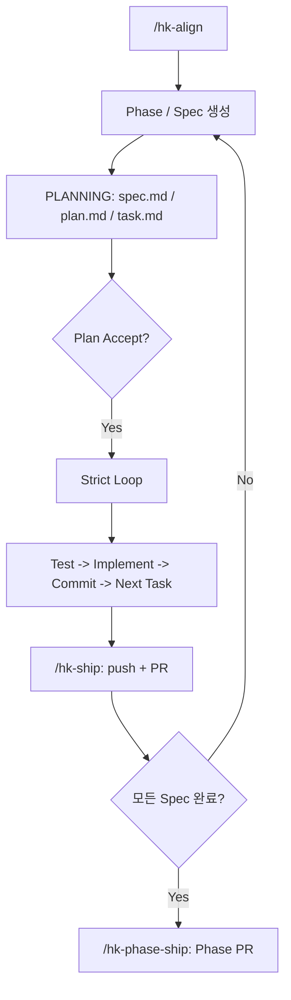

# harness-kit

> Claude Code를 위한 SDD(Spec-Driven Development) 거버넌스 부트스트랩 툴킷
> 한 번 만들어두고, 다음 프로젝트에서는 한 줄로 같은 하네스를 깐다.

[](./VERSION)
[](#대상-환경)
[](#)

---

## 💡 이 키트는 무엇인가

Claude Code를 그냥 쓰면 강력한 일반 비서지만, **반복 가능한 절차**와 **위반 방지**는 약합니다. "테스트를 먼저 써야 한다", "Plan을 검토한 뒤에 코드를 짜야 한다", "main 브랜치에서는 직접 커밋하지 않는다" — 이런 규칙들은 말로 하면 금방 잊힙니다.

harness-kit은 그 격차를 메꿉니다. **의도를 문서로 적는 것**에서 끝나지 않고, **강제까지 코드로 박는다**가 핵심입니다. 거버넌스 문서를 설치하고, hook으로 위반을 물리적으로 차단하고, 슬래시 커맨드로 자주 하는 절차를 한 단어로 줄입니다.

| | 기능 | 설명 |
|:---:|---|---|
| 1 | **거버넌스** | constitution / agent.md로 에이전트 행동 규약을 명문화 |
| 2 | **자동 강제** | hook으로 main 브랜치 작업·Plan Accept 우회·테스트 미실행 커밋을 물리적으로 차단 |
| 3 | **재현성** | 슬래시 커맨드와 `sdd` 메타 명령으로 자주 하는 절차를 한 단어로 |
| 4 | **재사용** | `install.sh` 한 번으로 다음 프로젝트에도 같은 환경 즉시 도입 |
| 5 | **모델 분배** | Opus로 기획·판단, Sonnet으로 태스크 실행, Opus sub-agent로 독립 코드 리뷰 |

---

## 📖 핵심 개념

**SDD (Spec-Driven Development)** — 코드를 작성하기 전에 Spec(명세)과 Plan(실행 계획)을 문서로 먼저 작성하고, 사람이 검토·승인한 뒤에만 구현에 들어가는 개발 방식입니다. 에이전트의 "먼저 짜고 나중에 생각하는" 충동을 구조적으로 막습니다.

### 작업 유형

| 유형 | 역할 | PR? | 언제 쓰나 |
|---|---|:---:|---|
| 🏗 **Phase** | 연관 Spec 묶음 (Epic) | ✅ | 3개+ Spec이 묶이거나 통합 테스트가 필요할 때. `--base`로 Phase 전용 브랜치 생성 가능 |
| 📝 **Spec** | Phase 내 단일 PR 단위 | ✅ | 1 Spec = 1 PR. `spec.md` → `plan.md` → `task.md` 작성 후 Plan Accept |
| 🔧 **spec-x** | Phase 없이 독립 단발 PR | ✅ | 버그 수정, 문서 정리 등. `sdd specx done <slug>`으로 마무리 |
| ⚡ **FF** | PR 없이 직접 커밋 | ❌ | 오탈자, 설정 변경 등 사소한 수정. state.json 변경 없음 |
| 🧊 **Icebox** | 아이디어 보관소 | — | 실행 불가. `queue.md`에 기록 후 나중에 Phase나 spec-x로 승격 |

### 프로젝트 구조와 상태 관리

| 경로 | 역할 |
|---|---|
| `backlog/queue.md` | 📊 대시보드 — 진행 중/대기/완료 Phase + Icebox. `sdd`가 자동 갱신 |
| `backlog/phase-{NN}.md` | 📋 Phase별 작업 지도 — Spec 표 + 통합 테스트 시나리오 |
| `specs/spec-{NN}-{NN}-{slug}/` | 📁 작업 산출물 — spec.md, plan.md, task.md, walkthrough.md, pr_description.md |
| `archive/` | 🗄 완료 항목 보관 — `sdd archive`로 정리. 조회 시 `(archived)` 표시 |
| `.claude/state/current.json` | ⚙️ 런타임 상태 — `phase`, `spec`, `planAccepted`, `lastTestPass` 등. hook이 읽어 Plan Accept·테스트 통과 여부를 판단. `.gitignore` 대상 |

### 핵심 규칙

| | 규칙 | 강제 수단 |
|---|---|---|
| 🛑 | **Plan Accept 전 코드 편집 금지** | `check-plan-accept.sh` hook |
| 1️⃣ | **One Task = One Commit** | task.md 체크박스 |
| 🚫 | **main 브랜치 직접 작업 금지** | `check-branch.sh` hook |
| 🧪 | **TDD: 테스트 → 구현 → 커밋** | `check-test-passed.sh` hook |

---

## 🖥 대상 환경 및 의존성

| 항목 | 지원 | 비고 |
|---|:---:|---|
| **macOS** | ✅ 1차 | Sonoma+, Apple Silicon / Intel |
| **Linux** | △ | bash 4.0+, jq, git이 있으면 동작 가능 (best-effort) |
| **Windows** | △ 미검증 | Git Bash (bash 4.0+ 포함) + jq 환경에서 동작 가능성 있음. WSL2 권장 |
| **AI 호스트** | Claude Code 전용 | `.claude/` 구조 + hooks + settings.json에 의존 |

```bash
# 필수 의존성 설치 (macOS)
brew install bash jq git    # macOS 기본 bash는 3.2 — 4.0+ 필요
```

---

## 📦 설치

```bash
# 설치
~/path/to/harness-kit/install.sh ~/Project/my-app

# Cursor IDE용 .cursorrules 함께 생성
~/path/to/harness-kit/install.sh --export-format=cursor ~/Project/my-app

# GitHub Copilot용 .github/copilot-instructions.md 함께 생성
~/path/to/harness-kit/install.sh --export-format=copilot ~/Project/my-app

# 미리 보기 (변경 없음)
~/path/to/harness-kit/install.sh --dry-run ~/Project/my-app

# 점검 — 의존성, 구조, 권한, hook, state 한 번에 확인
~/path/to/harness-kit/doctor.sh ~/Project/my-app

# 갱신 — state + 사용자 설정 보존
~/path/to/harness-kit/update.sh ~/Project/my-app

# 제거 — backlog/, specs/, archive/ 산출물은 보존
~/path/to/harness-kit/uninstall.sh ~/Project/my-app
```

---

## 🚀 시작하기: 첫 세션부터 첫 PR까지

### Step 1: Claude Code 시작 + `/hk-align`

프로젝트 디렉토리에서 Claude Code를 엽니다.

```bash
cd ~/Project/my-app
claude
```

Claude Code 안에서 `/hk-align`을 실행합니다. 이 커맨드가 자동으로:

1. constitution / agent / align 거버넌스 문서를 로딩합니다.
2. `sdd status`로 현재 상태(Active Phase, Active Spec, 다음 작업)를 확인합니다.
3. **단 하나의 질문**을 합니다: "어떤 컨텍스트로 진행할까요?"

이 질문에 지금 하려는 작업을 간단히 설명하면 에이전트가 적절한 작업 유형을 제안합니다.

### Step 2: Phase 생성 (큰 작업일 때)

여러 PR에 걸친 큰 작업이라면 Phase를 먼저 만듭니다.

```
사용자: "결제 안정성 관련 이슈를 phase로 묶고 싶어"

에이전트: sdd phase new payment-stability
```

`sdd phase new`가 실행되면 `backlog/phase-{N}.md`가 생성됩니다. 이 파일에 Phase의 목표, 성공 기준, Spec 목록, 통합 테스트 시나리오를 작성합니다. 작성은 에이전트가 초안을 만들고 사용자가 검토·수정합니다.

단독 PR이면 Phase 없이 바로 Step 3로 넘어갑니다.

### Step 3: Spec 생성 (1 PR 단위)

```
에이전트: sdd spec new retry-logic
```

`sdd spec new`가 실행되면 `specs/spec-{N}-{NN}-retry-logic/` 디렉토리가 생성되고 세 개의 파일이 만들어집니다:

- **`spec.md`** — 무엇을 왜 만드는가. 배경, 요구사항, 범위, 완료 기준.
- **`plan.md`** — 어떻게 만드는가. 기술 결정, 아키텍처, 구현 접근법.
- **`task.md`** — 단계별 체크리스트. 각 항목이 하나의 커밋이 됩니다.

이 시점에서는 **PLANNING 모드**입니다. 코드 편집은 허용되지 않습니다. 에이전트가 세 파일의 초안을 작성하고 사용자가 검토합니다.

### Step 4: Plan Accept (승인)

세 파일을 검토한 뒤 만족스러우면 승인합니다. 다음 중 어느 방법이든 됩니다:

- `1`, `Y`, `yes`, `ok`, `accept`를 입력
- `/hk-plan-accept` 커맨드 실행

승인되면 `sdd plan accept`가 실행되어 `planAccepted=true`가 기록되고, **Strict Loop**가 시작됩니다. 이후 `check-plan-accept.sh` hook이 해제되어 코드 편집이 가능해집니다.

plan.md 또는 task.md에 아직 템플릿 placeholder가 남아있으면 accept가 거부됩니다.

### Step 5: Strict Loop (자동 실행)

Plan Accept 후 에이전트는 task.md의 각 항목을 순서대로 처리합니다:

```
For 각 task:
  1. 테스트 작성 (실패 확인)
  2. 구현 (테스트 통과)
  3. sdd test passed  ← 테스트 통과 시각 기록
  4. git commit       ← One Task = One Commit
  5. sdd task done N  ← task.md 체크박스 완료
  6. 이슈 없으면 자동으로 다음 task 진행
     이슈 발생 시 멈추고 사용자에게 보고
```

모든 task가 완료될 때까지 에이전트가 자동으로 진행합니다. 사용자가 개입할 필요 없습니다.

`sdd test passed`를 호출하지 않고 커밋하면 `check-test-passed.sh` hook이 경고(또는 차단)합니다. 기본 임계는 30분(`HARNESS_TEST_WINDOW_MIN`으로 조정).

### Step 6: Ship (`/hk-ship`)

모든 task가 완료되면 `/hk-ship`을 실행합니다. 이 커맨드가:

1. `walkthrough.md`를 작성합니다 — 예상 못한 발견, 디버깅 과정, 기술 결정 이유, 기존 이슈 등 의미 있는 내용만.
2. `pr_description.md`를 작성합니다 — PR 본문.
3. ship 커밋을 생성합니다.
4. origin에 push합니다.
5. PR을 생성합니다 (`/hk-pr-gh` 또는 `/hk-pr-bb`).

PR merge 후 에이전트는 `sdd status`로 NEXT Spec을 확인하고 다음 작업을 안내합니다.

### Step 7: Phase 완료 (`/hk-phase-ship`)

Phase의 모든 Spec이 merge되면 `/hk-phase-ship`을 실행합니다. 이 커맨드가:

1. Phase의 성공 기준을 검증합니다.
2. 통합 테스트를 실행합니다.
3. go/no-go 판단을 합니다.
4. Phase base branch → main PR을 생성합니다 (base branch 모드일 때).
5. `sdd phase done`으로 Phase를 완료 처리합니다.

### 워크플로 한눈에 보기



---

## 🗄 디렉토리 아카이브

`specs/`에 Spec 디렉토리가 20개 이상 쌓이면 `sdd status`가 아카이브를 제안합니다. 아카이브는 완료된 Phase의 Spec과 backlog 파일을 `archive/` 디렉토리로 이동합니다.

```bash
# 미리 보기 (변경 없음)
sdd archive --dry-run

# 모든 완료 phase 아카이브
sdd archive

# 최근 N개 완료 phase는 남기고 아카이브
sdd archive --keep=2

# Claude Code 안에서
/hk-archive
```

아카이브된 항목도 `sdd phase list`, `sdd spec list`, `sdd phase show`, `sdd spec show`에서 `(archived)` 표시와 함께 조회됩니다. 데이터는 사라지지 않습니다.

---

## 📂 install.sh가 설치하는 것

```
<target>/
├── .harness-kit/                   # 키트 런타임
│   ├── agent/                      #   거버넌스
│   │   ├── constitution.md         #     헌법 (불변 규칙)
│   │   ├── agent.md                #     에이전트 작업 절차
│   │   ├── align.md                #     /hk-align 부트스트랩
│   │   └── templates/              #     산출물 양식 (spec, plan, task, walkthrough 등)
│   ├── bin/                        #   에이전트 전용 메타 명령
│   │   ├── sdd                     #     메인 메타 명령
│   │   └── lib/{common,state}.sh
│   ├── hooks/                      #   PreToolUse 후크
│   │   ├── check-branch.sh         #     main 보호
│   │   ├── check-plan-accept.sh    #     PLANNING 모드 가드
│   │   └── check-test-passed.sh    #     No Test, No Commit
│   └── CLAUDE.fragment.md          #   CLAUDE.md @import 대상
│
├── .claude/                        # Claude Code 통합
│   ├── settings.json               #   permissions + hooks (jq 머지)
│   ├── commands/                   #   슬래시 커맨드 (hk- prefix)
│   │   ├── hk-align.md
│   │   ├── hk-plan-accept.md
│   │   ├── hk-ship.md
│   │   ├── hk-phase-ship.md
│   │   ├── hk-phase-review.md
│   │   ├── hk-pr-gh.md
│   │   ├── hk-pr-bb.md
│   │   ├── hk-code-review.md
│   │   ├── hk-spec-critique.md
│   │   ├── hk-cleanup.md
│   │   └── hk-archive.md
│   └── state/current.json          #   런타임 state (gitignore)
│
├── backlog/                        # phase 정의 (평면 파일)
│   ├── queue.md                    #   대시보드 — 진행 중 Phase/Icebox
│   └── phase-{N}.md                #   phase별 spec 표 + 통합 테스트
│
├── specs/                          # 실제 작업 (work log)
│   └── spec-{N}-{NN}-{slug}/
│       ├── spec.md, plan.md, task.md
│       └── walkthrough.md, pr_description.md
│
├── archive/                        # 완료 항목 보관
│   ├── specs/
│   └── backlog/
│
└── CLAUDE.md                       # @import 3줄 추가
```

### 사용자 보존 (멱등성)

- `.claude/settings.json` 기존 `permissions`, `env`는 **합쳐짐**, hooks만 키트가 권위
- `CLAUDE.md` 사용자 내용 보존, @import 3줄만 추가 (`.harness-kit/CLAUDE.fragment.md` 참조)
- 두 번째 install 시 중복 없음

---

## ⌨ 명령 요약

### 키트 진입점

| 명령 | 설명 |
|---|---|
| `install.sh [TARGET]` | 설치 (`--dry-run`, `--force`, `--yes`, `--no-gitignore`, `--export-format=cursor\|copilot`) |
| `update.sh [TARGET]` | 키트 갱신 (state 보존) |
| `uninstall.sh [TARGET]` | 제거 (작업 산출물 보존) |
| `doctor.sh [TARGET]` | 점검 (의존성, 구조, 권한, hook, state) |
| `cleanup.sh [TARGET]` | 버전별 deprecated 파일 정리 |

### 슬래시 커맨드 (Claude Code 안에서)

| 커맨드 | 설명 |
|---|---|
| `/hk-align` | 세션 부트스트랩 — 거버넌스 로드 + `sdd status`로 현재 상태 확인 |
| `/hk-doctor` | 설치 환경 점검 — 필수 도구, 파일 구조, hook 상태 PASS/FAIL 출력 |
| `/hk-plan-accept` | plan.md 승인 → Strict Loop 시작 |
| `/hk-ship` | Spec 완료 — walkthrough/pr_description 검증 후 ship + push + PR 생성 |
| `/hk-phase-ship` | Phase 완료 — 성공 기준 검증 + 통합 테스트 + go/no-go + main PR |
| `/hk-phase-review` | Phase 회고 — 독립 Opus sub-agent로 비판적 검증 (목표 달성도, 테스트 품질, 잔재 탐지) |
| `/hk-pr-gh` | GitHub PR 생성 (gh CLI, pr_description.md 기반) |
| `/hk-pr-bb` | Bitbucket PR 생성 (pr_description.md 기반) |
| `/hk-code-review` | 독립 Opus sub-agent 코드 리뷰 (spec 대비 구현 + 품질 + 커버리지) |
| `/hk-spec-critique` | spec.md 비평 — Opus sub-agent로 유사 기법 조사 + 대안 제안 |
| `/hk-cleanup` | 프로젝트 정리 — 동기화 불일치, 잔여 파일, stale 요소 감지 및 정리 |
| `/hk-archive` | 완료된 phase의 spec/backlog를 `archive/`로 정리 |

### sdd 서브커맨드 (에이전트 내부용)

에이전트가 내부적으로 사용하는 메타 명령입니다. 사용자가 직접 실행할 필요는 없지만, 상태를 직접 확인하거나 조작할 때 쓸 수 있습니다.

| 명령 | 설명 |
|---|---|
| `sdd status [--brief\|--verbose\|--json]` | 현재 상태 출력 |
| `sdd doctor` | 설치 환경 진단 — 필수 도구, 파일 구조, hook 실행 권한 PASS/FAIL 출력 |
| `sdd queue` | `backlog/queue.md` 대시보드 출력 |
| `sdd phase new <slug> [--base]` | 새 Phase 생성 |
| `sdd phase list` | 모든 Phase와 Spec 카운트 |
| `sdd phase show [phase-N]` | Phase 상세 (생략 시 active) |
| `sdd phase done [phase-N]` | Phase를 완료 처리 |
| `sdd spec new <slug>` | active Phase 안에 새 Spec 생성 |
| `sdd spec list [--phase=N]` | Spec 목록 |
| `sdd spec show [spec-NN-NN-slug]` | Spec 상세 (생략 시 active) |
| `sdd plan accept` | 현재 Spec의 plan을 승인 |
| `sdd task done <num>` | task.md의 N번 항목을 완료 마킹 |
| `sdd test passed` | 테스트 통과 시각 기록 (`lastTestPass` 갱신) |
| `sdd ship [--check]` | walkthrough/pr_description 검증 후 ship 커밋 생성 |
| `sdd archive [--keep=N] [--dry-run]` | 완료 Phase의 파일을 `archive/`로 이동 |
| `sdd pr-watch <pr-number>` | PR merge 자동 감지 (30초 폴링, 60분 타임아웃) — merge 시 post-merge 절차 출력 |
| `sdd run-test <cmd...>` | 테스트 결과 자동 기록 wrapper — exit 0 시 `sdd test passed` 자동 호출 |
| `sdd specx done <slug>` | spec-x 작업을 queue.md done으로 이동 |
| `sdd hooks [status]` | hook 모드 현황 출력 |
| `sdd hooks block\|warn\|off <name>` | 특정 hook 모드 전환 안내 |
| `sdd help` | 도움말 |
| `sdd version` | 키트 버전 |

---

## 🧠 모델 분배 전략

메인 세션은 **Opus**로 운영하고, 역할별로 sub-agent 모델을 분배합니다:

| 역할 | 모델 | 이유 |
|---|---|---|
| Spec / Plan / Task 작성 | Opus (메인) | 아키텍처 판단에 깊은 추론 필요 |
| Task 실행 | Sonnet (sub-agent) | 상대적으로 기계적, 빠르고 저렴 |
| 코드 리뷰 / 비평 | Opus (sub-agent) | 미묘한 문제를 잡으려면 별도 컨텍스트의 깊은 분석 필요 |
| 코드 분석 | Opus (sub-agent) | 구조 파악, 영향 범위 판단 |

---

## 🔒 Hook 모드

세 개의 hook이 각각 독립적으로 모드를 가집니다:

| Hook | 기본 모드 | 역할 |
|---|:---:|---|
| `check-branch.sh` | `block` | main 브랜치에서 Edit/Write 차단 |
| `check-plan-accept.sh` | `warn` | Plan Accept 전 Edit/Write 차단 |
| `check-test-passed.sh` | `warn` | 테스트 미통과 상태에서 커밋 차단 |

| 모드 | 동작 | 사용 시점 |
|:---:|---|---|
| `warn` (기본) | stderr 메시지 + exit 0 (통과) | 첫 1주 — 관찰 |
| `block` | stderr 메시지 + exit 2 (차단) | 익숙해진 후 — 강제 |
| `off` | 검사 비활성 | 일회성 우회 |

```bash
# 글로벌 모드 변경
export HARNESS_HOOK_MODE=block

# 특정 hook만 변경
export HARNESS_HOOK_MODE_PLAN_ACCEPT=block
export HARNESS_HOOK_MODE_TEST_PASSED=block

# 일회성 우회
HARNESS_HOOK_MODE=off git commit -m "..."
```

---

## 🔗 Bitbucket PR 설정

`/hk-pr-bb` 사용 시 Bitbucket Cloud API 토큰이 필요합니다.

1. **Bitbucket 설정** → Personal Settings → API Key (또는 App Password)
2. 필요 권한: **Pull Request — Read + Write** (`pullrequest:read`, `pullrequest:write` 스코프)
3. 토큰을 파일로 저장:

```bash
mkdir -p ~/.config/bitbucket
echo "YOUR_API_TOKEN" > ~/.config/bitbucket/token
chmod 600 ~/.config/bitbucket/token
```

> 다른 경로를 사용하려면 `BITBUCKET_TOKEN_FILE` 환경변수로 지정할 수 있습니다.

> GitHub 사용자는 `gh auth login`만 하면 `/hk-pr-gh`가 바로 동작합니다.

---

## ❓ FAQ

**Q. Plan Accept 전에 코드를 못 만지는 이유는?**

`check-plan-accept.sh` hook이 `Edit/Write/MultiEdit` 도구 호출을 검사합니다. `.harness-kit/`, `backlog/`, `specs/` 등 산출물 경로는 통과되지만, 실제 소스 코드 편집은 차단됩니다. constitution의 "Premature Execution = Critical Violation" 원칙을 코드로 강제하는 장치입니다.

**Q. 테스트 통과했는데 커밋이 차단됩니다.**

`sdd test passed`를 호출해 통과 시각을 기록하세요. 기본 임계는 30분입니다. `HARNESS_TEST_WINDOW_MIN` 환경변수로 조정할 수 있습니다.

**Q. main에서 정말 커밋해야 하면?**

`HARNESS_HOOK_MODE=off git commit ...`으로 일회성 우회하거나, 해당 hook의 모드를 `off`로 설정합니다.

**Q. settings.json에 추가한 권한이 update 시 사라지나요?**

아닙니다. `permissions.allow/deny`는 합집합으로 병합됩니다. `hooks` 섹션만 키트가 덮어씁니다.

**Q. Phase base branch 모드는 언제 쓰나요?**

Spec 간 의존성이 있거나, main merge 전에 Phase 전체 통합 테스트를 돌리고 싶을 때 씁니다. `sdd phase new <slug> --base`로 선언하면 Phase 전용 브랜치가 생성되고 각 Spec PR이 main이 아닌 그 브랜치로 병합됩니다. 모든 Spec이 완료된 뒤 `/hk-phase-ship`이 Phase 브랜치 → main PR을 생성합니다.

**Q. archive 후에도 이전 Spec을 조회할 수 있나요?**

네. `sdd spec list`, `sdd spec show`, `sdd phase list`, `sdd phase show` 모두 `archive/` 디렉토리도 함께 조회합니다. 아카이브된 항목에는 `(archived)` 표시가 붙습니다.

**Q. spec-x와 FF의 차이는?**

spec-x는 PR을 만들고 리뷰를 받는 독립 작업입니다. FF는 PR 없이 main에 직접 커밋하는 사소한 수정입니다. FF는 `HARNESS_HOOK_MODE=off`로 hook을 우회하거나, 사용자가 명시적으로 승인한 뒤 진행합니다.

**Q. walkthrough.md에는 무엇을 써야 하나요?**

구현 내용 나열은 피합니다. 예상 못한 발견, 디버깅 과정, 기술 결정의 이유, 해결한 기존 이슈처럼 나중에 다시 봤을 때 의미 있는 내용을 씁니다.

