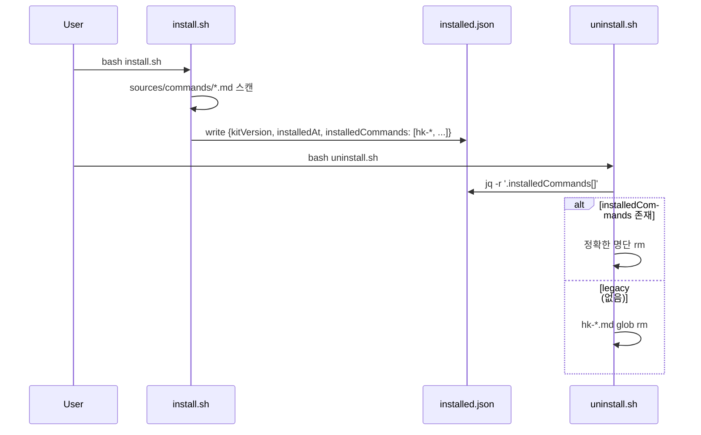

# Implementation Plan: spec-15-03

## 📋 Branch Strategy

- 신규 브랜치: `spec-15-03-uninstall-cmd-list-stale`
- **시작 지점**: `phase-15-upgrade-safety`
- PR target: `phase-15-upgrade-safety`

## 🛑 사용자 검토 필요 (User Review Required)

> [!IMPORTANT]
> - [ ] **`installed.json` 스키마 변경** — 신규 키 `installedCommands` 추가. 기존 키 변경 없음. update.sh 의 `kitVersion` 읽기 정상.
> - [ ] **fallback 정책** — `installedCommands` 부재 시 `hk-*.md` glob 제거. 사용자가 본인 슬래시 커맨드를 `hk-` 접두사로 만든 경우 같이 제거됨 (수용 가능 가정).
> - [ ] **spec 명세 swap** — phase-15.md 의 §spec-15-03 / §spec-15-04 자리바꿈 + 위험 섹션 ID 갱신. 본 spec 작업 첫 commit 에 포함.

> [!WARNING]
> - [ ] uninstall.sh 의 stale `KIT_COMMANDS="align ..."` 라인 제거 — 본 라인을 참조하는 외부 도구는 없을 것으로 판단되나, 만약 있다면 영향.

## 🎯 핵심 전략 (Core Strategy)

### 변경 흐름



### 주요 결정

| 컴포넌트 | 전략 | 이유 |
|:---:|:---|:---|
| **명단 기록 위치** | `installed.json.installedCommands` 배열 | 이미 install.sh 가 쓰는 파일. 신규 파일 추가 불필요 |
| **명단 생성 시점** | install.sh 의 슬래시 커맨드 복사 직후 | 실제 복사된 파일과 명단의 1:1 일치 보장 |
| **명단 형식** | basename (확장자 제외) 의 JSON 배열 | uninstall 이 `<basename>.md` 로 재구성. 경로 종속성 없음 |
| **Fallback 패턴** | `hk-*.md` glob | hk- 접두사 정책이 본 프로젝트 컨벤션 (audit §5.3.1). 사용자 본인 hk- 접두사 커맨드 사용은 컨벤션 위반으로 간주 |
| **jq 의존** | 필수. `command -v jq` 가드 + fallback 은 jq 없이도 glob 으로 동작 | jq 미설치 시에도 hk-* 정리 보장 |

## 📂 Proposed Changes

### [MODIFY] `install.sh` (47-459 부근)

`installed.json` 작성 부분 (현재 라인 452-457):

```bash
# 현재
cat > "$INSTALLED_JSON" <<EOF
{
  "kitVersion": "$KIT_VERSION",
  "installedAt": "$(date -u +%Y-%m-%dT%H:%M:%SZ)"
}
EOF

# 신규 — installedCommands 추가
_cmd_names=()
if [ -d "$KIT_DIR/sources/commands" ]; then
  for f in "$KIT_DIR/sources/commands"/*.md; do
    [ -e "$f" ] || continue
    _cmd_names+=("$(basename "$f" .md)")
  done
fi
# JSON 배열 조립 (jq 의존 회피 — 단순 텍스트)
_cmd_json="["
_first=1
for c in "${_cmd_names[@]}"; do
  [ $_first -eq 1 ] && _first=0 || _cmd_json="$_cmd_json,"
  _cmd_json="$_cmd_json\"$c\""
done
_cmd_json="$_cmd_json]"

cat > "$INSTALLED_JSON" <<EOF
{
  "kitVersion": "$KIT_VERSION",
  "installedAt": "$(date -u +%Y-%m-%dT%H:%M:%SZ)",
  "installedCommands": $_cmd_json
}
EOF
```

### [MODIFY] `uninstall.sh` (91-97 부근)

```bash
# 현재
KIT_COMMANDS="align spec-new plan-accept spec-status handoff phase-new phase-status task-done archive"
for c in $KIT_COMMANDS; do
  rm -f "$TARGET/.claude/commands/$c.md" 2>/dev/null || true
done

# 신규
INSTALLED_JSON="$TARGET/.harness-kit/installed.json"
if command -v jq >/dev/null 2>&1 \
   && [ -f "$INSTALLED_JSON" ] \
   && jq -e '.installedCommands' "$INSTALLED_JSON" >/dev/null 2>&1; then
  # 기록된 명단 사용 (정확)
  while IFS= read -r c; do
    [ -n "$c" ] && rm -f "$TARGET/.claude/commands/${c}.md" 2>/dev/null
  done < <(jq -r '.installedCommands[]' "$INSTALLED_JSON")
else
  # legacy fallback (구 install 또는 jq 미설치)
  rm -f "$TARGET/.claude/commands/hk-"*.md 2>/dev/null || true
fi
# 비어있으면 디렉토리 제거
rmdir "$TARGET/.claude/commands" 2>/dev/null || true
```

### [NEW] `tests/test-uninstall-cmd-list.sh`

4 시나리오:

1. **F1 검증** — fresh install: `installed.json` 에 `installedCommands` 배열 존재 + 12+ 항목 (현재 sources/commands/ 기준)
2. **F2 검증** — install + 사용자 foo.md 추가 → uninstall: hk-* 12개 제거됨 + foo.md 보존
3. **F3 검증** — legacy installed.json (installedCommands 키 제거) → uninstall: hk-* 모두 제거됨 (fallback 동작)
4. **F5 검증** — update 흐름 (install → uninstall --keep-state → install): 최종 상태에 hk-* 가 정확히 명단대로 존재

총 ≥ 8 checks (각 시나리오 평균 2 checks).

### [MODIFY] `backlog/phase-15.md`

§spec 명세에서 spec-15-03 / spec-15-04 swap. 위험 섹션 ID 갱신. 첫 commit 에 포함.

## 🧪 검증 계획

### 단위 테스트
```bash
bash tests/test-uninstall-cmd-list.sh
```

### 회귀
```bash
bash tests/test-version-bump.sh   # 전체 스위트 자동 실행
bash tests/test-update.sh         # update 흐름 회귀
bash tests/test-install-layout.sh # install 레이아웃 회귀
```

## 🔁 Rollback Plan

- 단일 PR 머지 → revert 시 `installed.json.installedCommands` 가 신규 install 부터 사라지지만 실 동작 영향 없음 (uninstall 이 다시 stale `KIT_COMMANDS` 사용).
- 즉시 롤백 가능.

## 📦 Deliverables 체크

- [ ] task.md 작성
- [ ] 사용자 Plan Accept
- [ ] install.sh / uninstall.sh 수정
- [ ] phase-15.md spec 명세 swap
- [ ] tests/test-uninstall-cmd-list.sh 8+ checks PASS
- [ ] 회귀 PASS
- [ ] walkthrough.md / pr_description.md ship + PR
