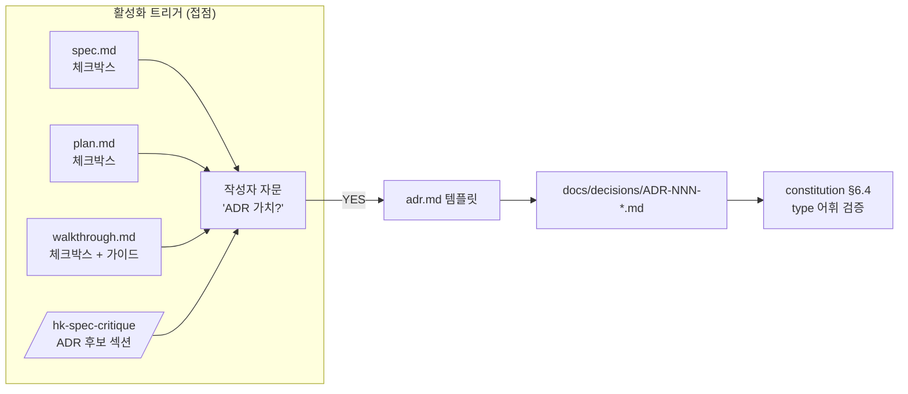

# Implementation Plan: spec-16-02

## 📋 Branch Strategy

- 신규 브랜치: `spec-16-02-adr-activation-trigger` (브랜치 이름 = spec 디렉토리 이름, `feature/` prefix 없음)
- 시작 지점: `main`
- 첫 task 가 브랜치 생성을 수행함 (이미 `sdd spec new` 로 디렉토리는 생성됨)

## 🛑 사용자 검토 필요 (User Review Required)

> 본 Plan 을 Accept 하기 전에 사용자가 명시적으로 확인해야 할 항목들.

> [!IMPORTANT]
> - [ ] **트리거 강제 수준** — *권장 + 추출 가이드* 비강제. ship 단계에서 ADR 체크박스 미체크여도 차단하지 않음.
> - [ ] **첫 ADR 포함** — `ADR-001-knowledge-types` 작성을 본 spec scope 에 포함 (트리거가 *살았는지* 검증 목적).
> - [ ] **체크 형태** — 본문 체크박스 (frontmatter 필드 아님). spec/plan/walkthrough 3 군데 동일 문구로 grep 가능.
> - [ ] **critique 통합 깊이** — sub-agent prompt 에 "ADR 후보" 1 섹션만 추가. *자동 식별 휴리스틱은 도입 안 함*.

> [!WARNING]
> - [ ] **거버넌스 톤 변경** — `constitution.md` §6.3 / §6.4 문구 갱신. 영어 톤 유지하되 ADR 가 type 어휘의 두 번째 사용자임을 명시.
> - [ ] **install 미러 동기화** — sources/ 와 `.harness-kit/agent/` 양쪽을 같은 PR 에서 손댐 (도그푸딩 일관성).

## 🎯 핵심 전략 (Core Strategy)

### 아키텍처 컨텍스트



### 주요 결정

| 컴포넌트 | 전략 | 이유 |
|:---:|:---|:---|
| **트리거 형태** | 본문 체크박스 (3 산출물 동일 문구) | frontmatter 필드는 sparse 함. grep 일관성 ↑ |
| **강제 수준** | 권장 (미체크 차단 없음) | constitution §6.4 와 동일한 *얇은 보강* 철학 |
| **첫 ADR 작성** | 본 spec 에 포함 | 트리거의 *실증* 없으면 활성화 검증 불가 |
| **critique 통합** | prompt 에 "체크 섹션" 만 추가 | 자동 식별 휴리스틱은 prompt 복잡도 비용 ↑ |
| **walkthrough → ADR 추출** | 가이드 문서만 (자동 도구 X) | 자동화는 spec-16-03 의 stale 탐지와 묶일 수 있음 |
| **ADR 템플릿 구조** | RCA 와 대칭 (frontmatter + 5 섹션 본문) | type 어휘 사용자 간 *통일된 형식* |

## 📂 Proposed Changes

### [Templates]

#### [NEW] `sources/templates/adr.md`
ADR 본문 템플릿. frontmatter `type:` 슬롯 (정규 어휘) + 본문 5 섹션 (Context / Decision / Consequences / Alternatives / Status). RCA 와 동일한 구조 패턴.

#### [MODIFY] `sources/templates/spec.md`
"🚫 Out of Scope" 섹션 직후 "📑 ADR 후보" 섹션 1 개 추가:

```markdown
## 📑 ADR 후보 (Architecture Decision Records)

> 본 SPEC 의 결정 중 *장기 자산* 으로 박을 가치 있는 것이 있는가?
> 후보가 있으면 본 spec 머지 시점에 `docs/decisions/ADR-{NNN}-{slug}.md` 로 작성.

- [ ] ADR 가치 있는 결정 있음 → 후보 한 줄 요약: <slug 후보>
```

#### [MODIFY] `sources/templates/plan.md`
"### 주요 결정" 표 직후 동일 형식의 "📑 ADR 후보" 섹션 추가.

#### [MODIFY] `sources/templates/walkthrough.md`
"📌 결정 기록" 표 직후 *ADR 승격 가이드* + 체크박스 1 개 추가:

```markdown
### ADR 승격 가이드

위 결정 중 *cross-spec / long-lived* 인 것이 있다면 ADR 로 승격합니다 (constitution §6.3).
승격 기준:
- 다른 spec 의 작업이 본 결정에 의존하는가?
- 6 개월 이상 유지될 가능성이 높은가?
- frontmatter `type:` 어휘 (decision / invariant / convention / tradeoff) 중 하나에 해당하는가?

- [ ] ADR 승격 대상 있음 → 작성됨: <ADR 경로 또는 (없음)>
```

#### [SYNC] `.harness-kit/agent/templates/adr.md` / `spec.md` / `plan.md` / `walkthrough.md`
sources/ 와 동일한 내용으로 install 미러 갱신 (도그푸딩).

### [Commands]

#### [MODIFY] `sources/commands/hk-spec-critique.md`
sub-agent prompt 의 "출력 형식" 에 다음 섹션을 4번 항목으로 추가:

```markdown
## 4. ADR 후보 추출

본 spec 에서 *장기 자산* 으로 박을 결정 후보를 식별합니다 (자동 식별 강제 X — 검토자 판단).

- [ ] **후보 발견**: <slug 후보> — type: <decision / invariant / convention / tradeoff>
- [ ] **후보 없음**: <이유 1 줄>
```

#### [SYNC] `.claude/commands/hk-spec-critique.md`
sources/ 와 동일하게 갱신.

### [Governance]

#### [MODIFY] `sources/governance/constitution.md`
§6.3 (Layout) 의 ADR 항목 보강:

```text
- ADR: `docs/decisions/ADR-{NNN}-{slug}.md` — for architectural / cross-Spec / long-lived decisions.
  Template: `.harness-kit/agent/templates/adr.md`. Frontmatter MUST include `type:` from the §6.4 vocabulary.
```

§6.4 의 "Rules" 첫 줄을 다음으로 갱신:

```text
- `type:` MUST be present in any frontmatter that adopts this vocabulary (RCA and ADR; both adopt the closure).
```

#### [SYNC] `.harness-kit/agent/constitution.md`
sources/ 와 동일하게 갱신.

### [Decisions]

#### [NEW] `docs/decisions/ADR-001-knowledge-types.md`
spec-16-01 의 Knowledge Type Vocabulary 도입 결정을 ADR 로 박는다. frontmatter `type: decision`. 본문 5 섹션:

```text
---
name: knowledge-types
description: 산출물 frontmatter type 슬롯에 5 어휘 closure 도입
metadata:
  type: decision
---

# ADR-001: Knowledge Type Vocabulary

## Context
(외부 진단 #2 Decision Ledger / #3 RCA, 어휘 부재로 grep 불가)

## Decision
(5 어휘 closure: decision / invariant / failure-pattern / convention / tradeoff)

## Consequences
(긍정: grep 검색 가능 / 부정: 어휘 변경 자체가 ADR 필요)

## Alternatives
(자유 태그 vs closure)

## Status
Adopted (2026-05-15, spec-16-01 머지) — RCA 가 첫 사용자, ADR 이 두 번째 사용자 (spec-16-02).
```

## 🧪 검증 계획 (Verification Plan)

### 단위 테스트 (필수)

본 키트는 bash 기반이라 형식 검증을 grep / 파일 존재 체크로 수행.

```bash
# 1. 트리거 체크박스 grep — spec/plan/walkthrough 템플릿 3 군데 모두 "ADR 후보" 헤더 있음
grep -l "## 📑 ADR 후보" sources/templates/spec.md sources/templates/plan.md \
  && grep -l "ADR 승격 가이드" sources/templates/walkthrough.md

# 2. install 미러 동일성
diff sources/templates/adr.md .harness-kit/agent/templates/adr.md
diff sources/templates/spec.md .harness-kit/agent/templates/spec.md
diff sources/templates/plan.md .harness-kit/agent/templates/plan.md
diff sources/templates/walkthrough.md .harness-kit/agent/templates/walkthrough.md
diff sources/commands/hk-spec-critique.md .claude/commands/hk-spec-critique.md
diff sources/governance/constitution.md .harness-kit/agent/constitution.md

# 3. ADR-001 파일 존재 + frontmatter type 확인
test -f docs/decisions/ADR-001-knowledge-types.md
grep -q "^  type: decision$" docs/decisions/ADR-001-knowledge-types.md

# 4. type 어휘 closure — RCA + ADR 모두 정규 어휘 집합 내
grep -rh "^  type:" docs/rca docs/decisions | sort -u
# 기대: failure-pattern, decision 만 출력

# 5. critique prompt 보강 검증
grep -q "ADR 후보 추출" sources/commands/hk-spec-critique.md
```

### 통합 테스트
Integration Test Required = no. Phase-level 통합 테스트 시나리오 1 (Knowledge Type 일관성) 의 *전제 조건* 을 본 spec 이 마련 (docs/decisions 첫 ADR 작성).

### 수동 검증 시나리오

1. **트리거 노출 확인** — `cat .harness-kit/agent/templates/spec.md` 출력에 "📑 ADR 후보" 섹션이 보임.
2. **critique 출력 형식 확인** — `/hk-spec-critique` 호출 시 sub-agent 가 4 섹션 (유사 기법 / 요구사항 비판 / 대안 / **ADR 후보**) 을 모두 작성.
3. **ADR-001 가독성** — 본문 5 섹션이 모두 채워져 있고 `type: decision` 이 frontmatter 에 있음.

## 🔁 Rollback Plan

- **문제 발생 시**: 본 PR revert. 템플릿/거버넌스 변경이 backward-incompatible 한 부분 없음 (체크박스 추가는 비강제, 새 ADR 파일은 신규).
- **install 미러 drift 발생 시**: `update.sh` 실행으로 sources → install 동기화.
- **데이터/상태 영향**: state.json 변경 없음. 기존 spec/plan/walkthrough 파일은 영향 없음 (템플릿 변경은 *신규* 산출물에만 적용).

## 📦 Deliverables 체크

- [ ] task.md 작성 (다음 단계)
- [ ] 사용자 Plan Accept 받음
- [ ] (실행 후) 모든 task 완료
- [ ] (실행 후) walkthrough.md / pr_description.md ship
