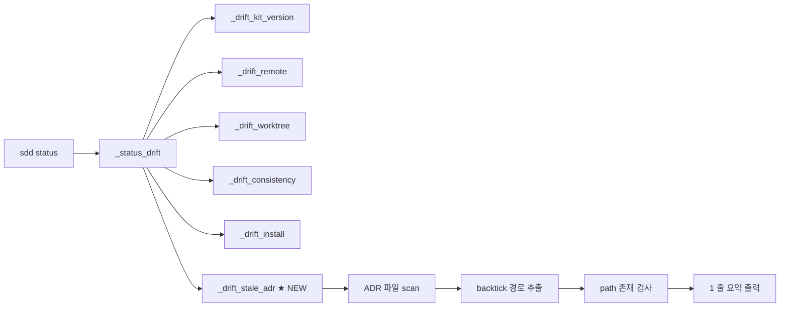

# Implementation Plan: spec-16-03

## 📋 Branch Strategy

- 신규 브랜치: `spec-16-03-stale-decision-detect`
- **시작 지점**: `phase-16-reliability-layer` (phase base branch 모드 — constitution §3.1, §6.5)
- **PR Target**: `phase-16-reliability-layer` (main 직 PR 아님)
- 첫 task 가 브랜치 생성을 수행함

## 🛑 사용자 검토 필요 (User Review Required)

> 본 Plan 을 Accept 하기 전에 사용자가 명시적으로 확인해야 할 항목들.

> [!IMPORTANT]
> - [ ] **Scope**: missing-path 만 (TTL 제거). RCA 제외. ADR-*.md 한정.
> - [ ] **경로 추출 규칙**: backtick 으로 감싸진 토큰 중 슬래시 포함 + URL 제외 + 확장자/디렉토리 슬래시 보유.
> - [ ] **출력 위치**: drift 섹션 (`_status_drift` 통합 체인). 별 섹션 아님.
> - [ ] **PR target**: `phase-16-reliability-layer` (main 직 아님 — base branch 모드).

> [!WARNING]
> - [ ] **false positive 위험**: backtick 토큰이 *진짜 파일 경로* 가 아닐 가능성 (예: `foo/bar` 가 namespace 표기). 규칙 좁게 잡고 fixture 검증으로 보완.
> - [ ] **ADR-001 회귀 검증**: 본 spec 통합 후 ADR-001 의 backtick 경로 모두 valid 인지 확인 (regression marker).

## 🎯 핵심 전략 (Core Strategy)

### 아키텍처 컨텍스트



### 주요 결정

| 컴포넌트 | 전략 | 이유 |
|:---:|:---|:---|
| **함수 위치** | `_drift_kit_version` 직후 | 외부 상태 / 의미적 검사 그룹. worktree·consistency·install 같은 git-기반 검사와 구분 |
| **경로 추출** | `grep -oE` + 후처리 필터 | bash 3.2 호환 + 정규식 간결성. AWK 도 가능하나 grep 이 더 익숙 |
| **path 컨텍스트** | `$SDD_ROOT` 기준 상대 경로 | 절대 경로는 사용자별 다름. ADR 본문은 항상 repo-relative 가정 |
| **출력 형식** | `stale ADR: N (missing-path) — <list>` 1 줄, 리스트 최대 3 개 | drift 섹션의 다른 라인과 형식 일관. 길이 폭주 방지 |
| **에러 처리** | docs/decisions/ 없거나 ADR 0 개 → silent return 1 | drift 출력은 *발견 시만*. 빈 상태는 noise |
| **install 미러** | `cp sources/bin/sdd .harness-kit/bin/sdd` (실행권한 보존) | 도그푸딩 일관성. spec-16-02 와 동일 패턴 |

### 정규식 설계

본문 추출 (1 line 단위 grep, line 후 처리):

```bash
# 1. backtick 안의 토큰 추출 (간단한 case)
grep -oE '`[^`]+`' "$adr_file"

# 2. 후처리 필터 (각 토큰에 대해):
#    - leading/trailing backtick 제거
#    - 슬래시 포함 여부 (`grep -q '/'`)
#    - URL 제외 (`! grep -qE '^(https?:|git@)'`)
#    - 확장자 OR trailing slash 보유
#      (`grep -qE '\.[a-zA-Z0-9]+$|/$'`)
```

## 📂 Proposed Changes

### [Drift 함수]

#### [MODIFY] `sources/bin/sdd`

`_drift_kit_version()` 직후, `_status_drift()` 전에 `_drift_stale_adr()` 추가. `_status_drift()` 의 has_drift 체인에 wire.

```bash
# Stale ADR 탐지: 본문의 backtick-wrapped 경로 중 존재하지 않는 것
_drift_stale_adr() {
  local adr_dir="$SDD_ROOT/docs/decisions"
  [ -d "$adr_dir" ] || return 1

  local stale_count=0
  local stale_list=""
  local adr path

  # ADR-*.md 파일 순회 (없으면 즉시 return)
  for adr in "$adr_dir"/ADR-*.md; do
    [ -f "$adr" ] || continue

    local has_missing=0
    # backtick 토큰 추출 → 슬래시·URL·확장자 필터 → 존재 검사
    while IFS= read -r path; do
      [ -z "$path" ] && continue
      echo "$path" | grep -q '/' || continue
      echo "$path" | grep -qE '^(https?:|git@)' && continue
      echo "$path" | grep -qE '\.[a-zA-Z0-9]+$|/$' || continue
      [ -e "$SDD_ROOT/$path" ] && continue
      has_missing=1
      break
    done < <(grep -oE '`[^`]+`' "$adr" | tr -d '`')

    if [ "$has_missing" -eq 1 ]; then
      stale_count=$((stale_count + 1))
      stale_list="${stale_list}${stale_list:+; }${adr#$SDD_ROOT/}"
    fi
  done

  [ "$stale_count" -eq 0 ] && return 1

  # 리스트 최대 3 개 + "…"
  local display="$stale_list"
  local list_count
  list_count=$(echo "$stale_list" | tr ';' '\n' | wc -l | tr -d ' ')
  if [ "$list_count" -gt 3 ]; then
    display=$(echo "$stale_list" | cut -d';' -f1-3 | sed 's/$/; …/')
  fi

  printf "  ${C_YLW}stale ADR: %d (missing-path) — %s${C_RST}\n" \
    "$stale_count" "$display"
  return 0
}
```

`_status_drift()` 의 wire:

```text
_drift_kit_version && has_drift=1
_drift_remote      && has_drift=1
_drift_worktree    && has_drift=1
_drift_consistency && has_drift=1
_drift_install     && has_drift=1
_drift_stale_adr   && has_drift=1   ← ★ 추가
```

#### [SYNC] `.harness-kit/bin/sdd`
sources 와 동일 (cp + chmod +x 보존).

### [Fixture / 단위 검증]

#### [NEW] `tests/fixtures/spec-16-03-stale-adr/ADR-999-stale-fixture.md` (단위 테스트용, 영구 보존하지 않음)

테스트 스크립트가 임시 생성/삭제:

```markdown
---
id: ADR-999
type: decision
date: 2026-05-16
status: accepted
---

# ADR-999: Fixture for stale detection

## Context
Path that exists: `sources/bin/sdd`
Path that does NOT exist: `src/removed-module.ts`
```

#### [NEW] `tests/test-drift-stale-adr.sh`

bash 3.2 호환 검증 스크립트:

```bash
#!/usr/bin/env bash
# tests/test-drift-stale-adr.sh
set -euo pipefail

SDD_ROOT="$(cd "$(dirname "$0")/.." && pwd)"
cd "$SDD_ROOT"

# 1. 정상 상태에서는 stale 출력 없음
output=$(bash .harness-kit/bin/sdd status 2>&1)
echo "$output" | grep -q "stale ADR" \
  && { echo "FAIL: clean state should not report stale"; exit 1; }
echo "PASS: clean state — no stale ADR"

# 2. fixture 주입 → 1 라인 출력
mkdir -p docs/decisions
cat > docs/decisions/ADR-999-fixture.md <<'EOF'
---
id: ADR-999
type: decision
date: 2026-05-16
status: accepted
---
# ADR-999: Fixture
Missing: `src/removed-module-fixture.ts`
EOF

output=$(bash .harness-kit/bin/sdd status 2>&1)
rm -f docs/decisions/ADR-999-fixture.md

echo "$output" | grep -q "stale ADR: 1 (missing-path)" \
  || { echo "FAIL: fixture should produce 1 stale; got: $output"; exit 1; }
echo "PASS: fixture → 1 stale ADR detected"

# 3. ADR-001 회귀 — 본문 모든 경로 valid 인지 (간접 검증)
output=$(bash .harness-kit/bin/sdd status 2>&1)
echo "$output" | grep -q "stale ADR" \
  && { echo "FAIL: ADR-001 has missing path — regression"; exit 1; }
echo "PASS: ADR-001 paths all valid (regression check)"

echo "All tests passed."
```

## 🧪 검증 계획 (Verification Plan)

### 단위 테스트 (필수)

```bash
bash tests/test-drift-stale-adr.sh
```

3 단계 (clean state / fixture / 회귀) 모두 PASS.

### 통합 테스트 (Integration Test Required = yes)

phase-16.md 시나리오 2 와 동일:

```bash
# Given: 가짜 ADR 주입
cat > docs/decisions/ADR-999-stale-integration.md <<'EOF'
---
type: decision
date: 2026-05-16
status: accepted
---
# ADR-999: Integration fixture
Reference: `src/removed-module.ts`
EOF

# When + Then
bash .harness-kit/bin/sdd status | grep -q "stale ADR: 1"

# Cleanup
rm -f docs/decisions/ADR-999-stale-integration.md
```

PASS 기준: grep 결과 hit + 정리 후 status 출력에서 stale 라인 사라짐.

### 수동 검증 시나리오

1. **정상 상태**: `sdd status` → drift 섹션에 "stale ADR" 없음. ADR-001 모든 경로 valid.
2. **부재 경로 주입**: 임시 ADR 추가 → `sdd status` → "stale ADR: 1 (missing-path) — docs/decisions/ADR-999-*.md" 출력.
3. **다수 ADR 부재**: 3 개 부재 ADR 주입 → 3 까지는 list 전부, 4 개 이상 → "…" 표시 확인.
4. **URL 무시**: ADR 본문에 `` `https://example.com/foo/bar` `` 만 있는 경우 → stale 아님.
5. **확장자 없는 토큰 무시**: `` `MyClass.method` `` 같은 백틱 코드 → 슬래시 미포함 → 무시.

## 🔁 Rollback Plan

- **문제 발생 시**: 본 PR revert. drift 함수 추가만 한 변경이라 backward-compatible. 기존 `sdd status` 동작에 영향 없음 (return 1 시 silent).
- **false positive 다발 시**: regex 보수적으로 조정 (다음 spec-x 로 처리).
- **데이터 영향**: 없음 (read-only 검사).

## 📦 Deliverables 체크

- [ ] task.md 작성 (다음 단계)
- [ ] 사용자 Plan Accept 받음
- [ ] (실행 후) 모든 task 완료
- [ ] (실행 후) walkthrough.md / pr_description.md ship
