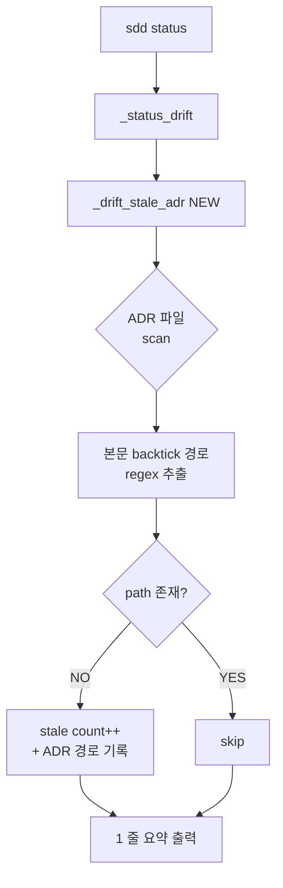

# spec-16-03: Stale ADR 탐지 (missing-path)

## 📋 메타

| 항목 | 값 |
|---|---|
| **Spec ID** | `spec-16-03` |
| **Phase** | `phase-16` |
| **Branch** | `spec-16-03-stale-decision-detect` |
| **상태** | Planning |
| **타입** | Feature |
| **Integration Test Required** | yes |
| **작성일** | 2026-05-16 |
| **소유자** | dennis |

## 📋 배경 및 문제 정의

### 현재 상황

- spec-16-02 머지로 `docs/decisions/ADR-{NNN}-{slug}.md` 경로가 활성화됨. ADR-001-knowledge-types 가 첫 산출물.
- `sources/bin/sdd` 의 `_status_drift()` 가 5 카테고리 (kit_version / remote / worktree / consistency / install) 의 drift 만 감지.
- ADR 자체의 *staleness* 는 검사 안 됨 — 본문이 *지운 모듈* 을 참조해도 키트가 모름.

### 문제점

- ADR 은 *long-lived* 자산이지만, 코드는 지속적으로 refactor / rename / delete 됨. ADR 본문이 가리키는 경로가 사라져도 ADR 은 그대로 남아 *잘못된 참조* 를 영구화.
- "ADR 가 stale 한지 어떻게 아는가?" 라는 질문에 *수동 검토 외 방법 없음*. 산출물이 누적될수록 검토 비용 ↑.
- phase-16 통합 테스트 시나리오 2 (지운 경로 참조 가짜 ADR 1 개 → drift 섹션에 1 줄 출력) 의 *전제 기능* 부재.

### 해결 방안 (요약)

`sources/bin/sdd` 에 `_drift_stale_adr()` 함수 신설. `docs/decisions/ADR-*.md` 본문의 backtick-wrapped 파일 경로를 grep 추출 → `[ -e <path> ]` 체크 → 누락이 있으면 drift 섹션에 1 줄 출력. install 미러 동기화.

## 📊 개념도 (선택)



## 🎯 요구사항

### Functional Requirements

1. **신규 함수**: `_drift_stale_adr()` 추가 — `_drift_kit_version` 직후 위치 (의미상 *외부 상태 검사* 그룹).
2. **검사 대상**: `docs/decisions/ADR-*.md` 파일들 (RCA 는 제외 — failure 기록은 stale 의미가 다름).
3. **경로 추출 규칙**: ADR 본문의 backtick (`` ` ``) 으로 감싸진 토큰 중 다음 조건 모두 충족:
   - 슬래시(`/`) 1 개 이상 포함
   - URL 패턴 제외 (`http://`, `https://`, `git@`)
   - 확장자 또는 디렉토리 끝 슬래시 보유 (예: `src/foo.ts`, `docs/decisions/`)
4. **존재 확인**: 추출된 각 경로에 대해 `[ -e "$SDD_ROOT/$path" ]` 검사. 없으면 stale.
5. **출력 형식**: stale count > 0 일 때만 1 줄:
   ```
   stale ADR: N (missing-path) — <ADR 경로 ;-구분 리스트 (최대 3 개, 초과는 …)>
   ```
6. **wire-up**: `_status_drift()` 의 has_drift 누적 체인에 `_drift_stale_adr && has_drift=1` 추가.
7. **install 미러 동기화**: `sources/bin/sdd` 와 `.harness-kit/bin/sdd` 동일.

### Non-Functional Requirements

1. **bash 3.2+ 호환**: 연관 정규식 / 루프는 bash 3.2 동작 보장. `mapfile` / `declare -A` 금지.
2. **성능**: ADR 파일 < 100 개 가정. 검사 1 초 이내. 캐시 없음.
3. **silent on no-ADR**: `docs/decisions/` 디렉토리 없거나 ADR-*.md 0 개 → return 1 (drift 출력 X).
4. **false positive 회피**: regex 가 좁게 — 슬래시 포함 필수, URL 제외. 인라인 코드 (`obj.method()`) 가 잘못 매칭되지 않도록.

## 🚫 Out of Scope

- **TTL 초과 결정 탐지** — 사용자 결정: TTL 은 임의적이고 false-positive 가능성 높아 제외 (외부 결정 2026-05-16).
- **RCA 검사** — failure 기록은 *과거 사실* 이라 stale 의미가 다름. 별도 spec 으로 검토 시 따로.
- **자동 수정** — drift 탐지만. ADR archive / 경로 갱신은 사용자 책임.
- **의미적 contradiction 탐지** — ADR-A 와 ADR-B 가 충돌하는지 같은 휴리스틱은 본 spec 범위 밖.
- **drift 표 sdd CLI 갱신 액션** (예: `sdd adr stale --fix`) — 본 spec 은 *탐지* 만, action 은 추후.
- **markdown 링크 (`[label](path)`) 까지 검사** — backtick 만. markdown 링크는 path 가 아닌 anchor 일 가능성 ↑.

## ✅ Definition of Done

- [ ] `_drift_stale_adr()` 함수 신설, `_status_drift` 에 wire
- [ ] `sources/bin/sdd` ↔ `.harness-kit/bin/sdd` diff 동일
- [ ] 단위 fixture 검증: ADR 본문에 존재 경로 1 개 + 부재 경로 1 개 → "stale ADR: 1 (missing-path)" 출력
- [ ] 단위 fixture 검증: ADR 없거나 모두 valid → drift 출력 없음
- [ ] **통합 테스트 (phase 시나리오 2)**: 가짜 ADR 1 개 ( `src/removed-module.ts` 참조) 생성 → `sdd status` → stale ADR 1 라인 출력 확인 → fixture 삭제
- [ ] ADR-001-knowledge-types 의 기존 경로 검사 → 모두 valid (현재 ADR 회귀 검증)
- [ ] `walkthrough.md` 와 `pr_description.md` ship commit
- [ ] `spec-16-03-stale-decision-detect` 브랜치 push 완료 + PR 생성 (target: `phase-16-reliability-layer`)
