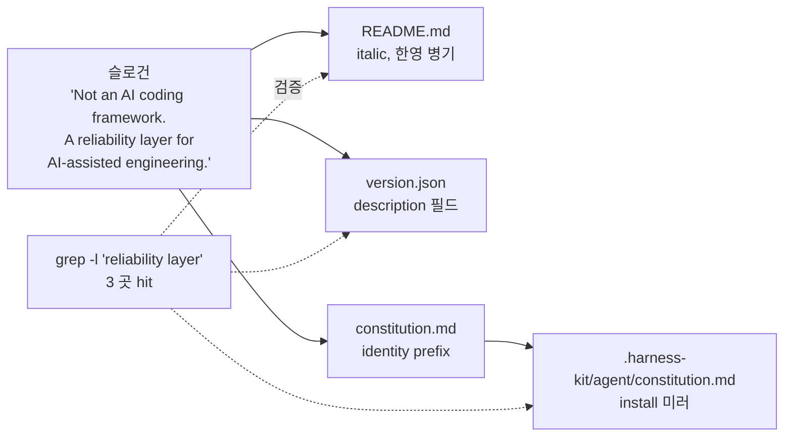

# Implementation Plan: spec-16-04

## 📋 Branch Strategy

- 신규 브랜치: `spec-16-04-reliability-positioning`
- **시작 지점**: `phase-16-reliability-layer` (phase base branch 모드)
- **PR Target**: `phase-16-reliability-layer` (main 직 PR 아님)
- 첫 task 가 브랜치 생성을 수행함

## 🛑 사용자 검토 필요 (User Review Required)

> 본 Plan 을 Accept 하기 전에 사용자가 명시적으로 확인해야 할 항목들.

> [!IMPORTANT]
> - [ ] **슬로건 문구**: `Not an AI coding framework. A reliability layer for AI-assisted engineering.` — period 포함, italic 강조.
> - [ ] **README 배치**: 한영 병기 (영문 italic slogan + 기존 한국어 부제 유지). 한국어 부제 제거 아님.
> - [ ] **constitution.md 위치**: `# Project Constitution` 직후, "The Constitution defines..." 문장 *직전* 1 줄 추가.
> - [ ] **PR target**: `phase-16-reliability-layer` (main 직 아님).

> [!WARNING]
> - [ ] **거버넌스 영문 유지**: constitution.md 한 줄 추가는 영문. 한국어 X (메모리 룰).
> - [ ] **install 미러 동기화**: `.harness-kit/agent/constitution.md` 도 동일 PR 에서 갱신.

## 🎯 핵심 전략 (Core Strategy)

### 아키텍처 컨텍스트



### 주요 결정

| 컴포넌트 | 전략 | 이유 |
|:---:|:---|:---|
| **슬로건 문구** | 영문 1 줄 고정 (`Not an AI coding framework. A reliability layer for AI-assisted engineering.`) | phase-16.md 의 spec-16-04 방향성 그대로 + 한영 병기 결정 일관 |
| **README 위치** | `# harness-kit` 직후 + italic + 빈 줄 + 기존 한국어 부제 | 영문 우선 시야 (외부 사용자) + 한국어 본문 진입 자연스러움 (내부 사용자) |
| **version.json 필드** | top-level `"description"` (npm/package.json convention) | machine-readable, 향후 marketplace 노출 시 활용 가능 |
| **constitution.md 위치** | `# Project Constitution` 직후 prefix 1 줄 | invariant laws 정의의 *왜* 가 됨 — "이 거버넌스가 무엇을 위한지" 가 lawer 정의보다 먼저 |
| **constitution.md 톤** | 영문 (governance 룰) | 메모리 룰 — 4 거버넌스 파일 영어 전용 |
| **install 미러 동기화** | `cp sources/governance/constitution.md .harness-kit/agent/constitution.md` | 도그푸딩 일관성, spec-16-02/03 동일 패턴 |

### 슬로건 문구 (확정)

> *Not an AI coding framework. A reliability layer for AI-assisted engineering.*

- 길이: 76 자 (1 줄 안정)
- 구조: *부정문 (무엇이 아닌가) → 긍정문 (무엇인가)* — 외부 진단의 표현 그대로
- 동사 없음 — 표어/슬로건 형식
- `reliability layer` 는 grep 검증 키 토큰

## 📂 Proposed Changes

### [README]

#### [MODIFY] `README.md` (상단 1 곳)

```diff
 # harness-kit

+*Not an AI coding framework. A reliability layer for AI-assisted engineering.*
+
 > Claude Code를 위한 SDD(Spec-Driven Development) 거버넌스 부트스트랩 툴킷
 > 한 번 만들어두고, 다음 프로젝트에서는 한 줄로 같은 하네스를 깐다.
```

### [version.json]

#### [MODIFY] `version.json`

```diff
-{"version": "0.9.1"}
+{
+  "version": "0.9.1",
+  "description": "Not an AI coding framework. A reliability layer for AI-assisted engineering."
+}
```

### [Governance]

#### [MODIFY] `sources/governance/constitution.md`

```diff
 # Project Constitution

+harness-kit is a reliability layer for AI-assisted engineering. The Constitution below defines the invariant laws that make this layer enforceable.
+
 The Constitution defines the invariant laws of this project. All Agents MUST comply with these rules at all times. This document takes precedence over all other instructions.
```

> 기존 첫 문장을 보존하면서 그 *위* 에 정체성 문장을 추가. 두 문장이 자연스럽게 연결됨 — "이게 reliability 계층이다" → "그래서 이런 invariant laws 가 필요하다".

#### [SYNC] `.harness-kit/agent/constitution.md`

`cp sources/governance/constitution.md .harness-kit/agent/constitution.md` (도그푸딩).

## 🧪 검증 계획 (Verification Plan)

### 단위 테스트 (필수)

bash 키트라 형식 검증을 grep / diff 로 수행.

```bash
# 1. 3 곳 모두 슬로건 토큰 hit (phase 시나리오 3)
grep -l "reliability layer" README.md version.json .harness-kit/agent/constitution.md
# 기대: 3 줄 출력

# 2. version.json 이 valid JSON
jq '.description' version.json
# 기대: "Not an AI coding framework. A reliability layer for AI-assisted engineering."

# 3. install 미러 동등성
diff sources/governance/constitution.md .harness-kit/agent/constitution.md
# 기대: 빈 출력

# 4. README 한국어 부제 보존
grep "SDD(Spec-Driven Development) 거버넌스" README.md
# 기대: hit

# 5. constitution.md identity 문장 hit
grep "harness-kit is a reliability layer" sources/governance/constitution.md
# 기대: hit
```

### 통합 테스트
Integration Test Required = no. Phase 통합 테스트 시나리오 3 이 본 spec 의 검증 그 자체 — 별 시나리오 없음.

### 수동 검증 시나리오

1. **README 시각 확인** — `head -10 README.md` 출력에 영문 italic slogan + 한국어 부제 순서로 보임.
2. **version.json valid** — `jq . version.json` 가 에러 없이 두 필드 출력.
3. **constitution 자연스러움** — 첫 두 문단이 *정체성 → invariant laws 정의* 흐름으로 연결됨.

## 🔁 Rollback Plan

- **문제 발생 시**: 본 PR revert. 슬로건 추가만 한 문서 변경이라 backward-compatible.
- **JSON 파싱 에러 시 (version.json)**: 즉시 revert. 다른 도구 (sdd, `_drift_kit_version`) 가 version.json 파싱에 의존.
- **데이터 영향**: 없음.

## 📦 Deliverables 체크

- [ ] task.md 작성 (다음 단계)
- [ ] 사용자 Plan Accept 받음
- [ ] (실행 후) 모든 task 완료
- [ ] (실행 후) walkthrough.md / pr_description.md ship
