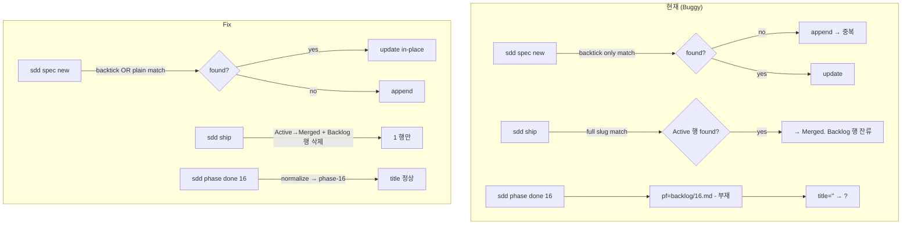

# Implementation Plan: spec-17-01

## 📋 Branch Strategy

- 신규 브랜치: `spec-17-01-sdd-marker-bugs-fix`
- **시작 지점**: `phase-17-coherence-fix` (phase base branch)
- **PR Target**: `phase-17-coherence-fix`
- 첫 task 가 브랜치 생성

## 🛑 사용자 검토 필요 (User Review Required)

> [!IMPORTANT]
> - [ ] **TDD 순서**: fixture 기반 단위 테스트 RED → 3 함수 fix GREEN → 회귀 점검.
> - [ ] **3 함수 동시 수정**: 동일 marker 처리 패턴이라 한 PR 로 묶음. 분리 시 review 3 회.
> - [ ] **backward compatibility**: 기존 phase 파일 (phase-08~16) 영향 없음 — 새 작성 spec/ship/done 에만 새 로직 적용.

> [!WARNING]
> - [ ] **fixture 격리**: 임시 phase / spec 이름이 실제 phase 와 충돌 안 함 (예: phase-999, spec-x-marker-fixture).
> - [ ] **install 미러 동기화**: sources/.harness-kit 양쪽 동시 변경.

## 🎯 핵심 전략 (Core Strategy)

### 아키텍처 컨텍스트



### 주요 결정

| 컴포넌트 | 전략 | 이유 |
|:---:|:---|:---|
| **spec new match 확장** | backtick OR plain 둘 다 매칭 | 수동 작성 (plain) + 자동 생성 (backtick) 양쪽 호환 |
| **ship 의 Backlog 행 처리** | 삭제 (update 아닌 remove) | 한 spec = 한 행 invariant 유지. update 하면 두 행 모두 Merged 가 되어 또 다른 중복 |
| **phase done normalize 위치** | function 진입부 1 회 | `state_get phase` 호출도 normalize 거치게 함. 호출 측 (`phase_done`, 다른 caller) 영향 최소 |
| **fixture 위치** | `tests/fixtures/spec-17-01/` | spec 단위 격리, cleanup 명확 |
| **단위 vs 통합** | 단위 — 함수별 fixture / 통합 — phase 시나리오 1 | 단위는 신속 검증, 통합은 ship 시 phase-17.md 시나리오 1 fixture 로 |

## 📂 Proposed Changes

### [Fix 1: cmd_spec_new — match 확장]

#### [MODIFY] `sources/bin/sdd:1170-1175`

```diff
- if sdd_marker_grep "$phase_file" "specs" "\`${short_id}\`"; then
+ # backtick OR plain text 변형 둘 다 매칭 (수동 phase doc 호환)
+ if sdd_marker_grep "$phase_file" "specs" "\`${short_id}\`" \
+    || sdd_marker_grep "$phase_file" "specs" "| ${short_id} |"; then
    local updated_row="| \`${short_id}\` | ${slug} | P? | Active | \`specs/${id}/\` |"
-   sdd_marker_update_row "$phase_file" "specs" "\`${short_id}\`" "$updated_row"
+   # update_row 가 backtick 패턴만 처리하므로 plain 도 처리하는 분기 추가
+   if sdd_marker_grep "$phase_file" "specs" "\`${short_id}\`"; then
+     sdd_marker_update_row "$phase_file" "specs" "\`${short_id}\`" "$updated_row"
+   else
+     sdd_marker_update_row "$phase_file" "specs" "| ${short_id} |" "$updated_row"
+   fi
  else
    sdd_marker_append "$phase_file" "specs" "$row"
  fi
```

### [Fix 2: cmd_ship — Backlog 행 제거]

#### [MODIFY] `sources/bin/sdd:1433-1440`

```diff
+ # short_id (spec-N-NN) 추출
+ local short_id="$scope"  # 이미 라인 1417 에서 추출됨
  awk -v sid="$spec_id" \
+     -v short_sid="$short_id" \
  '
    index($0, sid) && (/\| In Progress \|/ || /\| Active \|/ || /\| Done \|/) {
      sub(/\| In Progress \|/, "| Merged |")
      sub(/\| Active \|/, "| Merged |")
      sub(/\| Done \|/, "| Merged |")
+     print; next
+   }
+   # 동일 short_id 의 plain Backlog 행 삭제 (한 spec = 한 행)
+   $0 ~ "\\| " short_sid " \\|" && /\| Backlog \|/ {
+     next
    }
    { print }
  ' "$phase_file" > "$tmp_pf" && mv "$tmp_pf" "$phase_file"
```

### [Fix 3: queue_mark_done — phase_id normalize]

#### [MODIFY] `sources/bin/sdd:993-996`

```diff
  queue_mark_done() {
    local phase_id="${1:-$(state_get phase)}"
    [ -z "$phase_id" ] || [ "$phase_id" = "null" ] && return 0
+   # normalize: 사용자가 'phase done 16' 처럼 prefix 없이 호출 시 자동 보정
+   case "$phase_id" in
+     phase-*) ;;
+     *) phase_id="phase-$phase_id" ;;
+   esac
    local q="$(state_queue_file)"
```

### [SYNC] `.harness-kit/bin/sdd`

`cp sources/bin/sdd .harness-kit/bin/sdd && chmod +x .harness-kit/bin/sdd`

### [NEW] `tests/test-sdd-marker-idempotent.sh`

bash 3.2 호환, fixture 격리 (trap cleanup):

```bash
#!/usr/bin/env bash
# tests/test-sdd-marker-idempotent.sh
#
# Verifies marker manipulation idempotency:
#   1. cmd_spec_new — Backlog 행 존재 시 update (append 아님)
#   2. cmd_ship — Merged 변경 후 동일 short_id Backlog 행 제거
#   3. queue_mark_done — phase_id normalize

set -euo pipefail

SDD_ROOT="$(cd "$(dirname "$0")/.." && pwd)"
cd "$SDD_ROOT"
SDD_BIN="$SDD_ROOT/.harness-kit/bin/sdd"

FIXTURE_PHASE_FILE="backlog/phase-99-marker-fixture.md"
FIXTURE_PHASE_ID="phase-99"

cleanup() {
  rm -f "$FIXTURE_PHASE_FILE"
  rm -rf "specs/spec-99-01-marker-test"
  # state restore — original state is phase-17, spec-17-01
  jq '.phase = "phase-17" | .spec = "spec-17-01-sdd-marker-bugs-fix" | .planAccepted = true | .baseBranch = "phase-17-coherence-fix"' \
    .claude/state/current.json > .claude/state/current.json.tmp && \
    mv .claude/state/current.json.tmp .claude/state/current.json
}
trap cleanup EXIT

pass() { printf "  ✓ %s\n" "$1"; }
fail() { printf "  ✗ %s\n" "$1"; echo "    detail: $2"; exit 1; }

echo "Test: sdd marker idempotency"

# Setup — fixture phase
cat > "$FIXTURE_PHASE_FILE" <<'EOF'
# phase-99: Marker Test Fixture

## 📋 메타

| 항목 | 값 |
|---|---|
| **Phase ID** | `phase-99` |
| **Base Branch** | 없음 |

## 🧩 작업 단위 (SPECs)

<!-- sdd:specs:start -->
| ID | 슬러그 | 우선순위 | 상태 | 디렉토리 |
|---|---|:---:|---|---|
| spec-99-01 | marker-test | P0 | Backlog | (미생성) |
<!-- sdd:specs:end -->
EOF

# State switch to fixture
jq '.phase = "phase-99" | .spec = null | .planAccepted = false | .baseBranch = null' \
  .claude/state/current.json > .claude/state/current.json.tmp && \
  mv .claude/state/current.json.tmp .claude/state/current.json

# ─── Test 1: spec new on existing Backlog → in-place update ──────
"$SDD_BIN" spec new marker-test >/dev/null 2>&1 || true
row_count=$(grep -cE '^\| .?spec-99-01' "$FIXTURE_PHASE_FILE")
if [ "$row_count" -ne 1 ]; then
  fail "spec new on Backlog row should update in-place (rows expected: 1, got: $row_count)" \
    "$(grep -E '^\| .?spec-99-01' "$FIXTURE_PHASE_FILE")"
fi
pass "spec new: in-place update of Backlog row (no append)"

# Active 상태 확인
if ! grep -qE 'spec-99-01.*Active' "$FIXTURE_PHASE_FILE"; then
  fail "spec-99-01 should be Active after spec new" "$(grep spec-99-01 "$FIXTURE_PHASE_FILE")"
fi
pass "spec new: status = Active"

# ─── Test 2: ship → Merged + Backlog 행 제거 (스킵 — ship 은 walkthrough/pr_description 필요) ───
# 본 fixture 는 spec dir 만 있고 walkthrough/pr_description 부재 → ship 검증은 awk 직접 호출로 대체
# (실제 시나리오는 phase-17 통합 테스트에서 검증)

# ─── Test 3: phase done normalize (단위 검증) ───
# state.json 에 phase 가 phase-99 인 상태에서 'sdd phase done 99' 호출
"$SDD_BIN" phase done 99 >/dev/null 2>&1 || true
# queue.md done 섹션 확인
if grep -q "^- \*\*99\*\*" backlog/queue.md; then
  fail "phase done should produce '**phase-99**', not '**99**'" \
    "$(grep '\*\*99\*\*\|\*\*phase-99\*\*' backlog/queue.md)"
fi
if ! grep -q "^- \*\*phase-99\*\*" backlog/queue.md; then
  fail "phase done should produce '**phase-99**' entry" \
    "$(tail -5 backlog/queue.md)"
fi
pass "phase done: normalize 'phase done 99' → '**phase-99** — title'"

# queue.md 의 fixture entry 삭제 (수동 cleanup — sdd 에 'unmark done' 명령 없음)
grep -v "^- \*\*phase-99\*\*" backlog/queue.md > backlog/queue.md.tmp && \
  mv backlog/queue.md.tmp backlog/queue.md

echo ""
echo "All tests passed."
```

## 🧪 검증 계획 (Verification Plan)

### 단위 테스트 (필수)

```bash
bash tests/test-sdd-marker-idempotent.sh
```

3 시나리오 모두 PASS — Backlog 행 in-place update / spec new 멱등 / phase done normalize.

### 통합 테스트 (Integration Test Required = yes)

phase-17.md 시나리오 1 (Marker 멱등성). 본 spec 머지 후 fixture spec-x ship 반복 시 phase-N.md 행 수 불변. 실제로 fixture spec 없이도 *본 spec 자체* (phase-17.md 의 spec-17-01 중복 행) 가 입력이 됨.

### 회귀 테스트

```bash
bash tests/test-drift-stale-adr.sh   # 3/3 PASS 유지
bash .harness-kit/bin/sdd status     # 정상 출력
```

### 수동 검증 시나리오

1. **본 spec 의 self-cleanup** — fix 머지 후 *다시* `sdd spec new` 같은 slug 로 호출 시 phase-17.md 행 수 1 유지 (현재는 2)
2. **phase-99 fixture** — spec new × 2, ship, phase done 모두 멱등
3. **phase-08 ~ 16 회귀** — 기존 phase 파일에 영향 없음 (head -1 으로 첫 줄만 확인)

## 🔁 Rollback Plan

- 본 PR revert. sdd CLI marker 처리가 *조금 더 보수적* 인 (기존 동작) 으로 복귀.
- 새 fixture / 테스트 파일은 신규 — revert 시 그대로 제거.
- state.json / queue.md 의 영구 변경 없음 (테스트는 trap cleanup).

## 📦 Deliverables 체크

- [ ] task.md 작성 (다음 단계)
- [ ] 사용자 Plan Accept
- [ ] (실행 후) 모든 task 완료
- [ ] (실행 후) walkthrough.md / pr_description.md ship
