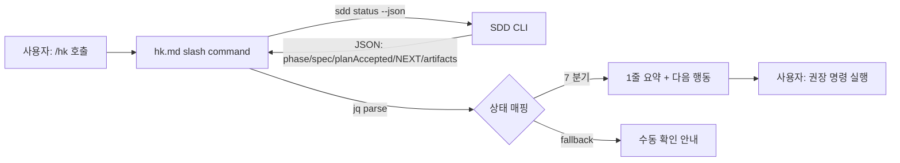

# Implementation Plan: spec-17-02

## 📋 Branch Strategy

- 신규 브랜치: `spec-17-02-accessibility-install-and-entry`
- **시작 지점**: `phase-17-coherence-fix` (phase base branch)
- **PR Target**: `phase-17-coherence-fix`
- 첫 task 가 브랜치 생성

## 🛑 사용자 검토 필요 (User Review Required)

> [!IMPORTANT]
> - [ ] **`/hk` = read-only 안내** — state 변경 동작 (Plan Accept / Ship) 은 기존 슬래시 커맨드 호출. 본 spec 은 추천만.
> - [ ] **`/hk` 와 `/hk-align` 공존** — 대체 아님. `/hk-align` (세션 시작 부트스트랩) vs `/hk` (지속적 사용 안내) 역할 분리.
> - [ ] **7 상태 매핑** — spec.md §Functional Requirements 표 그대로. fallback 1 상태 추가.
> - [ ] **README minor 갱신만** — Step 1 (line 126 주변) 3-5 줄. install 섹션 / 본문 구조 유지.

> [!WARNING]
> - [ ] **install 검증** — get.sh dry-run. 실제 install 안 함. URL/HTTPS 변경 없음.
> - [ ] **bash 3.2+ 호환** — `/hk` 의 bash 부분 (slash command 가 markdown + bash code blocks 라).

## 🎯 핵심 전략 (Core Strategy)

### 아키텍처 컨텍스트



### 주요 결정

| 컴포넌트 | 전략 | 이유 |
|:---:|:---|:---|
| **slash command 본문 형식** | markdown + bash code blocks (sdd status --json 직접 호출 + jq 파싱) | 기존 `hk-*.md` 패턴과 동일. 추가 dependency 없음 |
| **state 매핑 알고리즘** | jq 표현식 1 개로 분기 + bash case statement | 단일 jq 호출 → bash case. 파일 1 개로 self-contained |
| **artifacts 검사** | `sdd status --json` 의 `artifacts` 필드 활용 (있는지 확인) | sdd CLI 가 이미 ✓/✗ 출력 — 신뢰 |
| **`/hk-align` 과의 관계** | 보완 (대체 아님) | 두 진입점 다른 역할 |
| **fallback 단계** | sdd 부재 → 1 줄 안내 + 수동 명령 제시 | graceful degradation |
| **install 검증 방식** | get.sh dry-run (변경 없음) | 실제 install 안 하고 작동 시연만 |
| **README 변경 위치** | Step 1 직후 한 줄 추가 | 본문 구조 유지, 최소 침습 |

## 📂 Proposed Changes

### [NEW] `sources/commands/hk.md`

`/hk` 슬래시 커맨드 본문 (예상 구조):

```markdown
---
description: 지금 무엇을 해야 하나 — sdd status 기반 다음 행동 1 줄 안내
---

현재 SDD 상태를 읽고, 지금 권장되는 다음 행동을 1 줄로 안내합니다.
세션 시작 시에는 `/hk-align` (전체 부트스트랩), 작업 중에는 `/hk` (가벼운 다음 행동).

## 1. 상태 읽기

```bash
bash .harness-kit/bin/sdd status --json
```

(JSON 출력 시 본 커맨드가 jq 로 파싱하여 분기)

## 2. 7 상태 매핑

| state | 행동 |
| phase=null | "Active phase 없음 — 새 phase 시작: /hk-align 또는 sdd phase new <slug>" |
| phase, spec=null, NEXT 있음 | "다음 spec 대기: sdd spec new <slug> (NEXT: <id>)" |
| phase, spec=null, NEXT 없음 | "Phase 완료 가능: /hk-phase-ship" |
| phase, spec, planAccepted=false, artifacts 미완 | "spec/plan/task 작성 필요" |
| phase, spec, planAccepted=false, artifacts ✓ | "Plan Accept: /hk-plan-accept (또는 /hk-spec-critique)" |
| phase, spec, planAccepted=true, walkthrough/pr_desc 미완 | "Strict Loop 진행 — task.md 의 다음 task" |
| phase, spec, planAccepted=true, Ship-ready | "Ship: /hk-ship" |
| fallback (sdd 없음 / 파싱 실패) | "sdd 상태 확인 불가 — bash .harness-kit/bin/sdd status 수동 확인" |

## 3. 출력 형식

```
📍 [현재 상태 1 줄 요약]
→ [권장 행동 1 줄]

(drift / 진단 있으면 1 줄 더)
```

## 4. 사용 예시

(slash command 자기 문서화 — 첫 사용자 onboarding)
```

#### [SYNC] `.claude/commands/hk.md`

install 미러 — `cp sources/commands/hk.md .claude/commands/hk.md`.

### [MODIFY] `README.md`

`/hk-align` 설명 직후 (Step 1 안에 또는 직후) `/hk` 안내 3-5 줄 추가:

```diff
 ### Step 1: Claude Code 시작 + `/hk-align`

 ...

 Claude Code 안에서 `/hk-align`을 실행합니다. 이 커맨드가 자동으로:
 ...

+#### 작업 중 다음 행동이 헷갈리면 — `/hk`
+
+`/hk-align` 은 *세션 시작 시* 전체 컨텍스트 부트스트랩이고, `/hk` 는 *작업 중* 현재 상태에서 권장되는 다음 행동을 1 줄로 알려줍니다 (Plan Accept 가 필요한지, Ship 가능한지, phase 가 완료 됐는지 등). 13 개 슬래시 커맨드를 외울 필요 없음.
+
+```bash
+/hk
+```
+
```

### [Verification] `get.sh` 동작 검증 (수정 없음)

```bash
# Fixture target — 실제 변경 없음 (--dry-run)
mkdir -p /tmp/hk-install-fixture
curl -fsSL https://raw.githubusercontent.com/Changsik00/harness-kit/main/get.sh \
  | bash -s -- --dry-run --yes /tmp/hk-install-fixture
# 기대: "dry-run" 출력 + 변경 사항 list, 실제 파일 생성 없음
rm -rf /tmp/hk-install-fixture
```

## 🧪 검증 계획 (Verification Plan)

### 단위 테스트 (필수)

```bash
# 1. hk.md 파일 존재
test -f sources/commands/hk.md
test -f .claude/commands/hk.md
diff sources/commands/hk.md .claude/commands/hk.md   # identical

# 2. 7 상태 매핑 키워드 grep — 본문에 각 상태 키워드 hit
grep -c "Active phase 없음" sources/commands/hk.md   # ≥1
grep -c "Plan Accept" sources/commands/hk.md         # ≥1
grep -c "/hk-ship" sources/commands/hk.md            # ≥1
grep -c "/hk-phase-ship" sources/commands/hk.md      # ≥1

# 3. README 갱신 — /hk 안내 hit
grep -c "/hk\`" README.md                            # ≥2 (Step 1 + 새 섹션)
grep -q "세션 시작 시" README.md && grep -q "작업 중" README.md

# 4. install 검증 — get.sh dry-run 성공 (exit 0)
mkdir -p /tmp/hk-install-fixture
curl -fsSL https://raw.githubusercontent.com/Changsik00/harness-kit/main/get.sh \
  | bash -s -- --dry-run --yes /tmp/hk-install-fixture
rm -rf /tmp/hk-install-fixture
```

### 통합 테스트 (Integration Test Required = yes)

phase-17 시나리오 3 (단일 명령 install + 진입점) 의 단위 구현:

```bash
# Given: 현 phase-17 상태 (Active spec = spec-17-02)
# When: /hk 시뮬레이션 (sdd status --json + 매핑 로직)
# Then: 출력에 "spec/plan/task 작성 필요" 또는 "Plan Accept" 안내

# 본 spec 의 ship 전 단위 시연으로 검증.
```

### 수동 검증 시나리오

1. **현 상태 (`phase-17`, `spec-17-02`, planAccepted=false, artifacts 진행 중)** — `/hk` 가 "Plan Accept 필요" 안내
2. **state mock — phase=null** — `/hk` 가 "Active phase 없음" 안내
3. **install dry-run** — `get.sh` 출력에 변경 list, 실제 파일 0
4. **README 가독성** — Step 1 출력에 `/hk-align` / `/hk` 차이 분명히 보임

## 🔁 Rollback Plan

- 본 PR revert. 추가만 한 변경이라 기존 동작 영향 없음.
- `/hk` 슬래시 커맨드 없어도 `/hk-align` + 13 개 기존 커맨드 그대로 동작.

## 📦 Deliverables 체크

- [ ] task.md 작성 (다음 단계)
- [ ] 사용자 Plan Accept
- [ ] (실행 후) 모든 task 완료
- [ ] (실행 후) walkthrough.md / pr_description.md ship
