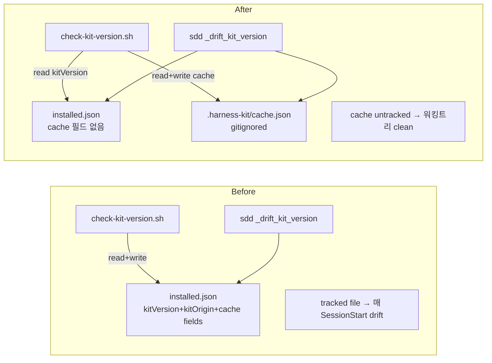

# Implementation Plan: spec-17-03

## 📋 Branch Strategy

- 신규 브랜치: `spec-17-03-internal-reliability-infra`
- **시작 지점**: `phase-17-coherence-fix`
- **PR Target**: `phase-17-coherence-fix`

## 🛑 사용자 검토 필요 (User Review Required)

> [!IMPORTANT]
> - [ ] **3 묶음 한 spec** (cache 분리 / phase integration test / doctor 확장) + (선택) helper 일반화. 한 PR 로 review.
> - [ ] **Cache migration silent** — 기존 installed.json 의 캐시 필드는 첫 hook 실행 시 cache.json 으로 이동 + 제거. 사용자 액션 0.
> - [ ] **`tests/test-phase16-integration.sh` 가 fixture 격리** (ADR-999-phase16-integration 같은 고유 slug + trap cleanup).
> - [ ] **doctor 확장 optional** — `docs/rca/` 부재 시 silent skip, 존재 시 검증. 기존 사용자 false negative 0.

> [!WARNING]
> - [ ] **install.sh / update.sh 의 installed.json 생성 로직 변경** — 새 installed.json 에 lastVersionCheck/latestKnownVersion 미포함.
> - [ ] **bash 3.2+ 호환** — cache.json 처리 / jq filter 모두.

## 🎯 핵심 전략 (Core Strategy)

### 아키텍처 컨텍스트



### 주요 결정

| 컴포넌트 | 전략 | 이유 |
|:---:|:---|:---|
| **cache 파일 위치** | `.harness-kit/cache.json` | install dir 안에 — 다른 install 자산과 함께 grouping. `.harness-kit/` 전체를 .gitignore 하지 않으므로 cache.json 만 별도 무시 |
| **migration 시점** | hook 첫 실행 시 | install.sh 변경보다 hook 변경이 자연스러움 — 기존 사용자도 SessionStart 한 번이면 자동 |
| **doctor `docs/rca` 부재 처리** | silent skip | check_warn 도 noise — 사용자가 phase-16 산출물 install 안 받았을 수도 있음. 존재 시만 검증 |
| **phase16-integration fixture slug** | `ADR-999-phase16-integration` (spec-16-03 의 ADR-999-fixture 와 다른 slug) | trap cleanup 안전 + 다른 테스트와 race 없음 |
| **helper 일반화 (선택)** | 시간 남으면 — 호출 측 단순화 우선 | 본 spec 의 3 묶음이 핵심 |
| **install 미러** | sources + .harness-kit 양쪽 sync | spec-16/17 패턴 |

## 📂 Proposed Changes

### [Fix 1: Cache 분리]

#### [MODIFY] `sources/hooks/check-kit-version.sh`

read/write 경로 + migration 로직:

```bash
# 추가: cache.json 정의 + migration
CACHE_JSON="$HARNESS_ROOT/.harness-kit/cache.json"

# Migration (1 회만): installed.json 에 캐시 필드 있으면 cache.json 으로 이동
if [ -f "$INSTALLED_JSON" ]; then
  has_legacy=$(jq -r 'has("lastVersionCheck") or has("latestKnownVersion")' "$INSTALLED_JSON" 2>/dev/null || echo "false")
  if [ "$has_legacy" = "true" ]; then
    legacy_last=$(jq -r '.lastVersionCheck // empty' "$INSTALLED_JSON" 2>/dev/null)
    legacy_known=$(jq -r '.latestKnownVersion // empty' "$INSTALLED_JSON" 2>/dev/null)
    # cache.json 작성
    if [ -n "$legacy_last" ] || [ -n "$legacy_known" ]; then
      jq -n --arg ts "$legacy_last" --arg v "$legacy_known" \
        '{lastVersionCheck: $ts, latestKnownVersion: $v}' > "$CACHE_JSON"
    fi
    # installed.json 에서 제거
    tmp=$(jq 'del(.lastVersionCheck, .latestKnownVersion)' "$INSTALLED_JSON")
    [ -n "$tmp" ] && echo "$tmp" > "$INSTALLED_JSON"
  fi
fi

# 그 후 read 경로: cache.json 우선, 부재 시 빈 값
[ -f "$CACHE_JSON" ] && {
  last_check=$(jq -r '.lastVersionCheck // empty' "$CACHE_JSON" 2>/dev/null)
  latest_known=$(jq -r '.latestKnownVersion // empty' "$CACHE_JSON" 2>/dev/null)
}

# write 경로: cache.json 갱신 (installed.json 미터치)
if [ -n "$latest" ]; then
  now_iso=$(date -u +%Y-%m-%dT%H:%M:%SZ)
  jq -n --arg ts "$now_iso" --arg v "$latest" \
    '{lastVersionCheck: $ts, latestKnownVersion: $v}' > "$CACHE_JSON"
fi
```

#### [MODIFY] `sources/bin/sdd` `_drift_kit_version()` (line 285-341)

동일 패턴 — `CACHE_JSON` 정의 + read/write 경로 전환. installed.json 은 kitVersion / kitOrigin 만 read.

#### [SYNC] install mirrors:
- `.harness-kit/hooks/check-kit-version.sh`
- `.harness-kit/bin/sdd`

#### [MODIFY] `.gitignore`

```diff
+ .harness-kit/cache.json
```

#### [MODIFY] `install.sh` (선택)

새 installed.json 작성 시 두 캐시 필드 미포함. 그러나 hook 의 migration 으로도 충분 — install.sh 미변경 가능 (기존 사용자도 hook 첫 실행으로 정리).

### [Fix 2: Phase integration test]

#### [NEW] `tests/test-phase16-integration.sh`

```bash
#!/usr/bin/env bash
# tests/test-phase16-integration.sh
#
# phase-16.md 의 통합 시나리오 3 개 자동 검증:
#   1. Knowledge Type closure (docs/rca + docs/decisions 의 type 정규 어휘)
#   2. Stale ADR detection (fixture 주입 → drift 출력)
#   3. Reliability layer slogan 3 곳 hit (README + version.json + constitution)
#
# 명명 규약 `tests/test-phase{N}-integration.sh` — 후속 phase 동일 패턴.

set -euo pipefail
SDD_ROOT="$(cd "$(dirname "$0")/.." && pwd)"
cd "$SDD_ROOT"

FIXTURE_ADR="docs/decisions/ADR-999-phase16-integration-fixture.md"
cleanup() { rm -f "$FIXTURE_ADR"; }
trap cleanup EXIT

pass() { printf "  ✓ %s\n" "$1"; }
fail() { printf "  ✗ %s\n" "$1"; echo "    detail: $2"; exit 1; }

echo "Test: phase-16 integration (3 scenarios)"

# ─── Scenario 1: Knowledge Type closure ───
types=$(grep -rh "^type:" docs/rca docs/decisions 2>/dev/null | sort -u | awk -F': ' '{print $2}')
allowed="decision invariant failure-pattern convention tradeoff"
for t in $types; do
  echo "$allowed" | grep -qw "$t" || fail "Scenario 1: out-of-closure type '$t'" "$types"
done
pass "Scenario 1: Knowledge Type closure (vocabulary 안)"

# ─── Scenario 2: Stale ADR detection ───
cat > "$FIXTURE_ADR" <<'EOF'
---
type: decision
status: accepted
---
Missing: `src/removed-module-phase16-integration.ts`
EOF
output=$(HARNESS_DRIFT_FETCH=0 bash .harness-kit/bin/sdd status 2>&1)
cleanup
echo "$output" | grep -q "stale ADR: 1 (missing-path)" \
  || fail "Scenario 2: fixture should produce 'stale ADR: 1'" "$output"
pass "Scenario 2: Stale ADR detection (fixture → drift)"

# ─── Scenario 3: Reliability layer slogan ───
hits=$(grep -l "reliability layer" README.md version.json .harness-kit/agent/constitution.md 2>/dev/null | wc -l | tr -d ' ')
[ "$hits" -eq 3 ] || fail "Scenario 3: expected 3 hits, got $hits" "files with 'reliability layer'"
pass "Scenario 3: 'reliability layer' 3 곳 hit"

echo ""
echo "All 3 scenarios passed."
```

### [Fix 3: Doctor 확장]

#### [MODIFY] `doctor.sh` (line 67 + line 81)

```diff
-for d in .harness-kit .harness-kit/agent .harness-kit/agent/templates .harness-kit/bin .harness-kit/hooks .claude/commands .claude/state "$_BACKLOG_DIR" "$_SPECS_DIR"; do
+for d in .harness-kit .harness-kit/agent .harness-kit/agent/templates .harness-kit/bin .harness-kit/hooks .claude/commands .claude/state "$_BACKLOG_DIR" "$_SPECS_DIR"; do
   if [ -d "$TARGET/$d" ]; then
     check_pass "$d"
   else
     check_fail "$d 없음"
   fi
 done
+# Optional dirs (phase-16 산출물 — 부재 시 silent skip)
+for d in docs/rca docs/decisions; do
+  [ -d "$TARGET/$d" ] && check_pass "$d (optional)"
+done

-for f in queue.md phase.md spec.md plan.md task.md walkthrough.md pr_description.md; do
+for f in queue.md phase.md spec.md plan.md task.md walkthrough.md pr_description.md rca.md adr.md; do
   [ -f "$TARGET/.harness-kit/agent/templates/$f" ] && check_pass ".harness-kit/agent/templates/$f" || check_fail ".harness-kit/agent/templates/$f 없음"
 done
```

#### [SYNC] `.harness-kit/bin/doctor.sh` (있다면 — 확인 필요. 본 저장소는 root 의 doctor.sh 가 사용됨)

### [Fix 4 (선택): helper 일반화]

#### [MODIFY] `sources/bin/sdd` `sdd_marker_grep`

backtick OR plain 두 패턴 모두 매칭하도록 일반화. spec-17-01 의 호출 측 분기 (cmd_spec_new) 단순화.

```bash
# (변경 예상 — 정확한 코드는 helper 함수 검토 후 결정)
sdd_marker_grep() {
  local file="$1" marker="$2" pattern="$3"
  # 기존: pattern 그대로 grep
  # 변경: backtick 형식 pattern 도 plain 으로 grep (또는 호출 측이 두 변형 모두 전달)
  ...
}
```

(시간 남으면 — 본 spec scope 의 끝부분)

## 🧪 검증 계획 (Verification Plan)

### 단위 테스트

```bash
# 1. cache.json 분리 검증
bash .harness-kit/hooks/check-kit-version.sh 2>/dev/null
test -f .harness-kit/cache.json
jq -e '.lastVersionCheck and .latestKnownVersion' .harness-kit/cache.json
# installed.json 에서 두 필드 없음 확인
jq -e 'has("lastVersionCheck") | not' .harness-kit/installed.json
jq -e 'has("latestKnownVersion") | not' .harness-kit/installed.json

# 2. .gitignore 검증
grep -q "cache.json" .gitignore
git check-ignore .harness-kit/cache.json   # → exit 0 (ignored)

# 3. 워킹트리 cleanliness
git status --porcelain | grep installed.json && echo "FAIL: installed.json drift" || echo "PASS: clean"

# 4. phase16 integration script
bash tests/test-phase16-integration.sh   # 3/3 PASS

# 5. doctor 확장
bash doctor.sh | grep -E "rca.md|adr.md"   # ≥2 hits
```

### 통합 테스트 (Integration Test Required = yes)

phase-17.md 시나리오 2 (워킹트리 cleanliness + integration self-test):
- SessionStart 후 `git status --porcelain` 빈 출력
- `bash tests/test-phase16-integration.sh` 3/3 PASS

### 회귀 테스트

```bash
bash tests/test-sdd-marker-idempotent.sh   # 3/3 PASS
bash tests/test-drift-stale-adr.sh          # 3/3 PASS
bash .harness-kit/bin/sdd status            # 정상 출력 (drift 0)
```

## 🔁 Rollback Plan

- 본 PR revert. 캐시 분리 / 신규 테스트 / doctor 확장 모두 추가 변경 — 기존 동작 유지.
- Migration 은 *1 회만* — revert 후 다음 hook 실행에서 다시 installed.json 에 캐시 필드 작성 가능 (backward compat 양방향).

## 📦 Deliverables 체크

- [ ] task.md 작성 (다음 단계)
- [ ] 사용자 Plan Accept
- [ ] (실행 후) 모든 task 완료
- [ ] (실행 후) walkthrough.md / pr_description.md ship
