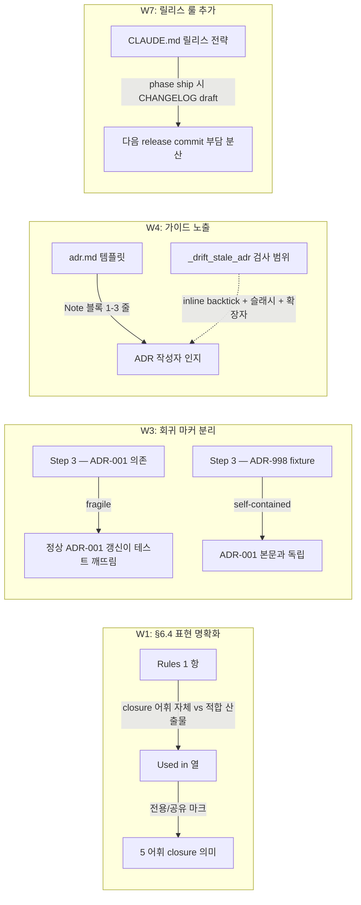

# Implementation Plan: spec-17-04

## 📋 Branch Strategy

- 신규 브랜치: `spec-17-04-governance-test-coherence`
- **시작 지점**: `phase-17-coherence-fix`
- **PR Target**: `phase-17-coherence-fix`

## 🛑 사용자 검토 필요 (User Review Required)

> [!IMPORTANT]
> - [ ] **4 항목 한 spec 묶음** (W1 §6.4 표현 / W3 fixture 분리 / W4 ADR 가이드 / W7 CHANGELOG 룰) — review 1 회.
> - [ ] **W1 은 문서 표현만 명확화** — closure 어휘 자체 변경 없음. ADR 승격 없이 §6.4 표 + Rules 표현 정리.
> - [ ] **W3 은 회귀 마커를 fixture-based 로 전환** — 기존 ADR-001 본문 변경에 테스트 종속 안 함. fixture slug 는 `ADR-998-valid-paths-fixture` (spec-16-03 의 ADR-999 와 다른 slug).
> - [ ] **W4 는 ADR 템플릿에 가이드 1-3 줄 추가** — 검사 로직 확장 아님 (spec-16-03 의 의도된 한계 유지). 인간 작성자 silent gap 해소.
> - [ ] **W7 은 CLAUDE.md "릴리스 전략" 섹션에 1-2 줄 추가** — CHANGELOG.md backfill 은 본 spec 에서 안 함 (다음 release commit 시점).

> [!WARNING]
> - [ ] **install 미러 sync** — constitution.md / adr.md 변경 시 `.harness-kit/agent/` 양쪽 동기화 필수.
> - [ ] **회귀 0** — test-sdd-marker-idempotent / test-drift-stale-adr / test-phase16-integration 3 종 모두 PASS 유지.

## 🎯 핵심 전략 (Core Strategy)

### 아키텍처 컨텍스트



### 주요 결정

| 컴포넌트 | 전략 | 이유 |
|:---:|:---|:---|
| **W1 §6.4 변경 범위** | "Used in" 열 표현만 명확화 (전용/공유 마크) + Rules 1 항 부연 1 줄 | closure 어휘 자체 변경 없음 → ADR 승격 불필요. 표 표현 모호성만 해소 |
| **W1 변경 위치** | sources/governance/constitution.md → install 미러 sync | 거버넌스 원본 변경은 항상 양쪽 sync |
| **W3 fixture slug** | `ADR-998-valid-paths-fixture` | spec-16-03 의 ADR-999-stale-fixture / spec-17-03 의 ADR-999-phase16-integration-fixture 와 다른 번호. 동시 실행 race 회피 |
| **W3 fixture 본문** | backtick 경로는 *항상 존재* 파일만 (예: `sources/bin/sdd`, `README.md`) | stale 검사 시 0 hit → "stale ADR" 라인 부재 검증 |
| **W4 가이드 위치** | adr.md 템플릿 frontmatter 다음, Context 섹션 앞에 Note 블록 (`> **Note:** ...`) | 작성자 시선이 frontmatter → 본문 진입 직전에 노출. install 미러 sync |
| **W4 가이드 내용** | *inline backtick + 슬래시 + 확장자* 만 검사 대상 명시. code fence 안 / 슬래시 없는 토큰 / URL 은 무시 | spec-16-03 의 의도된 한계를 노출 — silent gap 제거 |
| **W7 룰 위치** | CLAUDE.md "릴리스 전략" 섹션의 "룰" 하위에 bullet 1-2 줄 | 기존 섹션 구조 유지. 별 섹션 신설 안 함 |
| **W7 적용 시점** | 다음 release (post-phase-17) 가 첫 실증 | 본 spec 은 *룰만* 추가 — 실 entry backfill 안 함 |

### 📑 ADR 후보

- [ ] ADR 가치 있는 결정 있음
- [x] **없음** — 본 spec 의 4 항목 모두 *문서 표현 명확화 / 테스트 fixture 분리 / 단발 룰 추가*. invariant 변경 / 장기 결정 없음. W1 의 §6.4 표현 정리는 closure 어휘 자체 (ADR 가치) 가 아닌 *표 표현* 만 손댐.

## 📂 Proposed Changes

### [W1: §6.4 closure 표 표현 명확화]

#### [MODIFY] `sources/governance/constitution.md` §6.4

```diff
 | Type | Used in | When to apply |
 |---|---|---|
-| `decision` | ADR | A non-trivial design choice with rationale; long-lived. |
-| `invariant` | ADR / runbook-style notes | A property the system MUST preserve (e.g. domain ≠ infra). |
-| `failure-pattern` | RCA | A recurring failure with reproduction + prevention. |
-| `convention` | ADR / style guide | A naming/structure rule adopted for consistency. |
-| `tradeoff` | ADR | A choice with explicit cost on the rejected side. |
+| `decision` | ADR only | A non-trivial design choice with rationale; long-lived. |
+| `invariant` | ADR + runbook-style notes (shared) | A property the system MUST preserve (e.g. domain ≠ infra). |
+| `failure-pattern` | RCA only | A recurring failure with reproduction + prevention. |
+| `convention` | ADR + style guide (shared) | A naming/structure rule adopted for consistency. |
+| `tradeoff` | ADR only | A choice with explicit cost on the rejected side. |

 Rules:
-- `type:` MUST be present in any frontmatter that adopts this vocabulary (RCA and ADR; both adopt the closure).
+- `type:` MUST be present in any frontmatter that adopts this vocabulary. Both RCA and ADR adopt the same closure (5 values), but each artifact MUST use only the types marked applicable in the "Used in" column above (e.g. ADR MUST NOT use `failure-pattern`; RCA MUST NOT use `decision`).
 - Values outside the set are a violation — grep tools rely on closure.
 - Vocabulary changes (add / rename / remove) are themselves architecture decisions — record as an ADR with `type: decision`.
```

#### [SYNC] `.harness-kit/agent/constitution.md`

동일 변경 미러.

### [W3: test-drift-stale-adr.sh 회귀 마커 fixture-based 전환]

#### [MODIFY] `tests/test-drift-stale-adr.sh` Step 3

```diff
 # ─── Step 3: regression after fixture removal ────────────────────
-cleanup
-output=$(HARNESS_DRIFT_FETCH=0 bash "$SDD_BIN" status 2>&1 || true)
-if echo "$output" | grep -q "stale ADR"; then
-  fail "ADR-001 regression — existing ADR paths should all be valid" "$output"
-fi
-pass "regression: ADR-001 paths all valid"
+# Self-contained fixture: ADR with only-valid backtick paths → no stale line.
+VALID_FIXTURE="docs/decisions/ADR-998-valid-paths-fixture.md"
+cleanup_valid() { rm -f "$VALID_FIXTURE"; }
+trap 'cleanup; cleanup_valid' EXIT
+
+cleanup
+cat > "$VALID_FIXTURE" <<'EOF'
+---
+id: ADR-998
+type: decision
+date: 2026-05-17
+status: accepted
+---
+# ADR-998: Fixture for regression — all paths valid
+
+## Context
+Existing paths only: `sources/bin/sdd`, `README.md`, `version.json`.
+
+## Decision
+This ADR exists only for the regression test (Step 3) — all backtick paths MUST exist.
+EOF
+
+output=$(HARNESS_DRIFT_FETCH=0 bash "$SDD_BIN" status 2>&1 || true)
+cleanup_valid
+if echo "$output" | grep -q "stale ADR"; then
+  fail "regression: fixture with all-valid paths should produce no stale line" "$output"
+fi
+pass "regression: ADR-998 (all-valid-paths fixture) → no stale line"
```

> **결과**: Step 3 가 ADR-001 본문에 더 이상 종속 안 함. 회귀 마커가 *자기 입력 (fixture)* 만 의존 → ADR-001 정상 갱신해도 영향 없음.

### [W4: ADR 템플릿에 stale 검사 경로 가이드 추가]

#### [MODIFY] `sources/templates/adr.md`

frontmatter 다음, `# ADR-{NNN}` 헤더 앞 (또는 헤더 직후) 에 Note 블록 추가:

```diff
 ---
 id: ADR-{NNN}
 type: decision    # decision | invariant | convention | tradeoff
 date: YYYY-MM-DD
 status: proposed  # proposed | accepted | superseded | deprecated
 ---

 # ADR-{NNN}: <한 줄 제목>

+> **Note — 경로 표기와 stale 검사**: 본 ADR 의 inline backtick 경로 (예: `src/foo.ts`) 는 `sdd status` 의 stale ADR 검사 대상입니다.
+> 검사 패턴은 *inline backtick + 슬래시 + 확장자* 만. ` ``` ` code fence 안 경로, 슬래시 없는 토큰, URL 은 무시됩니다.
+> 코드 경로가 이동/삭제되면 stale 라인이 떠 ADR 갱신 신호가 됩니다.
+
 ## 📚 Context
```

#### [SYNC] `.harness-kit/agent/templates/adr.md`

동일 변경 미러.

### [W7: CLAUDE.md "릴리스 전략" 섹션 — CHANGELOG draft 룰 추가]

#### [MODIFY] `CLAUDE.md` "릴리스 전략" → "룰" 하위에 bullet 추가

```diff
 ### 룰

 - **spec-x 산출물 만들지 않음** — release 는 메타 작업. spec/plan/task/walkthrough/pr_description 미생성.
 - **alignment phase 생략** — 사용자가 "배포하자" 하면 분류·옵션 제시 없이 위 절차 즉시 수행.
 - **버전 결정**: `MAJOR.MINOR.PATCH` (semver). 사용자가 버전을 지정하지 않으면 변경 성격으로 추정 (`feat`만 있으면 minor, `fix/docs/chore`만 있으면 patch, breaking change 가 있으면 major) 후 한 줄로 알린 뒤 진행.
 - **변경 항목 출처**: `git log {직전버전tag}..main --oneline` 으로 PR 머지 commit 을 식별해 CHANGELOG 작성.
+- **Phase ship 시 CHANGELOG draft 갱신**: phase 머지 commit 직후, `CHANGELOG.md` 최상단의 `## [Unreleased]` 섹션 (없으면 신설) 에 해당 phase 의 주요 변경 항목 draft entry 를 추가. 다음 release commit 에서 `## [Unreleased]` → `## [X.Y.Z] — YYYY-MM-DD` 로 stamp. 목적: 다중 phase 누적 시 catch-up 부담 분산.
 - **본 룰 자체의 변경**: 본 섹션 갱신은 정식 SDD-x 또는 FF 로 처리 (release PR 안에 룰 변경을 끼우지 않음. 단, 본 룰을 *처음 박는 0.9.1* 은 자기-적용 예외).
```

> **적용 시점**: 다음 release (post-phase-17) 가 본 룰의 첫 실증. 본 spec 은 룰 텍스트만 추가 — `## [Unreleased]` 섹션 신설은 phase-17 phase-ship 시 별도 (또는 다음 release commit 시점).

## 🧪 검증 계획 (Verification Plan)

### 단위 테스트

```bash
# W1: 거버넌스 표 변경 검증 (수동 grep)
grep -E "ADR only|RCA only|\\(shared\\)" sources/governance/constitution.md   # ≥4 hits
grep -E "ADR only|RCA only|\\(shared\\)" .harness-kit/agent/constitution.md   # ≥4 hits (mirror sync)

# W3: fixture-based 회귀 마커
bash tests/test-drift-stale-adr.sh   # 3/3 PASS (Step 3 가 ADR-998 fixture 사용)

# W4: ADR 템플릿에 가이드 존재
grep -q "stale ADR 검사 대상" sources/templates/adr.md
grep -q "stale ADR 검사 대상" .harness-kit/agent/templates/adr.md

# W7: 릴리스 룰 추가 검증
grep -q "Phase ship 시 CHANGELOG draft" CLAUDE.md
```

### 통합 테스트 (Integration Test Required = no — 본 spec 은 cleanup 묶음)

기존 phase-16 통합 시나리오 회귀만 확인:

```bash
bash tests/test-phase16-integration.sh   # 3/3 PASS
```

### 회귀 테스트

```bash
bash tests/test-sdd-marker-idempotent.sh   # 3/3 PASS
bash tests/test-drift-stale-adr.sh          # 3/3 PASS (W3 변경 후)
bash tests/test-phase16-integration.sh      # 3/3 PASS
bash .harness-kit/bin/sdd status            # 정상 출력 + drift 0
```

### 수동 검증 시나리오

1. **W1**: §6.4 표를 직접 읽어 "Used in" 열의 *전용/공유* 마크가 5 행 모두에 존재 — 기대: 작성자가 ADR-002 작성 시 `failure-pattern` 부적합을 표 보고 즉시 인지.
2. **W3**: ADR-001 본문에 임의 backtick 경로 추가/제거 → `bash tests/test-drift-stale-adr.sh` 여전히 PASS — 기대: 회귀 마커가 ADR-001 변경에 둔감.
3. **W4**: 새 ADR 작성 (ADR-002 가설) 시 Note 블록을 보고 작성자가 `src/foo.ts` 같은 표기를 사용 — 기대: code fence 안 경로는 검사 안 됨을 작성자가 사전 인지.
4. **W7**: 다음 release commit (예: 0.9.2) 시 `## [Unreleased]` → `## [0.9.2]` stamp 시연 — 기대: phase-ship 당시 작성한 draft 가 release commit 의 catch-up 부담 0.

## 🔁 Rollback Plan

- 본 PR revert. 4 항목 모두 *문서 변경 / 테스트 fixture 추가* — 코드 동작 변경 없음.
- W3 의 fixture (ADR-998) 는 trap cleanup 으로 테스트 종료 시 자동 삭제 — revert 후 잔재 0.

## 📦 Deliverables 체크

- [ ] task.md 작성 (다음 단계)
- [ ] 사용자 Plan Accept
- [ ] (실행 후) 모든 task 완료
- [ ] (실행 후) walkthrough.md / pr_description.md ship
