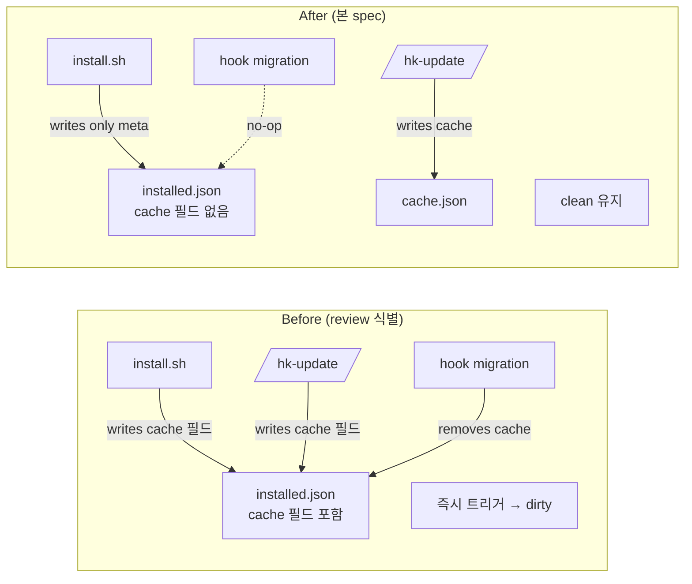

# Implementation Plan: spec-17-05

## 📋 Branch Strategy

- 신규 브랜치: `spec-17-05-pre-ship-fixes`
- **시작 지점**: `phase-17-coherence-fix`
- **PR Target**: `phase-17-coherence-fix`

## 🛑 사용자 검토 필요 (User Review Required)

> [!IMPORTANT]
> - [ ] **6 Critical 한 spec 묶음** — 회고에서 식별된 Critical 6 건 (C1~C6) 모두 본 spec 에서 처리. review 1 회.
> - [ ] **C1 + C2 가 spec-17-03 의 누수 sealing** — install.sh + /hk-update 의 cache destination 정정. 신규 사용자 + /hk-update 호출 양쪽 모두 cleanliness 보존.
> - [ ] **C5 신규 test-phase17-integration.sh — 3/4 시나리오 자동화** — 시나리오 3 (curl install end-to-end) 은 fixture 환경 필요 → 본 spec 범위 초과, skip 표시.
> - [ ] **C6 — `## [Unreleased]` 신설 후 phase-17 entry draft 작성** — W7 룰의 첫 실증. 다음 release commit 에서 `[X.Y.Z] — YYYY-MM-DD` stamp 만.

> [!WARNING]
> - [ ] **install.sh 변경** — 신규 사용자 환경에 직접 영향. cache 필드 제거 시 hook migration 이 trigger 안 됨 (정상 — 처음부터 없으니).
> - [ ] **`.harness-kit/installed.json` 도그푸딩 매니페스트 변경** — 본 저장소 자체의 installed.json. release commit 시 kitVersion 갱신 잊지 않도록.

## 🎯 핵심 전략 (Core Strategy)

### 아키텍처 컨텍스트



### 주요 결정

| 컴포넌트 | 전략 | 이유 |
|:---:|:---|:---|
| **C1 변경 범위** | `install.sh:515-516` 두 줄 제거만 (`update.sh` 는 자체 cache 코드 없음 — grep 0 hit) | 최소 surface. hook migration 이 *역할* 그대로 (legacy → cache.json) |
| **C2 hk-update.md 정정** | 캐시 jq 명령의 destination 을 `installed.json` → `.harness-kit/cache.json` 변경. 주석도 갱신 | spec-17-03 가 cache 의 SSOT 를 cache.json 으로 옮김. 안내 문서가 SSOT 따라야 함 |
| **C3 installedCommands sync** | 도그푸딩 1 회성 — `.harness-kit/installed.json` 에 `"hk"` 항목 알파벳 순 첫 위치 (hk-align 앞) 삽입 | install.sh 의 manifest 생성은 *동적* (sources/commands/*.md glob) — 신규 install 은 자동 정합. 본 저장소만 stale |
| **C4 queue.md 매핑 정정** | line 28 `spec-17-03` → `spec-17-02` / line 30 `spec-17-02` → `spec-17-03` 두 곳 swap | 단순 typo fix |
| **C5 test-phase17 시나리오 구성** | 시나리오 1 (위임) / 2 (cleanliness) / 4 (governance grep) 3 종 — 시나리오 3 (curl install) 은 echo "[skip]" + 이유 | end-to-end install 검증은 fixture 디렉토리 + actual curl 필요 — 본 spec 의 *방어선* 범위 초과 |
| **C6 CHANGELOG draft 위치** | `# CHANGELOG` 헤더 + 안내 줄들 직후, `---` 분리선 다음, `## [0.9.1]` 직전에 `## [Unreleased]` 섹션 신설 | 기존 형식 일관 — 다음 release commit 이 같은 위치를 `## [X.Y.Z] — YYYY-MM-DD` 로 stamp |
| **C6 draft entry 출처** | phase-17 4 PR (#122, #123, #124, #125) + 본 spec (#126 가설) commit log | git log 기반 — 본 spec PR 도 포함 (draft 작성 시점이 본 spec 안이라 자기 포함) |

### 📑 ADR 후보

- [ ] ADR 가치 있는 결정 있음
- [x] **없음** — 본 spec 의 6 항목 모두 *문서/매니페스트/테스트* 수정. 새 invariant 박힘 없음. cache destination 분리 자체는 spec-17-03 결정 — 본 spec 은 그 결정의 누수 sealing.

## 📂 Proposed Changes

### [C1: install.sh cache 필드 제거]

#### [MODIFY] `install.sh:511-519`

```diff
   cat > "$INSTALLED_JSON" <<EOF
 {
   "kitVersion": "$KIT_VERSION",
   "kitOrigin": "$_kit_origin",
   "installedAt": "$(date -u +%Y-%m-%dT%H:%M:%SZ)",
-  "lastVersionCheck": "",
-  "latestKnownVersion": "",
   "uxMode": "interactive",
   "installedCommands": $_cmd_json
 }
 EOF
```

> **검증**: `grep -n "lastVersionCheck\|latestKnownVersion" install.sh update.sh` → 0 hits.

### [C2: /hk-update cache destination 정정]

#### [MODIFY] `sources/commands/hk-update.md` ~line 100-110

```diff
 ### 6. 캐시 업데이트

-업데이트 조회 성공 시 `installed.json` 의 캐시를 갱신합니다:
+업데이트 조회 성공 시 `.harness-kit/cache.json` 의 캐시를 갱신합니다 (spec-17-03 에서 분리):

 ```bash
-jq --arg ts "$(date -u +%Y-%m-%dT%H:%M:%SZ)" --arg v "$latest" \
-  '.lastVersionCheck=$ts | .latestKnownVersion=$v' installed.json
+jq -n --arg ts "$(date -u +%Y-%m-%dT%H:%M:%SZ)" --arg v "$latest" \
+  '{lastVersionCheck: $ts, latestKnownVersion: $v}' > .harness-kit/cache.json
 ```
```

#### [SYNC] `.claude/commands/hk-update.md`

install 미러 — 동일 변경.

### [C3: installed.json installedCommands `hk` 추가]

#### [MODIFY] `.harness-kit/installed.json`

```diff
   "installedCommands": [
+    "hk",
     "hk-align",
     "hk-archive",
     ...
   ]
```

> 도그푸딩 1 회성 — install.sh 의 manifest 생성 로직은 동적 (glob) 이라 신규 install 자동 정합.

### [C4: queue.md Icebox 매핑 정정]

#### [MODIFY] `backlog/queue.md:28,30`

```diff
-- ~~접근성 개선~~ → phase-17 **spec-17-03** (accessibility-install-and-entry)
+- ~~접근성 개선~~ → phase-17 **spec-17-02** (accessibility-install-and-entry)
 - ~~sdd marker 버그 (W5/W10)~~ → ✓ **spec-17-01** 머지로 종식 (RCA-001 prevention)
-- ~~installed.json 캐시 (C3)~~ / ~~phase integration test (W2)~~ / ~~doctor 새 경로 (W6)~~ → phase-17 **spec-17-02** (internal-reliability-infra)
+- ~~installed.json 캐시 (C3)~~ / ~~phase integration test (W2)~~ / ~~doctor 새 경로 (W6)~~ → phase-17 **spec-17-03** (internal-reliability-infra)
```

### [C5: tests/test-phase17-integration.sh 신규]

#### [NEW] `tests/test-phase17-integration.sh`

phase-17.md `🧪 통합 테스트 시나리오` 의 4 시나리오:
- **시나리오 1**: Marker 멱등성 — `test-sdd-marker-idempotent.sh` 위임
- **시나리오 2**: 워킹트리 cleanliness — SessionStart hook 후 `git status --porcelain` 빈 출력
- **시나리오 3**: curl install end-to-end — **skip** (fixture 환경 필요, Icebox)
- **시나리오 4**: Governance/test grep — §6.4 마크 / ADR 가이드 / CHANGELOG 룰 + phase16 self-test

`set -euo pipefail` / bash 3.2+ 호환 / 명명 규약 첫 자기 적용 / chmod +x.

### [C6: CHANGELOG.md [Unreleased] 신설]

#### [MODIFY] `CHANGELOG.md` 최상단

`# CHANGELOG` 헤더 + 안내 + `---` 다음, `## [0.9.1]` 앞에 `## [Unreleased]` 섹션 신설. `Added` / `Fixed` / `Changed` 소제목별 phase-17 4 PR + 본 spec 변경 사항 draft entry. 각 항목 끝에 `(#PR번호)` 인용 (#122, #123, #124, #125, #126 가설).

## 🧪 검증 계획 (Verification Plan)

### 단위 테스트

```bash
# C1: install.sh cache 필드 제거
grep -c "lastVersionCheck\|latestKnownVersion" install.sh   # → 0
grep -c "lastVersionCheck\|latestKnownVersion" update.sh    # → 0 (이미 0)

# C2: hk-update.md destination 정정
grep -q "cache.json" sources/commands/hk-update.md           # PASS

# C3: installedCommands hk 추가
jq -r '.installedCommands | length' .harness-kit/installed.json   # → 14
jq -r '.installedCommands | index("hk")' .harness-kit/installed.json   # → 숫자 (not null)

# C4: queue.md 매핑 정정
grep "접근성 개선" backlog/queue.md | grep -q "spec-17-02"   # PASS
grep "installed.json 캐시" backlog/queue.md | grep -q "spec-17-03"   # PASS

# C5: 신규 통합 테스트
bash tests/test-phase17-integration.sh   # 3 passed / 1 skipped

# C6: CHANGELOG draft
grep -q "## \[Unreleased\]" CHANGELOG.md   # PASS
```

### 통합 테스트 (Integration Test Required = yes)

`bash tests/test-phase17-integration.sh` — 본 spec 의 신규 통합 테스트가 그 자체로 검증 대상.

### 회귀 테스트

```bash
bash tests/test-sdd-marker-idempotent.sh   # 3/3 PASS
bash tests/test-drift-stale-adr.sh          # 3/3 PASS
bash tests/test-phase16-integration.sh      # 3/3 PASS
bash .harness-kit/bin/sdd status            # 정상 + drift 0
```

## 🔁 Rollback Plan

- 본 PR revert. 6 항목 모두 *문서/매니페스트/테스트 신규* — 코드 동작 변경 최소 (install.sh 두 줄 제거).
- C1 revert 시 hook migration 이 다시 trigger (legacy → cache.json) — 양방향 호환.
- C6 revert 시 [Unreleased] 섹션 사라짐 — 다음 release commit 시 catch-up 부담 그대로 (룰만 박힌 상태로 복귀).

## 📦 Deliverables 체크

- [ ] task.md 작성 (다음 단계)
- [ ] 사용자 Plan Accept
- [ ] (실행 후) 모든 task 완료
- [ ] (실행 후) walkthrough.md / pr_description.md ship
