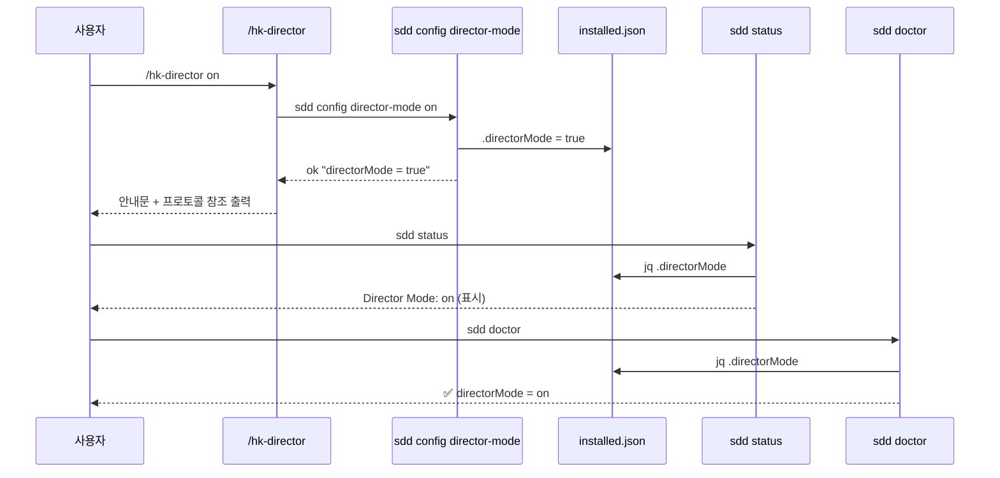

# Implementation Plan: spec-20-01

## 📋 Branch Strategy

- 브랜치: `spec-20-01-director-switch` (phase-20-director-mode 를 base 로 함 — D1 결정)
- 시작 지점: `phase-20-director-mode` (phase base branch)
- 첫 task 가 브랜치 확인을 수행함 (이미 해당 브랜치에 있음)

## 🛑 사용자 검토 필요 (User Review Required)

> [!IMPORTANT] — 디렉터 결정 완료 (2026-06-03)
> - [x] `sdd status` off 시: **행 완전 생략** (on 일 때만 `Director Mode: on`). 기본값 off 노이즈 최소화.
> - [x] `doctor` off 시: **`_doc_pass` 정보성**으로 (`_doc_warn` 아님). off 는 의도적 기본값이라 WARN 카운트 오염 금지 (spec-13-02 graceful 철학).

> [!WARNING]
> - [ ] `installed.json` 스키마 변경: `directorMode` 키 추가. 기존 install 환경은 키가 없으므로, 부재 시 `false` 기본값으로 처리해야 함 (jq `// false` 패턴). 다운스트림에 `update.sh` 안내 필요.

## 🎯 핵심 전략 (Core Strategy)

### 아키텍처 컨텍스트



### 주요 결정

| 컴포넌트 | 전략 | 이유 |
|:---:|:---|:---|
| **`installed.json` 키** | `directorMode` (boolean, 기본 `false`) | `uxMode` 선례 — 같은 파일, 같은 패턴 |
| **CLI 인터페이스** | `sdd config director-mode [on\|off\|toggle]` | `sdd config ux-mode` 와 대칭 — 동사 대신 on/off 사용 (boolean 성격) |
| **슬래시 커맨드** | `sources/commands/hk-director.md` → bash 한 줄로 `sdd config director-mode` 호출 | hk-ask-mode 선례 — 커맨드가 sdd 를 래핑 |
| **status 노출** | `directorMode=true` 일 때만 행 출력 | false 는 기본값이므로 노이즈 최소화. 필요 시 사용자 검토로 조정 |
| **doctor 노출** | 설정 섹션에 추가, on → pass, off → **pass(정보성)** | off 는 의도적 기본값 — WARN 카운트 오염 금지 (디렉터 결정) |
| **모드 강도** | 지시 주입 (instruction injection) | D3 결정 — 런타임 커널 없음, hk-align 과 같은 강도 |
| **미러** | sources + .claude 둘 다 | install.sh glob 패턴 선례, 도그푸딩 필수 |

### 📑 ADR 후보

- [x] ADR 가치 있는 결정 있음 → 후보: `director-mode-as-instruction-injection` (type: decision / invariant) — ADR-006 에 통합 예정.
- [ ] 없음

## 📂 Proposed Changes

### 슬래시 커맨드

#### [NEW] `sources/commands/hk-director.md`

디렉터 모드 토글 커맨드. hk-ask-mode 패턴을 따른다.

```text
---
description: 디렉터 모드 토글 — on/off/toggle/상태 조회
---

directorMode 를 변경합니다. 다음 명령을 실행하고 결과를 그대로 출력하세요:

```bash
bash .harness-kit/bin/sdd config director-mode $ARGUMENTS
```

on 시 디렉터 프로토콜(spec-20-02)이 적용됩니다.
인수 없이 호출하면 현재 상태를 조회합니다.
변경된 값은 다음 세션부터 적용됩니다.
```

#### [NEW] `.claude/commands/hk-director.md`

`sources/commands/hk-director.md` 와 동일 내용 — 도그푸딩 미러.

### sdd CLI

#### [MODIFY] `sources/bin/sdd`

1. **`cmd_config` 라우팅** — `director-mode` 케이스 추가:

```bash
director-mode) _config_director_mode "$@" ;;
```

2. **`_config_director_mode` 함수** — `_config_ux_mode` 와 대칭 구조:
   - 인수 없음 → `jq -r '.directorMode // false'` 조회 후 출력
   - `on` → `jq '.directorMode = true'` 저장
   - `off` → `jq '.directorMode = false'` 저장
   - `toggle` → 현재 값 읽어 반전
   - 그 외 → `die "허용된 값: on | off | toggle (입력: $value)"`

3. **usage 문자열** — `config director-mode [on|off|toggle]` 행 추가 (l.57 근처)

4. **`cmd_status`** — `directorMode=true` 일 때 `Director Mode: on` 행 출력:

```bash
local director_mode
director_mode=$(jq -r '.directorMode // false' "$installed_json" 2>/dev/null || echo "false")
if [ "$director_mode" = "true" ]; then
  printf "  Director Mode: %s\n" "${C_CYN}on${C_RST}"
fi
```

5. **`cmd_doctor`** — "설정" 섹션에 `directorMode` 점검 추가:

```bash
local dm
dm=$(jq -r '.directorMode // false' "$installed_json" 2>/dev/null || echo "false")
if [ "$dm" = "true" ]; then
  _doc_pass "directorMode = on"
else
  _doc_pass "directorMode = off (비활성 — /hk-director on 으로 활성화)"
fi
```

### 테스트

#### [NEW] `tests/test-director-mode.sh`

단위 테스트 스크립트. 검증 항목:

1. `sources/commands/hk-director.md` 파일 존재 + frontmatter (`description:` 행 포함)
2. `.claude/commands/hk-director.md` 파일 존재 (미러 parity) + 내용 동일
3. `sdd config director-mode` (인수 없음) → `directorMode:` 포함 출력
4. `sdd config director-mode on` → `installed.json` 에 `"directorMode": true` 기록
5. `sdd config director-mode off` → `installed.json` 에 `"directorMode": false` 기록
6. `sdd config director-mode toggle` (off→on) → 반전 확인
7. `sdd config director-mode toggle` (on→off) → 반전 확인
8. `sdd status` 출력 grep — `directorMode=true` 시 `Director Mode` 행 포함
9. `sdd status` 출력 grep — `directorMode=false` 시 `Director Mode` 행 미포함
10. `sdd doctor` 출력 grep — `directorMode` 관련 텍스트 포함

테스트 환경: 임시 디렉토리 + 최소 `installed.json` 복사본으로 격리 실행.

## 🧪 검증 계획 (Verification Plan)

### 단위 테스트 (필수)

```bash
bash tests/test-director-mode.sh
```

### 수동 검증 시나리오

1. `bash .harness-kit/bin/sdd config director-mode` → `directorMode: false` (또는 `true`) 출력 확인
2. `bash .harness-kit/bin/sdd config director-mode on` → ok 메시지 확인
3. `bash .harness-kit/bin/sdd status` → `Director Mode: on` 행 확인
4. `bash .harness-kit/bin/sdd config director-mode off` → ok 메시지 확인
5. `bash .harness-kit/bin/sdd status` → `Director Mode` 행 미출력 확인
6. `bash .harness-kit/bin/sdd doctor` → directorMode 점검 결과 확인

## 🔁 Rollback Plan

- `sources/commands/hk-director.md` 및 `.claude/commands/hk-director.md` 삭제
- `sources/bin/sdd` 에서 `director-mode` 케이스 및 `_config_director_mode` 함수 제거, `cmd_status` / `cmd_doctor` 에서 추가 블록 제거
- `installed.json` 에서 `directorMode` 키 제거 (jq `del(.directorMode)`)
- 데이터/상태 영향: `installed.json` 의 `directorMode` 키만 영향 — 기존 `uxMode` 등 무관

## 📦 Deliverables 체크

- [x] task.md 작성 (다음 단계)
- [ ] 사용자 Plan Accept 받음
- [ ] (실행 후) 모든 task 완료
- [ ] (실행 후) walkthrough.md / pr_description.md ship
