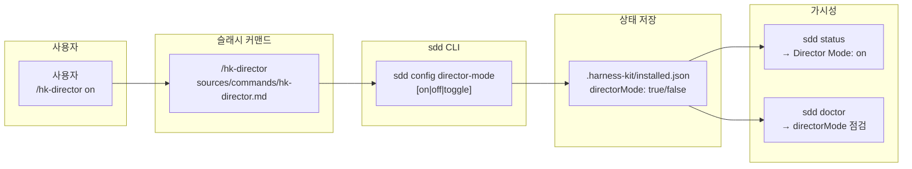

# spec-20-01: 디렉터 모드 스위치 + 상태 노출

## 📋 메타

| 항목 | 값 |
|---|---|
| **Spec ID** | `spec-20-01` |
| **Phase** | `phase-20` |
| **Branch** | `spec-20-01-director-switch` |
| **상태** | Planning |
| **타입** | Feature |
| **Integration Test Required** | no |
| **작성일** | 2026-06-03 |
| **소유자** | dennis |

## 📋 배경 및 문제 정의

### 현재 상황

harness-kit 은 ADR-005(context orchestration)에서 "orchestrator–worker + offloading" 전략을 정의했으나, 이를 사용자가 명시적으로 켜고 끌 수 있는 런타임 스위치가 없다. `uxMode` 처럼 `installed.json` 에 persist 되는 플래그도 없고, `sdd status` / `doctor` 에 모드 가시성도 없다.

`uxMode` (`hk-ask-mode` / `sdd config ux-mode`) 는 이미 동일한 패턴(토글 커맨드 + `installed.json` + config 서브커맨드)으로 구현되어 있어 선례 코드로 활용 가능하다.

### 문제점

- 디렉터 모드 사용 의사를 표현할 수단이 없어, 팀원 간 합의된 "지금 디렉터 모드 적용 중" 상태를 공유할 방법이 없다.
- 모드 진입 시 디렉터 프로토콜(spec-20-02 소관)을 context 에 주입할 훅 지점이 없어, 이후 spec 들이 의존할 수 없다.
- `sdd status` 와 `doctor` 에 노출이 없으므로, 활성 모드를 진단에서 확인할 수 없다.

### 해결 방안 (요약)

`/hk-director` 슬래시 커맨드와 `sdd config director-mode [on|off|toggle]` 를 추가하고, `installed.json` 에 `directorMode` boolean 플래그를 저장한다. `sdd status` 는 플래그가 `true` 일 때 Director Mode 행을 출력하고, `doctor` 는 플래그 상태를 점검 항목으로 포함한다. 커맨드는 모드 진입 시 디렉터 프로토콜 참조를 안내문으로 주입한다(프로토콜 내용 자체는 spec-20-02 소관).

## 📊 개념도

## 🎯 요구사항

### Functional Requirements

1. `/hk-director on` — `directorMode=true` 로 설정하고, 디렉터 프로토콜 참조 안내문을 출력한다.
2. `/hk-director off` — `directorMode=false` 로 설정하고, 비활성 확인 메시지를 출력한다.
3. `/hk-director toggle` — 현재 값을 반전한다. 인수 없이 호출 시 현재 상태를 출력한다.
4. `sdd config director-mode [on|off|toggle]` — 인수 없으면 현재 값 조회, 있으면 설정/토글.
5. `sdd status` — `directorMode=true` 일 때 `Director Mode: on` 행을 출력한다(false/미설정 시 행 생략).
6. `sdd doctor` — `directorMode` 항목을 점검 섹션에 추가한다(`on` → pass, `off`/미설정 → 정보성 안내).
7. 커맨드 파일은 `sources/commands/hk-director.md` 원본 + `.claude/commands/hk-director.md` 미러 둘 다 존재한다(도그푸딩 install.sh glob 선례).

### Non-Functional Requirements

1. bash 3.2 / BSD 호환 — `declare -A`, `mapfile`, `${var,,}` 등 bash 4+ 전용 구문 사용 금지.
2. `uxMode` 구현과 대칭적 코드 구조 — 네이밍(`directorMode`), 기본값(`false`), jq 패턴, ok/die 헬퍼 동일 패턴.
3. `installed.json` 이 없는 환경에서 `sdd config director-mode` 호출 시 `die` 로 안내한다.
4. 모드는 *지시 주입* 강도 — Claude Code 런타임 커널이 아니므로 커맨드가 안내문·참조를 출력하는 방식. hk-align 이 거버넌스를 "강제"하는 것과 같은 강도.

## 🚫 Out of Scope

- 디렉터 프로토콜 실제 행동 규약 내용 (spec-20-02 소관)
- 모델 역할별 config (`director/worker/scout` 매핑) (spec-20-04 소관)
- 리뷰 패널 오케스트레이션 (spec-20-06 소관)
- `sdd config director-mode` 외 CLI 자동화(예: pre-commit 훅 연동)
- `hk-director` 가 실제로 서브에이전트를 생성하거나 dispatch 하는 동작

## 📑 ADR 후보 (Architecture Decision Records)

> 본 SPEC 의 결정 중 *장기 자산* 으로 박을 가치 있는 것이 있는가? (constitution §6.3 ADR 정의)
> 후보가 있으면 본 spec 머지 시점에 `docs/decisions/ADR-{NNN}-director-switch.md` 로 작성합니다.

- [x] ADR 가치 있는 결정 있음 → 후보 한 줄 요약: `director-mode-as-instruction-injection` (type: decision) — "디렉터 모드는 런타임 커널이 아닌 지시 주입" 불변식. ADR-006 에 통합 가능 (phase-20 기존 초안).
- [ ] 없음

## 🔗 관련 문서 (Related)

- 관련 wiki: [[wiki/patterns]]
- 관련 ADR: [[ADR-005]], [[ADR-006]] (phase-20 초안)
- 관련 RCA: 없음

## ✅ Definition of Done

- [ ] `tests/test-director-mode.sh` 의 모든 케이스 PASS
- [ ] (Integration Test Required = no — 단위 테스트로 충분)
- [ ] `walkthrough.md` 와 `pr_description.md` 작성 및 ship commit
- [ ] `spec-20-01-director-switch` 브랜치 push 완료
- [ ] 사용자 검토 요청 알림 완료
