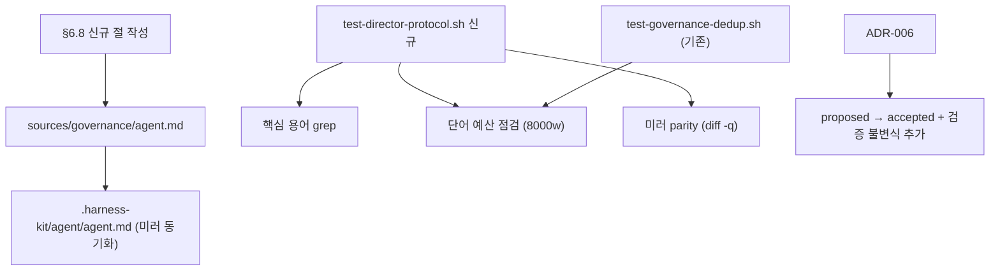

# Implementation Plan: spec-20-02

## 📋 Branch Strategy

- 브랜치: `spec-20-02-director-protocol` (이미 존재 — phase-20 base 모드)
- Base: `phase-20-director-mode`
- 첫 task 는 브랜치 전환 확인만 수행 (이미 생성됨)

## 🛑 사용자 검토 필요 (User Review Required)

> [!IMPORTANT]
> - [ ] **단어 예산 처리 방향**: 현재 합계 7335w, 여유 665w. §6.8 신규 절을 300w 이하로 제한하면 8000w 상한 유지 가능. 단, spec-20-03/04 추가 절이 올 경우 상한 초과 가능 — 지금 결정 필요: (1) 300w 제한 유지 + 나중에 §13 Rule Prune (권장), (2) 구현 전 §6.6/§6.7 일부 prune 후 여유 확보.
> - [ ] **ADR-006 업데이트 vs ADR-007 신규**: "검증 = 행동/증류" 불변식을 ADR-006 에 흡수(proposed → accepted)할지 별도 ADR-007 로 분리할지. ADR-006 이 proposed 상태이므로 업데이트가 자연스러움 (권장).

> [!WARNING]
> - [ ] `test-governance-dedup.sh` Check 3(8000w 상한)는 §6.8 추가 후에도 통과해야 함. 구현 Task 2 전에 단어 수 사전 확인 필수.
> - [ ] 이중 미러(`sources/governance/agent.md` ↔ `.harness-kit/agent/agent.md`) 중 하나라도 누락되면 `test-governance-dedup.sh` Check 2 실패 — 두 파일 동시 수정 필수.

## 🎯 핵심 전략 (Core Strategy)

### 아키텍처 컨텍스트



### 주요 결정

| 컴포넌트 | 전략 | 이유 |
|:---:|:---|:---|
| **§6.8 구조** | 운영 규칙 5개 번호 목록 + ADR 참조, 서술 없음 | 단어 예산 준수 + constitution §13 간결성 원칙 |
| **§6.8 위치** | §6.7 바로 다음 | 모델/패턴 다음 → 디렉터 프로토콜 흐름 자연스러움 |
| **내용 언어** | 영어 | agent.md 영어 전용 원칙 |
| **검증 파일** | `tests/test-director-protocol.sh` 신규 | director-mode.sh 는 토글/플래그 전용 — 프로토콜 검증 분리 |
| **ADR-006 처리** | proposed → accepted, 검증 불변식 흡수 | 본 spec 이 ADR-006 의 "디렉터 운영 프로토콜" 산출물. 별도 ADR-007 불필요 |
| **단어 예산 상한** | 현행 8000w 유지 | 300w 이하 신규 절이면 여유 안에 들어옴. 상한 조정 불필요 |

### 📑 ADR 후보

- [x] ADR 가치 있는 결정 있음 → `director-verification-invariant` — ADR-006 업데이트로 흡수 (type: invariant). 구현 Task 3 에서 ADR-006 을 proposed → accepted + 검증 불변식 추가.

## 📂 Proposed Changes

### [거버넌스 — agent.md]

#### [MODIFY] `sources/governance/agent.md`

§6.7 Workflow Patterns 다음에 §6.8 Director Mode Protocol 절 추가.

뼈대 (구현 시 영문 최종화, 300w 이하 유지):

```text
### 6.8 Director Mode Protocol

Active when directorMode is enabled (→ `/hk-director`).

1. **Intent handshake**: Before dispatching workers, confirm intent with the
   user — restate or ask one clarifying question. Proceed only after confirmation.

2. **Scoped brief dispatch**: Worker brief must include:
   target files, expected behaviour, test command, commit format,
   artifact commit scope. Never pass full history.

3. **Distilled contract return**: Worker returns commit SHA, test status,
   and decision list only — NOT its full transcript.

4. **Verification by action, not re-ingestion**: Validate via
   test re-run + live smoke + distilled contract review.
   Re-reading the worker's full transcript is PROHIBITED.
   (→ ADR-005 ④, ADR-006)

5. **Gates stay with director**: Plan Accept and Ship gates are held by
   director + user. Never delegated to a worker.

6. **No over-dispatch**: Respect §6.7 dispatch threshold.
   Single short commands stay in the main thread.
   Director mode raises the delegation default — it does not mandate
   delegation for everything.
```

#### [MODIFY] `.harness-kit/agent/agent.md`

`sources/governance/agent.md` 와 동일하게 미러 동기화 (cp 또는 동시 편집).

### [테스트]

#### [NEW] `tests/test-director-protocol.sh`

검증 항목:
1. §6.8 핵심 용어 존재 grep (`6.8 Director Mode Protocol`, `Intent handshake`, `distilled contract`, `re-ingestion`, `Plan Accept`)
2. sources ↔ 미러 parity (`diff -q sources/governance/agent.md .harness-kit/agent/agent.md`)
3. 단어 예산 재확인 (constitution+agent.md 합계 8000w 이하)

### [ADR]

#### [MODIFY] `docs/decisions/ADR-006-director-mode.md`

- `status: proposed` → `status: accepted`
- Consequences 에 검증 불변식 추가: "디렉터는 워커 transcript 전문 재흡수 금지 — 테스트 재실행+증류 계약 대조로 검수"
- "적용: agent.md §6.8" 기록

## 🧪 검증 계획 (Verification Plan)

### 단위 테스트 (필수)

```bash
bash tests/test-director-protocol.sh
bash tests/test-governance-dedup.sh
bash tests/test-director-mode.sh
```

### 수동 검증 시나리오

1. **단어 예산**: `wc -w sources/governance/agent.md sources/governance/constitution.md` → 합계 8000 이하 확인.
2. **미러 parity**: `diff sources/governance/agent.md .harness-kit/agent/agent.md` → 출력 없음(동일).
3. **§6.8 존재**: `grep -n "6.8 Director Mode" sources/governance/agent.md` → 해당 절 라인 출력.
4. **ADR-006 상태**: `grep "status:" docs/decisions/ADR-006-director-mode.md` → `accepted`.

## 🔁 Rollback Plan

- agent.md 변경은 텍스트 추가만이므로 `git revert` 로 완전 복원 가능.
- `test-governance-dedup.sh` 단어 예산 초과 시: 커밋 취소 후 §6.8 절 축소 재시도.
- 미러 미동기화 감지 시: 해당 커밋에서 `cp sources/governance/agent.md .harness-kit/agent/agent.md` 로 복원.

## 📦 Deliverables 체크

- [ ] task.md 작성 (다음 단계)
- [ ] 사용자 Plan Accept 받음
- [ ] (실행 후) 모든 task 완료
- [ ] (실행 후) walkthrough.md / pr_description.md ship
