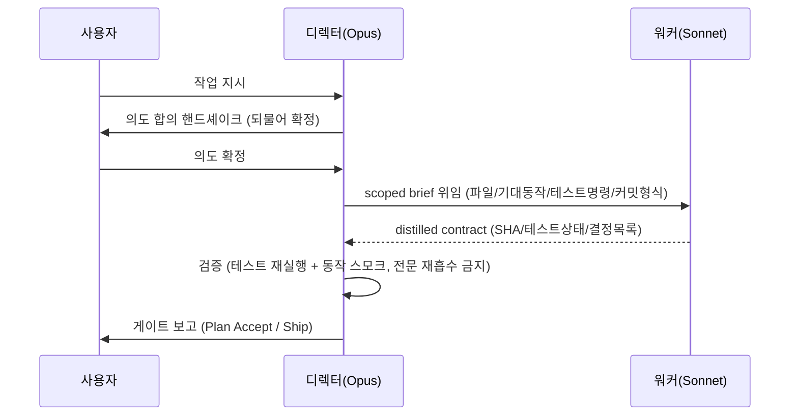

# spec-20-02: 디렉터 운영 프로토콜 명문화

## 📋 메타

| 항목 | 값 |
|---|---|
| **Spec ID** | `spec-20-02` |
| **Phase** | `phase-20` |
| **Branch** | `spec-20-02-director-protocol` |
| **상태** | Planning |
| **타입** | Feature |
| **Integration Test Required** | no |
| **작성일** | 2026-06-04 |
| **소유자** | dennis |

## 📋 배경 및 문제 정의

### 현재 상황

ADR-005 가 "context orchestrator" 전략을 확정했고, ADR-006 이 디렉터 모드 개념을 선언했다. spec-20-01 에서 `/hk-director` 토글 명령과 플래그 영속화가 완료됐다. 그러나 **디렉터가 실제로 어떻게 행동해야 하는지** — 의도 합의 방법, 워커 위임 방식, 검수 절차 — 는 agent.md 에 명문화되지 않은 상태다.

spec-20-01 도그푸딩에서 두 가지 핵심 발견이 이번 spec 의 입력이 됐다:

1. **행동 검증 불변식**: authoring 위임보다 *implementation* 위임이 context 절감 효과가 훨씬 크다. 디렉터가 검수를 위해 워커 전문(transcript)을 재흡수하면 목적이 반감된다. 검증은 *테스트 재실행 + 동작 스모크 + 증류 계약 대조*로 수행해야 한다.
2. **워커 브리핑 갭**: 워커 브리핑에 "기획 산출물도 커밋 범위"가 빠져 디렉터가 사후 커밋해야 하는 상황 발생. 브리핑 명세가 완전해야 한다.

### 문제점

- 디렉터가 의도를 확정하는 절차(되물어 합의 → 팀 편성 → 위임)가 비구조화되어 세션마다 일관성이 없다.
- 워커 위임 시 어떤 내용을 "scoped brief"에 담아야 하는지 명세가 없어 위임 품질이 불안정하다.
- "검증은 워커 transcript 재흡수가 아닌 행동/증류"라는 ADR-005 ④축이 *운영 절차*로 구체화되지 않았다.
- over-dispatch(단발 작업도 위임)와 under-dispatch(모든 걸 디렉터가 직접) 경계가 불분명하다.
- Plan Accept·Ship 게이트가 워커에 내려가면 안 된다는 규칙이 없다.

### 해결 방안 (요약)

`sources/governance/agent.md` 에 **§6.8 Director Mode Protocol** 신규 절을 추가한다. ① 의도 합의 핸드셰이크, ② 위임+증류 보고 루프, ③ 게이트·검수 디렉터 보유, ④ over-dispatch 금지 — 네 가지 운영 규칙을 *운영 절차* 수준(근거는 ADR 참조, agent.md 엔 규칙만)으로 간결하게 명문화한다. 이중 미러(`sources/governance/agent.md` ↔ `.harness-kit/agent/agent.md`)를 동기화한다. 검증은 `tests/test-director-protocol.sh` 신규 작성(핵심 용어 grep + 단어 예산 + 미러 parity).

## 📊 개념도

## 🎯 요구사항

### Functional Requirements

1. **의도 합의 핸드셰이크**: 디렉터는 사용자 지시를 받은 뒤 의도를 한 번 되물어 확정(또는 직접 요약 제시 후 승인 요청)하고, 확정 후에 팀 편성·위임을 시작한다.
2. **scoped brief 위임 명세**: 워커 디스패치 시 brief 는 필수 항목(대상 파일, 기대 동작, 테스트 명령, 커밋 형식, 산출물 커밋 범위)을 포함해야 한다. 워커에게 전체 히스토리를 주지 않는다.
3. **distilled contract 반납**: 워커는 커밋 SHA, 테스트 상태, 주요 결정 목록만 반납한다. transcript 전문 반납은 VIOLATION.
4. **행동 검증 불변식**: 디렉터의 검수는 *테스트 재실행 + 동작 스모크 + 증류 계약 대조*로 수행한다. 워커 transcript 전문 재흡수는 명시적으로 금지한다(ADR-005 ④축의 운영화).
5. **게이트 보유**: Plan Accept 및 Ship 게이트는 디렉터+사용자가 보유하며 워커에 내리지 않는다.
6. **over-dispatch 금지**: §6.7 sub-agent dispatch threshold 를 준수한다. 단발(단일 `git commit` 등)은 인라인 처리. 디렉터 모드는 *기본값을 위임 쪽으로* 높이는 것이지 모든 것을 위임하는 것이 아니다.

### Non-Functional Requirements

1. **단어 예산**: 신규 §6.8 절은 300w 이하로 유지. constitution+agent.md 합계가 8000w 상한을 넘으면 안 된다.
2. **거버넌스 언어**: agent.md 내 절은 영어로 작성(constitution/agent.md 영어 전용 원칙).
3. **중복 없음**: §6.6(model allocation), §6.7(workflow patterns) 와 내용 중복 없이 참조만.
4. **이중 미러 parity**: `sources/governance/agent.md` 와 `.harness-kit/agent/agent.md` 는 항상 동일해야 한다.
5. **테스트 그린**: `tests/test-director-protocol.sh` 전체 통과 + 기존 `test-governance-dedup.sh` 단어 예산 체크도 유지.

## 🚫 Out of Scope

- SDD ceremony 분업 계약(planning=Opus/ceremony=Sonnet) → spec-20-03 에서 다룬다.
- 역할 기반 모델 config de-hardcode → spec-20-04.
- 도메인 에이전트 간 설계 대화 중재 → spec-20-05(research).
- 페르소나 패널 리뷰 오케스트레이션 → spec-20-06.
- `hk-director.md` 명령 파일 내용 변경 (spec-20-01 완료).
- `/hk-align` 수정 (디렉터 모드 주입은 spec-20-01 에서 이미 처리).

## 📑 ADR 후보 (Architecture Decision Records)

- [x] ADR 가치 있는 결정 있음 → `director-verification-invariant` — "디렉터 검증 = 행동/증류, 전문 재흡수 아님" (type: invariant). ADR-005 ④축의 운영적 구체화로, ADR-006 업데이트 또는 별도 ADR-007 로 박을 수 있음.

## 🔗 관련 문서 (Related)

- 관련 wiki: [[wiki/patterns]]
- 관련 ADR: [[ADR-005]], [[ADR-006]]
- 관련 RCA: 없음
- 관련 spec: [[spec-20-01]] (도그푸딩 발견 사항 1·2), [[spec-20-03]] (ceremony 분업)

## ✅ Definition of Done

- [ ] `sources/governance/agent.md` 에 §6.8 Director Mode Protocol 절 추가
- [ ] `.harness-kit/agent/agent.md` 미러 동기화
- [ ] `tests/test-director-protocol.sh` 신규 작성 및 전체 PASS
- [ ] `tests/test-governance-dedup.sh` 단어 예산 체크 통과 (8000w 이하)
- [ ] 모든 단위 테스트 PASS
- [ ] `walkthrough.md` 와 `pr_description.md` 작성 및 ship commit
- [ ] `spec-20-02-director-protocol` 브랜치 push 완료
- [ ] 사용자 검토 요청 알림 완료
