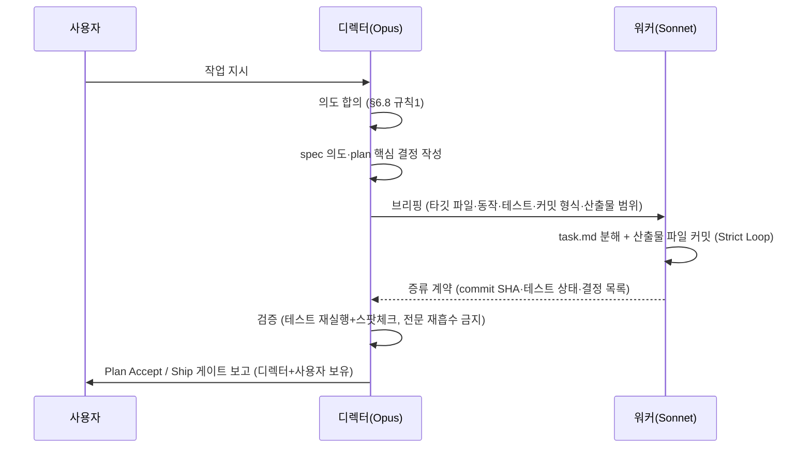

# spec-20-03: SDD ceremony 분업 계약 — planning=디렉터, ceremony=워커

## 📋 메타

| 항목 | 값 |
|---|---|
| **Spec ID** | `spec-20-03` |
| **Phase** | `phase-20` |
| **Branch** | `spec-20-03-ceremony-split` |
| **상태** | Planning |
| **타입** | Feature (governance) |
| **Integration Test Required** | no |
| **작성일** | 2026-06-04 |
| **소유자** | dennis |

## 📋 배경 및 문제 정의

### 현재 상황

spec-20-01(디렉터 스위치)·spec-20-02(디렉터 프로토콜)로 `/hk-director` 토글과 §6.8 행동 규약이 완성됐다. §6.8 은 디렉터 모드의 *무엇/왜*를 명문화했지만, **SDD 워크플로 안에서 구체적으로 누가 무엇을 담당하는지**(분업 계약)는 여전히 비어 있다.

현재 agent.md §6.1(Strict Loop) 과 §6.8(Director Mode Protocol) 은 서로 독립적이다. §6.1 은 "에이전트(기본 Opus)가 모든 task 를 직접 실행"을 암묵적으로 가정하고, §6.8 은 위임 원칙만 선언하되 SDD ceremony 에 어떻게 적용하는지 기술하지 않는다.

### 문제점

1. **디렉터 모드 on 상태에서도 spec/plan/task 산출물 작성(기계적 노동)이 디렉터(Opus) context 를 오염**시킨다. spec-20-01 에서 워커가 spec/plan/task 를 커밋하지 않은 갭이 발견됐고(walkthrough 발견2), 이를 규칙으로 박는 작업이 spec-20-02 에서 T1("기획 산출물 커밋")으로 일부 해소됐지만, 거버넌스 레벨에서 "워커가 산출물 파일을 직접 커밋해야 한다"는 의무는 아직 §6.1 에 명시되지 않았다.
2. **Plan Accept·Ship 게이트 위임 금지** 불변식이 §6.8 규칙5에 있으나, §6.1 Strict Loop 에 director-mode 컨텍스트가 없다. 결과적으로 디렉터 모드에서 task 실행을 워커에 내릴 때 게이트 경계가 모호하다.
3. 단어 예산 압박(현재 7507/8000w): 새 절을 추가하면 8000w 초과. 기존 절에 *간결하게 접붙이는* 방식이 필수다.

### 해결 방안 (요약)

§6.1(Strict Loop) 에 "director-mode 활성 시 task 실행 루프를 워커에 위임하고 산출물·커밋도 워커 범위에 포함"하는 한 단락을 추가한다. §6.8 에는 §6.1 위임 단락을 참조하는 한 줄을 덧붙인다. 이로써 SDD ceremony 분업 계약이 기존 절 안에 자연스럽게 박힌다. 신규 절(§6.9 등) 추가 금지.

## 📊 개념도

## 🎯 요구사항

### Functional Requirements

1. **§6.1 위임 단락**: director-mode 활성 시, Strict Loop task 실행을 워커(Sonnet sub-agent)에 위임한다는 규칙을 §6.1 말미에 추가한다. 워커 브리핑 범위(타깃 파일·동작·테스트 명령·커밋 형식) + **산출물 파일(spec/plan/task 포함) 직접 커밋 의무** 명시.
2. **§6.8 참조 줄**: §6.8 에 "SDD ceremony task 위임은 §6.1 위임 단락 참조" 한 줄 추가 — 중복 서술 없이 교차 참조.
3. **불변식 3가지 문서화** (§6.1 위임 단락 안에 포함):
   - Plan Accept·Ship 게이트는 워커에 위임 금지 (디렉터+사용자 보유).
   - 워커 커밋 범위 = spec/plan/task 산출물 포함.
   - 검증은 §6.8 규칙4 준용 (행동·증류, 전문 재흡수 금지).
4. **이중 미러 동기화**: sources/governance/agent.md 수정 후 .harness-kit/agent/agent.md 에 동일 내용 반영.
5. **테스트 확장**: tests/test-director-protocol.sh 에 ceremony-split 분업 계약 핵심 용어 grep + 단어 예산 + 미러 parity 검사 추가 (또는 신규 tests/test-ceremony-split.sh 작성).

### Non-Functional Requirements

1. **단어 예산 ≤120w 추가**: §6.1 위임 단락 + §6.8 참조 줄 합계. constitution+agent.md 총합 8000w 이하 유지.
2. **bash 3.2+ 호환**: 테스트 스크립트 bash 3.2 문법 준수.
3. **다운스트림 적용 가능**: 분업 계약은 NestJS(nextmarket-api) 환경에서도 그대로 작동해야 한다(도그푸딩 원칙).

## 🚫 Out of Scope

- §6.9 등 신규 절 추가 — 단어 예산 제약으로 금지(디렉터 지시).
- §13 Rule Prune — 별도 Icebox 항목. 본 spec 이후 누적 압박 시 별도 spec-x 로 처리.
- spec-20-04(역할 기반 모델 config) — 모델 이름 de-hardcode 는 다음 spec.
- review 패널 오케스트레이션(spec-20-06) — 별도 spec.
- 워커 디스패치 실제 자동화 코드 — 거버넌스 문서 명문화만, CLI 변경 없음.

## 📑 ADR 후보 (Architecture Decision Records)

> 본 SPEC 의 결정 중 *장기 자산* 으로 박을 가치 있는 것이 있는가?

- [ ] 없음 — ADR-006 이 이미 ceremony 분업 원칙을 흡수. 본 spec 은 그 운영 규칙의 §6.1 접붙이기로, 별도 ADR 가치 없음.

## 🔗 관련 문서 (Related)

- 관련 ADR: [[ADR-005]], [[ADR-006]]
- 관련 spec: [[spec-20-01]], [[spec-20-02]]
- 관련 wiki: [[wiki/patterns]]

## ✅ Definition of Done

- [ ] §6.1 위임 단락 추가 (≤120w, 불변식 3가지 포함)
- [ ] §6.8 참조 줄 1행 추가
- [ ] sources/governance/agent.md ↔ .harness-kit/agent/agent.md 미러 동기화
- [ ] 단어 예산 합계 8000w 이하 유지
- [ ] 테스트 (기존 확장 또는 신규) PASS — ceremony-split 핵심 용어 + 예산 + 미러
- [ ] `walkthrough.md` 와 `pr_description.md` 작성 및 ship commit
- [ ] `spec-20-03-ceremony-split` 브랜치 push 완료
- [ ] 사용자 검토 요청 알림 완료
