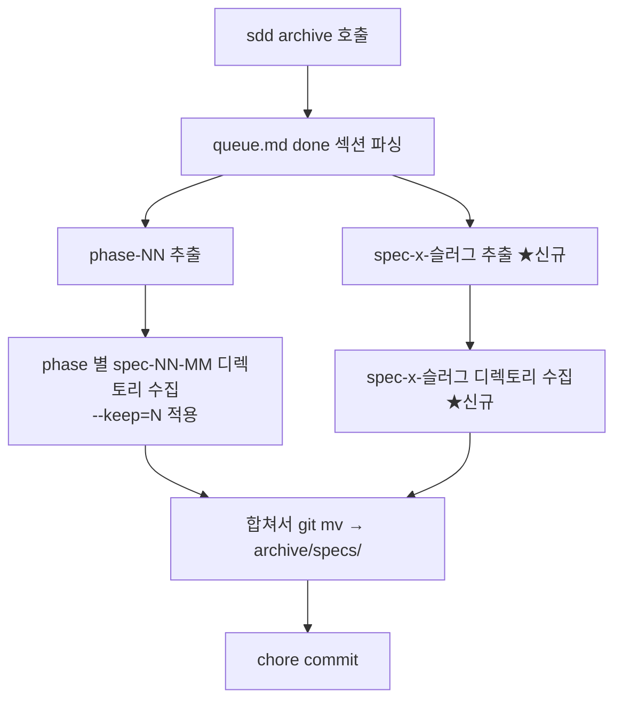

# Implementation Plan: spec-x-archive-include-specx

## 📋 Branch Strategy

- 신규 브랜치: `spec-x-archive-include-specx` (브랜치 이름 = spec 디렉토리 이름, `feature/` prefix 없음)
- 시작 지점: `main` (메모리 — spec-x는 main에서 브랜치)
- 첫 task 가 브랜치 생성을 수행함

## 🛑 사용자 검토 필요 (User Review Required)

> [!IMPORTANT]
> - [ ] **archive 자격 판정 기준**: spec-x 디렉토리는 `queue.md` 의 `done` 섹션에 `- [x] spec-x-{slug} (완료)` 형태로 등록된 경우에만 archive 대상이 된다. 즉 사용자가 `sdd specx done <slug>` 를 호출했어야 한다. 그렇지 않은 spec-x 디렉토리는 보존 — `sdd specx done` 호출이 archive 자격 게이트 역할을 한다.
> - [ ] **`--keep=N` 의미 비변경**: phase 단위 keep 만 적용. spec-x 는 keep 영향을 받지 않으며, `done` 섹션에 등록된 것은 모두 처리.

> [!WARNING]
> - [ ] **기존 회귀 테스트 Check 4 갱신 필요**: 현재 `tests/test-sdd-dir-archive.sh` Check 4 ("spec-x 디렉토리는 이동되지 않음") 는 `done` 섹션에 등록되지 않은 spec-x 만 보존한다는 의미로 재해석된다. fixture 가 spec-x 를 done 에 등록하지 않으므로 기존 테스트는 그대로 PASS — 단, **의미가 바뀌었음을 명확히 하기 위해 주석을 갱신**한다 (코드 변경 없음).

## 🎯 핵심 전략 (Core Strategy)

### 아키텍처 컨텍스트



### 주요 결정

| 컴포넌트 | 전략 | 이유 |
|:---:|:---|:---|
| **archive 자격** | `queue.md` `done` 섹션 등록 여부 | 기존 phase 흐름과 동일한 게이트, 외부 의존(gh CLI) 없음 |
| **수집 방법** | awk 로 `done` 섹션 추가 파싱 | 기존 phase 추출 awk 와 동일 패턴, 단순 확장 |
| **--keep 영향** | spec-x 는 영향 없음 | spec-x 는 phase 같은 순서 개념 부재, all-or-nothing 이 단순 |
| **부재 디렉토리** | 조용히 스킵 | 이미 정리된 경우 흔함, 경고 노이즈 회피 |

## 📂 Proposed Changes

### [sources/bin/sdd] cmd_archive 본체

#### [MODIFY] `sources/bin/sdd` (line 1588 ~ 1719 부근)

**1. `done` 섹션에서 spec-x 슬러그 추출 추가** (line 1622 부근의 `done_phases` 추출 다음)

```bash
# Extract spec-x slugs from done section
local done_specx
done_specx=$(awk '
  /<!-- sdd:done:start -->/ { in_d=1; next }
  /<!-- sdd:done:end -->/ { in_d=0; next }
  in_d {
    # Pattern: - [x] spec-x-{slug} (완료)
    if (match($0, /spec-x-[a-z0-9][a-z0-9-]*/)) {
      print substr($0, RSTART, RLENGTH)
    }
  }
' "$queue_file" | sort -u)
```

**2. spec-x 디렉토리 수집 루프 추가** (line 1672 의 phase 루프 다음)

```bash
# Collect spec-x dirs (independent of --keep, all done specx)
local specx_count=0
local specx_to_move=""
while IFS= read -r sid; do
  [ -z "$sid" ] && continue
  local sd="$SDD_SPECS/$sid"
  if [ -d "$sd" ]; then
    specx_to_move="${specx_to_move}${sd}\n"
    specx_count=$((specx_count + 1))
  fi
done <<< "$done_specx"
```

**3. 빈 검사 / 요약 / dry-run / 이동 / 커밋 메시지에 spec-x 통합** (line 1674~1718)

- `if [ "$spec_count" -eq 0 ] && [ "$backlog_count" -eq 0 ] && [ "$specx_count" -eq 0 ]` 로 확장
- 요약 출력에 `  spec-x 디렉토리: ${specx_count}개` 추가
- `--dry-run` 출력에 `printf "%b" "$specx_to_move" | while ...` 블록 추가
- 실제 이동 시 `git mv` 추가 루프
- 커밋 메시지: `chore: archive ${spec_count} spec dirs + ${backlog_count} backlog files + ${specx_count} spec-x dirs` (specx_count > 0 일 때만 spec-x 부분 표시 — 0 이면 기존 형식 유지)
- `ok` 출력에 spec-x 수 포함

**4. 기존 spec-x 스킵 로직 비변경**

- line 1661 의 `case "$base" in spec-x-*) continue ;; esac` 는 **유지**.
  - 이는 phase-bound spec 수집 루프에서 spec-x 가 잘못 들어가는 것을 막는 안전망.
  - spec-x 처리는 위의 별도 `done_specx` 수집 루프에서 담당.

#### [MODIFY] `.harness-kit/bin/sdd`

- 도그푸딩 동기화 — `sources/bin/sdd` 와 동일하게 갱신.

#### [MODIFY] `tests/test-sdd-dir-archive.sh`

- **Check 4 주석 갱신**: "spec-x 디렉토리는 이동되지 않음" → "done 섹션 미등록 spec-x 디렉토리는 보존됨". 본문 그대로.
- **신규 Check 7 추가**: "done 섹션 등록 spec-x 는 archive 됨"
  - fixture: `make_queue` 에 done spec-x 항목 추가하는 헬퍼 확장 또는 직접 queue.md 작성
  - `make_spec_dir "$F7" "spec-x-test-slug"` 생성
  - `sdd archive` 실행
  - assert: `archive/specs/spec-x-test-slug/` 존재 + `specs/spec-x-test-slug/` 부재
- **신규 Check 8 추가**: "done 섹션 등록 + dry-run 시 이동 안 됨"
  - assert: dry-run 후 `specs/spec-x-test-slug/` 그대로 유지

## 🧪 검증 계획 (Verification Plan)

### 단위 테스트 (필수)
```bash
# spec 별 회귀 테스트
bash tests/test-sdd-dir-archive.sh

# 광범위 회귀 — 변경 가능성 있는 영역
bash tests/test-sdd-archive-search.sh
bash tests/test-sdd-status-cross-check.sh
```

기대: 모든 PASS. Check 7/8 신규 PASS, 기존 Check 1~6 그대로 PASS.

### 수동 검증 시나리오
1. **로컬 dogfood 검증**: 본 PR 머지 후, 다른 spec-x 가 추가로 쌓일 때 (`sdd specx done <slug>` 호출 후) `sdd archive --dry-run` 실행 → 해당 spec-x 가 이동 대상에 포함되어 출력되는지 확인.
2. **백워드 호환**: phase 만 done 인 상황에서 `sdd archive` 실행 → 기존과 동일하게 동작 (spec-x 0개로 보고).

## 🔁 Rollback Plan

- 단일 PR 의 git revert 로 즉시 롤백 가능.
- 데이터 영향 없음 (이동된 디렉토리는 archive/ 에 보존, 추후 수동 복구 가능). 단, revert 후 archive/ 에 누적된 spec-x 디렉토리는 그 자리에 둔다 — 머지된 PR 의 결과물이므로 의미상 동일.

## 📦 Deliverables 체크

- [ ] task.md 작성 (다음 단계)
- [ ] 사용자 Plan Accept 받음
- [ ] (실행 후) 모든 task 완료
- [ ] (실행 후) walkthrough.md / pr_description.md ship
