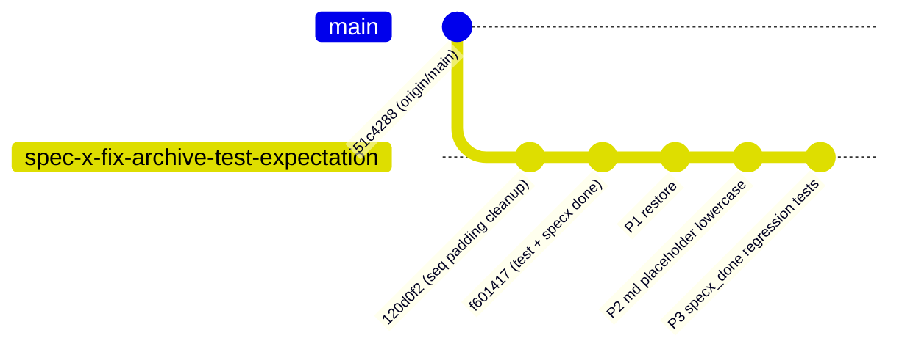

# Implementation Plan: spec-x-fix-archive-test-expectation

## 📋 Branch Strategy

- 신규 브랜치: `spec-x-fix-archive-test-expectation`
- 시작 지점: **현재 로컬 `main` HEAD (`f601417`)** — 원 커밋 `120d0f2`, `f601417` 을 그대로 포함
- 첫 task 가 브랜치 생성 + 로컬 `main` 포인터를 `origin/main` 으로 리셋 (destructive, 작업은 브랜치에 보존)

## 🛑 사용자 검토 필요 (User Review Required)

> [!IMPORTANT]
> - [ ] 로컬 `main` 포인터를 `origin/main` 으로 되돌리는 작업 (`git branch -f main origin/main`) 승인. 작업은 브랜치에 보존되므로 손실 위험 없음.
> - [ ] `120d0f2` 와 `f601417` 의 *다른* 변경 내용은 유효하다는 판단 확인.
> - [ ] B 항목(P2) 활성 .md 소문자 통일이 constitution §6.2 근거로 올바르다는 동의.

> [!WARNING]
> - [ ] 원격 `origin/main` 에는 이 단계에서 어떤 영향도 없음. PR merge 시점에 origin/main 업데이트됨.
> - [ ] P1 교정 방향은 "PR #65 결정 (spec-x 아카이브 안 함)" 기준. PR #64 의 "spec-x 아카이브" 는 최종 디자인 아님.

## 🎯 핵심 전략 (Core Strategy)

### 아키텍처 컨텍스트



### 주요 결정

| 컴포넌트 | 전략 | 이유 |
|:---:|:---|:---|
| **브랜치 base** | 현재 로컬 main HEAD (`f601417`) | 두 원 커밋을 그대로 포함 |
| **main 리셋** | `git branch -f main origin/main` | main 직접 커밋 흔적 제거, 정식 PR 경로 복귀 |
| **P1 교정 방향** | "spec-x 아카이브 안 됨" 기대값 복원 | 실제 구현(PR #65)과 일치 |
| **P2 범위** | 4 개 파일만 (align.md × 2, hk-plan-accept.md × 2) | 활성 문서 중 대문자/ambiguous placeholder 만 |
| **P3 위치** | `tests/test-sdd-ship-completion.sh` 에 Check 확장 | 기존 specx_done Check 6 옆에 추가하여 컨텍스트 유지 |

## 📂 Proposed Changes

### 브랜치 / 레퍼런스 조작 (파일 변경 아님)

- `git switch -c spec-x-fix-archive-test-expectation`
- `git branch -f main origin/main` (destructive, 승인 필요)

### P1 — Check 4 기대값 복원

#### [MODIFY] `tests/test-sdd-dir-archive.sh`

Check 4 블록의 기대값과 주석·제목을 PR #65 결정 ("spec-x 는 아카이브되지 않음") 에 맞게 복원. `f601417` 의 해당 블록만 역전, 동 커밋의 다른 변경은 유지.

### P2 — 활성 .md ID placeholder 소문자 통일

#### [MODIFY] `.harness-kit/agent/align.md`
- Line 43: `Active Phase: PHASE-{N}-{slug}` → `Active Phase: phase-{N}` (base branch 모드 아닐 때 slug 없음) 또는 `phase-{N}[-{slug}]` (옵션 표기)
- Line 44: `Active Spec: SPEC-{N}-{seq}-{slug}` → `Active Spec: spec-{phaseN}-{seq}-{slug}`

#### [MODIFY] `sources/governance/align.md`
- 동일 수정

#### [MODIFY] `.claude/commands/hk-plan-accept.md`
- Line 36: `✅ Plan Accepted: SPEC-{N}-{NN}-{slug}` → `✅ Plan Accepted: spec-{phaseN}-{seq}-{slug}`

#### [MODIFY] `sources/commands/hk-plan-accept.md`
- 동일 수정

> 참고: `.harness-kit/` 은 설치 결과물이지만, 본 리포 자체에 도그푸딩되어 있으므로 `sources/` 와 `.harness-kit/` 양쪽 모두 수정한다.

### P3 — `sdd specx done` 회귀 테스트 추가

#### [MODIFY] `tests/test-sdd-ship-completion.sh`

기존 Check 6 다음에 두 케이스 추가:

1. **Check 6b**: `sdd specx done spec-x-fix-typo` (prefix 포함 호출)
   - Fixture: Check 6 와 동일
   - 기대: specx 섹션에서 제거, done 섹션에 추가 (slug 중복 없이)

2. **Check 6c**: state.json active spec 리셋
   - Fixture: state.json 의 `spec = "spec-x-fix-typo"`, `planAccepted = true` 로 시작
   - 호출: `sdd specx done fix-typo`
   - 기대: state.json `spec = null`, `planAccepted = false`

## 🧪 검증 계획 (Verification Plan)

### 단위 테스트 (필수)
```bash
bash tests/test-sdd-dir-archive.sh          # P1 검증
bash tests/test-sdd-ship-completion.sh      # P3 검증 (Check 6b/6c)
for t in tests/test-*.sh; do echo "=== $t ==="; bash "$t" 2>&1 | tail -3; done
```
기대: 19/19 PASS.

### 통합 테스트
해당 없음 (Integration Test Required = no).

### 수동 검증 시나리오
1. `git log origin/main..HEAD --oneline` → 5 commits (`120d0f2`, `f601417`, P1, P2, P3).
2. `git branch --show-current` → `spec-x-fix-archive-test-expectation`.
3. `git log main..origin/main --oneline` → 출력 없음.

## 🔁 Rollback Plan

- 브랜치 push 전: `git branch -f main f601417` 로 원복 (reflog 로 참조 확보).
- 브랜치 push 후: 원격/로컬 브랜치 삭제. main 은 이미 origin/main 과 동기.
- PR merge 후 문제 발견: revert PR (표준 경로).

## 📦 Deliverables 체크

- [ ] task.md 작성
- [ ] 사용자 Plan Accept 받음
- [ ] (실행 후) 모든 task 완료
- [ ] (실행 후) walkthrough.md / pr_description.md ship
