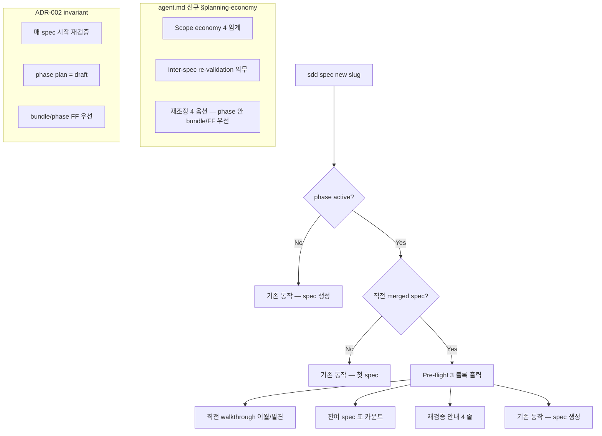

# Implementation Plan: spec-x-planning-economy

## 📋 Branch Strategy

- 신규 브랜치: `spec-x-planning-economy`
- **시작 지점**: `main` (spec-x 는 main 에서 분기 — 메모리 `feedback_specx_branch_from_main`)
- **PR Target**: `main`

## 🛑 사용자 검토 필요 (User Review Required)

> [!IMPORTANT]
> - [ ] **3 묶음 한 spec-x** — governance §planning-economy + sdd pre-flight + ADR-002. review 1 회.
> - [ ] **§planning-economy 는 영어** (governance 영어 원칙). ADR-002 는 한국어 (ADR-001 일관).
> - [ ] **`sdd cmd_spec_new` 변경은 *주의 환기* 만** — gate 아님. 기존 동작 비파괴.
> - [ ] **본 spec-x 머지 직후 ADR-002 가 효력 발동** — 다음 모든 spec/spec-x 가 본 invariant 적용 대상.

> [!WARNING]
> - [ ] **sdd 변경 → 모든 spec new 호출에 영향** — fixture 회귀 검증 필수.
> - [ ] **install 미러 sync** — agent.md / sdd 양쪽 sync 안 하면 다음 spec 진행 시 silent drift.

## 🎯 핵심 전략 (Core Strategy)

### 아키텍처 컨텍스트



### 주요 결정

| 컴포넌트 | 전략 | 이유 |
|:---:|:---|:---|
| **§planning-economy 위치** | `agent.md` 의 적절한 §번호 (SDD/Execution 절 인접) | 다른 SDD 절차와 인접 — 에이전트 자연 참조 |
| **§planning-economy 언어** | 영어 | governance 영어 원칙 (메모리) |
| **pre-flight gate 여부** | gate 아님 — *주의 환기* 출력 | 비파괴 변경. user 가 무시하면 기존 동작 |
| **출력 형식** | `📋 / 📋 / 💡` 3 블록 | sdd status 의 emoji 블록 패턴 일관 |
| **ADR-002 type** | `invariant` (첫 항목 — 가장 강함) + Decision 본문에 convention 측면 부연 | ADR frontmatter 는 단일 type. 강제력 우선 |
| **ADR-002 본문 언어** | 한국어 (ADR-001 일관) | docs/decisions/ 패턴 |
| **회귀 검증 방식** | 기존 4 테스트 + pre-flight 출력 *수동 시연* | pre-flight 가 *출력만* — 자동 테스트 ROI 낮음 |
| **`_pre_spec_validation()` helper 분리** | 별 함수 — `cmd_spec_new` 안에서 호출 | 테스트 가능성 + 단일 책임 |

### 📑 ADR 후보

- [x] **있음** → `docs/decisions/ADR-002-planning-economy.md`
  - **type**: `invariant` (frontmatter) — "매 spec 시작 시 재검증 의무" + "phase plan = draft" 두 invariant
  - **convention 측면** (bundle / phase FF 우선) 은 ADR 본문 Decision 섹션에 추가 명시
- [ ] 없음

## 📂 Proposed Changes

### [Component 1: agent.md §planning-economy 신설]

#### [MODIFY] `sources/governance/agent.md` — 새 § 추가

본 § 의 정확한 번호는 `agent.md` 현 §구조 확인 후 결정. 내용 (영어):

```markdown
## N. Planning Economy & Inter-Spec Re-Validation

### N.1 SDD Ceremony Cost
SDD ceremony (spec.md + plan.md + task.md + Plan Accept + walkthrough.md + pr_description.md + PR + review) is fixed-cost overhead. When the work itself is smaller than the ceremony, ROI is negative. The Agent MUST estimate scope before invoking SDD and recommend the appropriate work mode.

### N.2 Scope Economy Thresholds

| Scope | Mode | Example |
|---|---|---|
| 1-2 task, single file, reversible | FF (requires User approval per §2.3) | typo, single-line guidance |
| 3-5 task, single area | spec-x (no phase) OR bundle / phase FF (in phase) | minor refactor |
| 6+ task, cross-file invariant, integration test | spec (in phase or spec-x) | new feature, architectural change |

### N.3 Inter-Spec Re-Validation (in Phase)
Phase.md spec table is a draft, NOT a contract. At the start of each subsequent spec in a phase, the Agent MUST:
1. Read previous merged spec's walkthrough.md (Carry-over / Findings).
2. Inspect previous spec's git diff --stat (actual scope).
3. Review all remaining specs in the phase, not just the next.
4. For each remaining spec, assess: direction validity / scope size / bundle candidacy / FF demotion candidacy.

### N.4 Re-Adjustment Options (in Phase)
Within a phase, prefer bundle or phase FF over spec-x demotion:

| Situation | Action |
|---|---|
| Direction invalidated + no longer needed | Drop spec from phase.md table |
| Direction valid + scope small + another small remaining spec | Bundle (잡탕 cleanup pattern, e.g., spec-17-04) |
| Direction valid + scope 1-2 commits + no bundle target | Phase FF (commit directly to phase branch) |
| Direction valid + scope appropriate | Proceed as planned |

spec-x demotion is reserved for leftover work after a phase has ended, not for in-phase reshaping.

### N.5 Tool Support
`sdd spec new <slug>` (when invoked inside an active phase with a prior merged spec) outputs a pre-flight summary: previous spec's walkthrough carry-over/findings, diff stats, remaining spec table, one-line re-validation prompt. This is attention prompt, not a gate.
```

#### [SYNC] `.harness-kit/agent/agent.md`

동일 변경 미러.

### [Component 2: sdd cmd_spec_new pre-flight 강화]

#### [MODIFY] `sources/bin/sdd`

`_pre_spec_validation()` helper 신설 + `cmd_spec_new()` 시작 부분에 호출 추가:

```bash
_pre_spec_validation() {
  local phase_id
  phase_id=$(_state_get_phase 2>/dev/null || echo "")
  [ -z "$phase_id" ] && return 0

  local phase_file="backlog/${phase_id}.md"
  [ -f "$phase_file" ] || return 0

  # 직전 merged spec 추출 (phase.md 표에서 Merged 행 중 마지막)
  local prev_spec
  prev_spec=$(awk '/^\| `spec-/ && /\| Merged \|/ { match($0, /`spec-[^`]+`/); print substr($0, RSTART+1, RLENGTH-2) }' "$phase_file" 2>/dev/null | tail -1)
  [ -z "$prev_spec" ] && return 0

  local prev_dir="specs"
  local prev_wt
  prev_wt=$(find "$prev_dir" -maxdepth 2 -type d -name "${prev_spec}*" 2>/dev/null | head -1)
  [ -z "$prev_wt" ] && return 0
  prev_wt="${prev_wt}/walkthrough.md"
  [ -f "$prev_wt" ] || return 0

  echo ""
  echo "📋 직전 spec 변경 영향 (${prev_spec})"
  # 발견/이월 섹션 헤더만 (본문은 walkthrough 직접 참조 권장)
  grep -h "^## 🔍\|^## 🚧" "$prev_wt" 2>/dev/null | sed 's/^/  /'
  echo "  → 자세한 내용은 ${prev_wt} 참조"

  echo ""
  echo "📋 phase.md 잔여 spec"
  local remaining
  remaining=$(grep -c "| Backlog \||\| Active \|" "$phase_file" 2>/dev/null || echo 0)
  echo "  남은 spec: ${remaining} 개 (${phase_file} 참고)"

  echo ""
  echo "💡 본 spec ($1) 시작 전 재검증 (agent.md §planning-economy):"
  echo "  - 직전 변경으로 가정이 깨졌는가? (방향성)"
  echo "  - scope 가 여전히 적절한가? (크기)"
  echo "  - 잔여 spec 과 bundle 가능한가? (응집도)"
  echo "  - 1-2 commit 이면 phase FF 가 나은가? (경제성)"
  echo ""
}
```

`cmd_spec_new()` 본문 — slug 검증 통과 직후, 디렉토리 생성 직전 위치에:

```bash
_pre_spec_validation "$slug"
```

#### [SYNC] `.harness-kit/bin/sdd`

동일 변경 미러.

### [Component 3: ADR-002 작성]

#### [NEW] `docs/decisions/ADR-002-planning-economy.md`

frontmatter:
```yaml
---
id: ADR-002
type: invariant
date: 2026-05-17
status: accepted
---
```

본문 섹션 (한국어):
- **Context**: SDD ceremony 고정비 + phase-17 의 spec-17-03 누수 미발견 증거 + phase.md 표 contract 오해 패턴
- **Decision**: 3 invariant — (1) mode demote 의무 (FF/spec-x/spec/bundle 4 임계), (2) phase plan = draft (매 spec 시작 재검증), (3) phase 안 bundle/phase FF 우선
- **Consequences**: 긍정 (토큰 ROI / silent drift 차단 / 응집도) + 부정 (인지 부하 + 판단력 요구) + 중립 (점진 도입)
- **Alternatives**: 자동 bundle 실행 / `/hk-plan-economy` 별 슬래시 / post-hoc `/hk-phase-review` 만 / token cost 자동 추정 — 모두 비채택 + 이유
- **Status**: Accepted (2026-05-17), 첫 사용자: 다음 모든 `sdd spec new` 호출
- **Related**: spec-x-planning-economy / ADR-001 / RCA-001 / agent.md §planning-economy / phase-17 회고

ADR 템플릿의 stale 검사 가이드 Note 블록 포함 (spec-17-04 W4 패턴).

## 🧪 검증 계획 (Verification Plan)

### 단위 테스트

```bash
# Governance 변경
grep -q "Planning Economy" sources/governance/agent.md .harness-kit/agent/agent.md
diff sources/governance/agent.md .harness-kit/agent/agent.md      # (sync ok)

# sdd 변경
grep -q "_pre_spec_validation" sources/bin/sdd .harness-kit/bin/sdd
diff sources/bin/sdd .harness-kit/bin/sdd                          # (sync ok)

# ADR-002
test -f docs/decisions/ADR-002-planning-economy.md
grep -q "^id: ADR-002" docs/decisions/ADR-002-planning-economy.md
grep -q "^type: invariant" docs/decisions/ADR-002-planning-economy.md

# 회귀 4 종
bash tests/test-sdd-marker-idempotent.sh    # 3/3
bash tests/test-drift-stale-adr.sh           # 3/3
bash tests/test-phase16-integration.sh       # 3/3
bash tests/test-phase17-integration.sh       # 3 passed / 1 skipped
```

### 수동 검증 시나리오

1. **Phase 활성 + 직전 merged spec 존재**: 본 저장소가 `main` 이라 phase 없음 — fixture phase 임시 생성 또는 자기 시연 (예: phase-17 시점 reproduction).
2. **Phase 없음**: `main` 에서 `sdd specx new test-flag` 시도 → pre-flight 출력 *없음* + 기존 동작.
3. **ADR-002 자체 검증**: `bash tests/test-drift-stale-adr.sh` → ADR-002 의 backtick 경로 valid → Step 1 PASS.

## 🔁 Rollback Plan

- 본 PR revert. 3 묶음 모두 *추가* — 기존 동작 변경 0.
- pre-flight 가 *출력만* 이라 revert 시 자동 사라짐.
- ADR-002 는 status `accepted` → `deprecated` 또는 revert 로 처리.

## 📦 Deliverables 체크

- [ ] task.md 작성 (다음 단계)
- [ ] 사용자 Plan Accept
- [ ] (실행 후) 모든 task 완료
- [ ] (실행 후) walkthrough.md / pr_description.md ship
