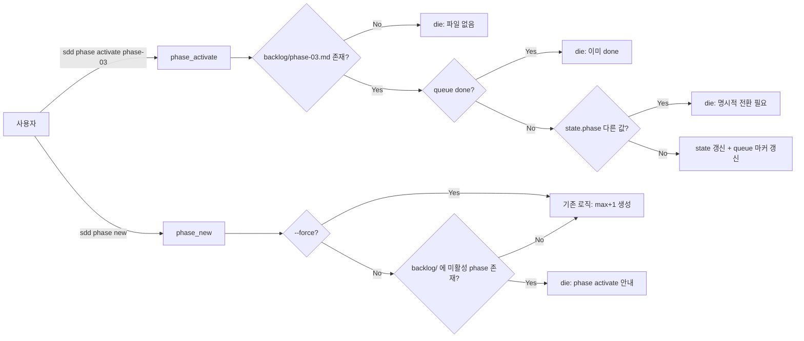

# Implementation Plan: spec-x-sdd-phase-activate

## 📋 Branch Strategy

- 신규 브랜치: `spec-x-sdd-phase-activate`
- 시작 지점: `main`
- 첫 task가 브랜치 생성을 수행함.

## 🛑 사용자 검토 필요 (User Review Required)

> [!IMPORTANT]
> - [ ] **`phase new` 가드 동작 변경 동의** — `backlog/`에 사전 정의 phase 파일이 있을 때 `sdd phase new`가 die 한다. 기존 워크플로우 사용자에게 영향이 있을 수 있음 (단, 본 프로젝트 내에는 사전 정의 phase가 없는 상태가 정상이라 직접 영향 없음).
> - [ ] **`--force` 플래그로 우회 가능** — 가드를 우회하고 싶을 때 명시적으로 `--force` 사용.
> - [ ] **`phase activate`는 본문 미수정** — 사용자가 작성한 `phase.md` 본문/메타 필드를 일체 변경하지 않음.

> [!WARNING]
> - [ ] 본 변경은 `sources/bin/sdd` 만 수정. 설치된 `.harness-kit/bin/sdd` 는 도그푸딩 시점(install/update)에 동기화됨. 단, 이번 PR에서 도그푸딩 동기화를 위해 `.harness-kit/bin/sdd` 도 함께 갱신한다.

## 🎯 핵심 전략 (Core Strategy)

### 아키텍처 컨텍스트



### 주요 결정

| 컴포넌트 | 전략 | 이유 |
|:---:|:---|:---|
| **`phase activate`** | 신규 서브커맨드. 본문 무수정 + state/queue만 갱신 | 사용자 작성 본문 보존 (Artifact Integrity, constitution §5.4) |
| **`phase new` 가드** | 사전 정의 phase 감지 시 die. `--force` 로 우회 | 사일런트 잘못된 생성 방지. backward compat은 `--force`로 보장 |
| **slug 추출** | `phase.md` 첫 줄 `# phase-NN: <slug>` 에서 파싱. fallback: `<id>` 자체 사용 | 사용자가 한국어 제목으로 바꿔둔 경우도 안전한 fallback |
| **buggy phase 판별** | queue.md done 섹션에 ID가 없고 + state.phase != id → "미활성" | done/active 마커는 sdd가 관리하므로 신뢰 가능 |
| **`--base` 처리** | activate에도 동일하게 지원. phase.md 메타가 채워져 있으면 우선 | phase 사전 정의 시 `Base Branch` 도 미리 적어두는 케이스 보호 |

## 📂 Proposed Changes

### sdd CLI

#### [MODIFY] `sources/bin/sdd`

1. **`cmd_phase` 라우팅** (현재 sdd:429-438):
   ```bash
   case "$sub" in
     new)      phase_new "$@" ;;
     activate) phase_activate "$@" ;;   # 신규
     list)     phase_list ;;
     show)     phase_show "$@" ;;
     done)     phase_done "$@" ;;
     ...
   esac
   ```

2. **`phase_activate()` 신규 함수**:
   ```bash
   phase_activate() {
     local id="${1:-}"
     [ -z "$id" ] && die "사용법: sdd phase activate <phase-NN> [--base]"
     [[ "$id" =~ ^phase-[0-9]+$ ]] || die "id 형식 오류: phase-NN"

     local file="$SDD_BACKLOG/${id}.md"
     [ -f "$file" ] || die "phase 파일 없음: $file"

     # done 체크 (queue.md done 섹션 스캔)
     if queue_phase_is_done "$id"; then
       die "이미 완료된 phase: $id"
     fi

     # 다른 active phase가 있으면 die (idempotent: 동일 id면 통과)
     local cur_phase
     cur_phase="$(state_get phase)"
     if [ "$cur_phase" != "null" ] && [ "$cur_phase" != "$id" ]; then
       die "다른 active phase 존재: $cur_phase (먼저 'sdd phase done' 또는 명시적 전환)"
     fi

     # --base 플래그
     local base_mode=0
     local arg
     for arg in "${@:2}"; do
       case "$arg" in --base) base_mode=1 ;; esac
     done

     # slug 추출: # phase-NN: <slug> 의 <slug> 부분
     local slug
     slug="$(head -1 "$file" | sed -n "s|^# *${id}: *\(.*\)$|\1|p")"
     [ -z "$slug" ] && slug="${id}"

     # state 갱신
     state_set phase "$id"
     state_set spec "null"
     state_set planAccepted "false"

     # base branch
     if [ $base_mode -eq 1 ]; then
       # phase.md 메타에 이미 채워져 있는지 확인
       local meta_base
       meta_base="$(grep -E '^\| \*\*Base Branch\*\*' "$file" | sed 's/.*| *//;s/ *|.*//' | head -1)"
       local base_branch
       if [ -n "$meta_base" ] && [[ "$meta_base" =~ ^phase-[0-9]+- ]]; then
         base_branch="$meta_base"
       else
         base_branch="${id}-${slug}"
       fi
       state_set baseBranch "$base_branch"
       ok "base branch: $base_branch"
     fi

     # queue.md 갱신 — active 마커 교체 + queued 마커에서 해당 phase 행 제거
     ensure_queue_file
     queue_set_active "$id" "$slug"
     queue_remove_from_queued "$id"   # 신규 헬퍼 (구현)

     ok "active phase 설정: $id ($slug)"
     echo ""
     echo "다음 단계:"
     echo "  1. phase.md 본문 확인 후 sdd spec new <slug> 로 첫 spec 시작"
   }
   ```

3. **`phase_new()` 가드** (현재 sdd:451-517):
   `--force` 플래그 파싱 추가. 가드 코드:
   ```bash
   # 사전 정의 phase 감지 (backlog/ 에 미활성 phase 파일 존재 시)
   if [ $force_mode -eq 0 ]; then
     local pending=()
     local pf
     for pf in "$SDD_BACKLOG"/phase-*.md; do
       [ -f "$pf" ] || continue
       local pid
       pid="$(basename "$pf" .md)"
       # done 이거나 현재 active 면 skip
       if queue_phase_is_done "$pid"; then continue; fi
       if [ "$pid" = "$(state_get phase)" ]; then continue; fi
       pending+=("$pid")
     done
     if [ ${#pending[@]} -gt 0 ]; then
       printf '⚠ 사전 정의된 phase 가 있습니다:\n' >&2
       for pid in "${pending[@]}"; do printf '  - %s\n' "$pid" >&2; done
       printf '\n다음 중 선택:\n' >&2
       printf '  1) sdd phase activate %s        # 기존 phase 활성화\n' "${pending[0]}" >&2
       printf '  2) sdd phase new <slug> --force  # 새 phase 강제 추가\n' >&2
       die "phase new 거부 — 사전 정의 phase 우선"
     fi
   fi
   ```

4. **헬퍼 함수**:
   - `queue_phase_is_done(id)` — `<!-- sdd:done:start -->` 영역에서 id 검색.
   - `queue_remove_from_queued(id)` — `<!-- sdd:queued:start -->` 영역에서 해당 id 행 제거.

5. **`cmd_help` 업데이트**:
   ```
   phase new <slug> [--force]   새 phase-{N}.md 생성 + queue 갱신
                                --force: 사전 정의 phase 가 있어도 새로 생성
   phase activate <phase-NN> [--base]
                                기존 phase 파일 활성화 (사전 정의 phase 진입)
   ```

#### [NEW] `tests/test-sdd-phase-activate.sh`

테스트 시나리오:
1. `phase activate phase-03` 정상 동작 — backlog/phase-03.md 존재 시 state/queue 갱신, 본문 미수정.
2. `phase activate` 파일 없음 → die.
3. `phase activate` 이미 done → die.
4. `phase activate` 다른 active phase 존재 → die.
5. `phase activate phase-03 --base` — phase.md 메타에 base branch 명시되어 있으면 그 값 사용.
6. `phase activate phase-03 --base` — 메타 비어있으면 `phase-03-<slug>` 자동 생성.
7. `phase new <slug>` — 사전 정의 phase 존재 시 die + 안내 메시지에 `phase activate` 포함.
8. `phase new <slug> --force` — 가드 우회, 기존 동작.
9. `phase new <slug>` — 사전 정의 phase 없으면 정상 동작.

#### [MODIFY] 버전 동기화

- `VERSION` → `0.6.2`
- `CHANGELOG.md` → `## [0.6.2] — 2026-04-28` 항목 추가
- `README.md` → 0.6.1 참조를 0.6.2로 교체
- `tests/test-version-bump.sh` → `TARGET="0.6.2"`
- `.harness-kit/installed.json` → `kitVersion: "0.6.2"` (도그푸딩 동기화)
- `.harness-kit/bin/sdd` → `sources/bin/sdd` 와 동일 내용으로 동기화 (도그푸딩)

## 🧪 검증 계획 (Verification Plan)

### 단위 테스트 (필수)
```bash
bash tests/test-sdd-phase-activate.sh
bash tests/test-version-bump.sh
```

### 회귀 테스트
```bash
# 전체 스위트 실행 (test-version-bump.sh 의 Check 6 가 자동으로 호출)
for t in tests/test-*.sh; do bash "$t" || echo "FAIL: $t"; done
```

### 수동 검증 시나리오
1. 임시 fixture에 `backlog/phase-03.md` 작성 → `sdd phase activate phase-03` → state.phase = phase-03, phase.md 본문 미변경.
2. 동일 fixture에서 `sdd phase new another` → die 메시지에 phase-03 표기 + activate 안내.
3. `sdd phase new another --force` → phase-04 생성.

## 🔁 Rollback Plan

- 단일 PR이므로 `git revert <merge-commit>` 으로 즉시 롤백 가능.
- state/queue 변경이 있는 사용자 환경의 경우, 롤백 후 0.6.1 동작 (사전 정의 phase 무시 + max+1 생성)으로 복귀.

## 📦 Deliverables 체크

- [ ] task.md 작성
- [ ] 사용자 Plan Accept 받음
- [ ] 모든 task 완료
- [ ] walkthrough.md / pr_description.md ship
