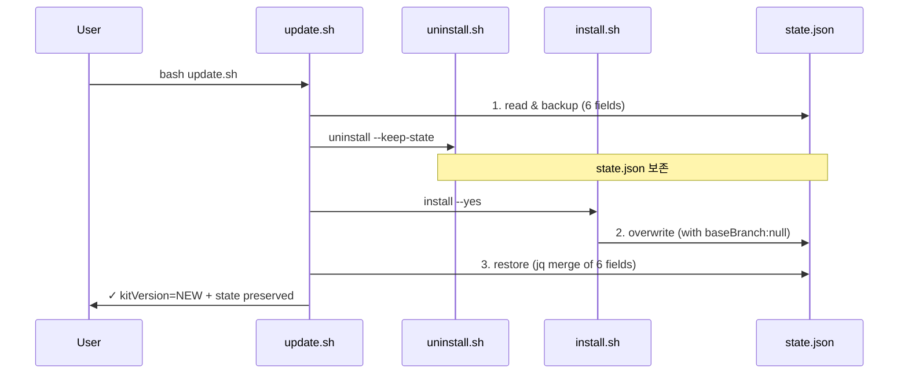

# Implementation Plan: spec-x-update-preserve-state

## 📋 Branch Strategy

- 신규 브랜치: `spec-x-update-preserve-state`
- 시작 지점: `main` (memory: spec-x 는 main 에서 분기)
- 첫 task 가 브랜치 생성을 수행함

## 🛑 사용자 검토 필요 (User Review Required)

> [!IMPORTANT]
> - [ ] **state 보존 필드 화이트리스트**: `phase`, `spec`, `branch`, `baseBranch`, `planAccepted`, `lastTestPass` 6개로 확정
> - [ ] **버전 표기**: 0.6.1 (patch, bug fix 만 포함). minor 변경 없음
> - [ ] **도그푸딩 시점**: 본 PR 머지 *전* 마지막 task 로 `bash update.sh` 실행 → state.json 갱신 결과를 PR 본문에 포함

> [!WARNING]
> - [ ] **`install.sh` state 템플릿 변경**은 신규 설치자에게도 영향 (기존 사용자에겐 영향 없음 — 이미 깔린 state.json 은 update 시 보존됨)
> - [ ] **도그푸딩 결과 `state.json` 이 변경되지만 .gitignore 대상이라 커밋되지 않음** — push 전 확인

## 🎯 핵심 전략 (Core Strategy)

### 아키텍처 컨텍스트



### 주요 결정

| 컴포넌트 | 전략 | 이유 |
|:---:|:---|:---|
| **백업/복원** | jq 한 번에 6개 필드 객체 추출 → install 후 `*` 머지 | bash 변수 4개 → 6개로 늘리는 것보다 jq 객체 한 덩어리가 응집도 ↑. bash 3.2 호환. |
| **install.sh 템플릿** | `baseBranch: null` 필드 추가 | sdd 코드는 이미 `.baseBranch // empty` 로 graceful 처리 중이지만, 명시적 null 이 한 진영의 진실 |
| **kitVersion 동기화** | install.sh 가 새로 쓰므로 자동 동기화 — 회귀 테스트로 명시화 | 별도 로직 불필요. 테스트만 추가 |
| **테스트 위치** | `tests/test-update.sh` 확장 | 기존 픽스처 재사용. 신규 파일보다 응집도 ↑ |

## 📂 Proposed Changes

### 1. update.sh

#### [MODIFY] `update.sh` (lines 113-145)

**현재**: 4개 필드 하드코딩 (`_SAVED_PHASE`, `_SAVED_SPEC`, `_SAVED_PLAN`, `_SAVED_TEST`).

**변경 후**: jq 객체 한 덩어리로 6개 필드 백업 → install 후 jq `* (merge)` 로 일괄 복원.

```bash
# state 백업 (install.sh 가 덮어쓰기 전에)
_STATE="$TARGET/.claude/state/current.json"
_SAVED_JSON='{}'
if command -v jq >/dev/null 2>&1 && [ -f "$_STATE" ]; then
  _SAVED_JSON=$(jq -c \
    '{phase, spec, branch, baseBranch, planAccepted, lastTestPass}' \
    "$_STATE" 2>/dev/null || echo '{}')
fi

# ... uninstall + install 실행 ...

# state 복원 (jq merge 로 백업 객체를 새 state 위에 덮어씀)
if command -v jq >/dev/null 2>&1 && [ -f "$_STATE" ] && [ "$_SAVED_JSON" != '{}' ]; then
  _tmp="$(mktemp)"
  if jq --argjson saved "$_SAVED_JSON" '. * $saved' \
       "$_STATE" > "$_tmp" 2>/dev/null; then
    mv "$_tmp" "$_STATE"
    ok "state 복원 완료"
  else
    warn "state 복원 실패 — 기본값으로 초기화"
    rm -f "$_tmp"
  fi
fi
```

> 핵심: jq 의 `* (recursive merge)` 로 새 state.json 위에 백업 객체를 덮어씀. 백업에 없는 키 (`kitVersion`, `installedAt`) 는 install 이 쓴 새 값을 유지하므로 자동 동기화.

### 2. install.sh

#### [MODIFY] `install.sh` (lines 481-491)

`state.json` 템플릿에 `baseBranch: null` 필드 추가:

```diff
 {
   "kitVersion": "$KIT_VERSION",
   "phase": null,
   "spec": null,
   "branch": null,
+  "baseBranch": null,
   "planAccepted": false,
   "lastTestPass": null,
   "installedAt": "..."
 }
```

### 3. VERSION

#### [MODIFY] `VERSION`

```
0.6.0 → 0.6.1
```

### 4. CHANGELOG.md

#### [MODIFY] `CHANGELOG.md`

상단에 0.6.1 항목 추가:

```markdown
## [0.6.1] — 2026-04-27

### Fixed
- **`update.sh` 의 state 손실 버그** — `branch`, `baseBranch` 가 update 후 영구 소실되던 문제 수정. 이제 `phase`, `spec`, `branch`, `baseBranch`, `planAccepted`, `lastTestPass` 6개 필드를 화이트리스트로 보존 (→ spec-x-update-preserve-state)
- **`install.sh` 의 state 템플릿** — 신규 설치 시 `baseBranch: null` 필드 명시 추가
```

### 5. tests/test-update.sh

#### [MODIFY] `tests/test-update.sh`

기존 시나리오 A 에 다음 검증 추가:

- `branch`, `baseBranch` 필드 보존 검증 (state 에 미리 주입한 값이 update 후 살아있는지)
- `kitVersion` 동기화 검증 (`state.json.kitVersion` == `installed.json.kitVersion` == `VERSION`)
- 신규 시나리오 C: state.json 에 6개 필드 모두 값이 있는 상태에서 update → 모두 보존

## 🧪 검증 계획 (Verification Plan)

### 단위 테스트 (필수)

```bash
bash tests/test-update.sh
bash tests/test-version-bump.sh
bash tests/test-install-layout.sh
```

### 회귀 테스트 (Ship 직전 1회)

```bash
# 전체 sweep — Ship 직전 한 번만
for t in tests/test-*.sh; do
  bash "$t" || echo "FAIL: $t"
done
```

### 수동 검증 시나리오 (도그푸딩, 마지막 task)

1. `bash update.sh --yes .` 실행 — 기대: `0.6.0 → 0.6.1` 로그 출력
2. `cat .claude/state/current.json` — 기대: `kitVersion=0.6.1`, `baseBranch` 필드 존재
3. `bash .harness-kit/bin/sdd status` — 기대: `harness-kit 0.6.1` 헤더

## 🔁 Rollback Plan

- Git 되돌리기: `git revert <commit>` 으로 update.sh / install.sh 변경 되돌림.
- state.json 복구: 본 spec 변경은 backward-compatible (기존 필드는 모두 보존). 롤백 위험 낮음.
- 도그푸딩으로 인해 본 프로젝트 `state.json` 이 갱신되지만 `.gitignore` 대상이라 PR 에 포함되지 않음.

## 📦 Deliverables 체크

- [ ] task.md 작성 (다음 단계)
- [ ] 사용자 Plan Accept 받음
- [ ] (실행 후) 모든 task 완료
- [ ] (실행 후) walkthrough.md / pr_description.md ship
